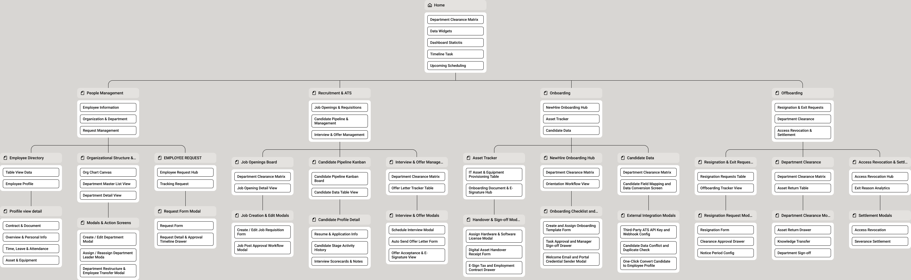
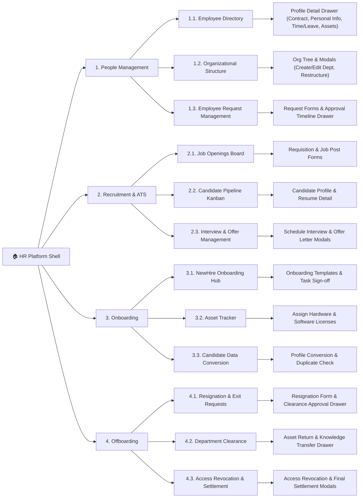
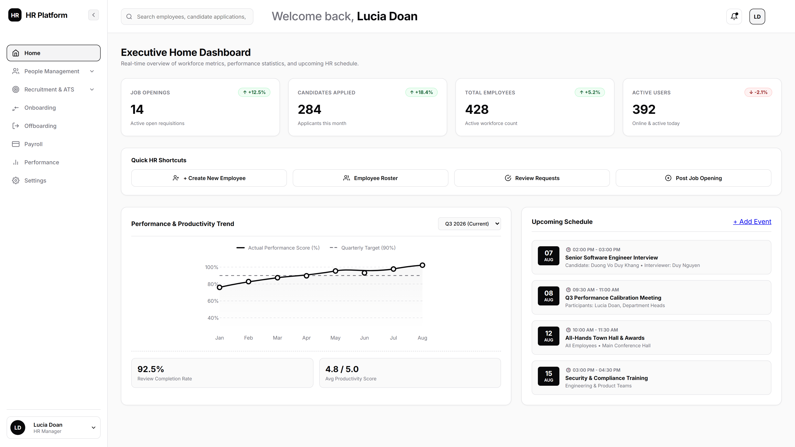
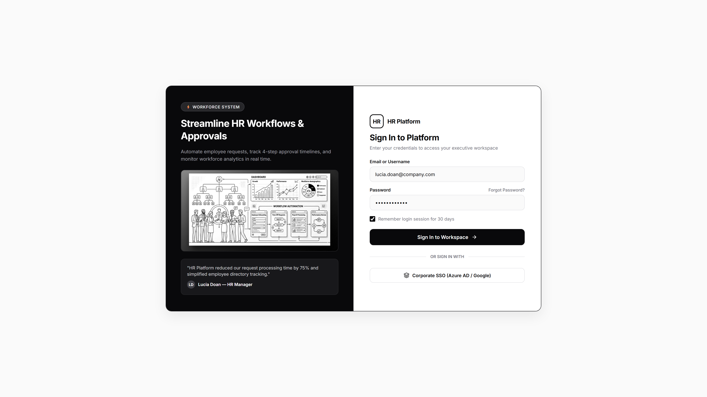

# Information Architecture & UI/UX Design Specifications

> 🎨 **Design & Architecture Links:**
> - **Figma UI/UX Design Wireframe**: [People Management Figma Wireframe](https://www.figma.com/design/D35Ut0x0TXeRGMjvLaNiIt/PeopleManagement?node-id=28-738&t=WYHn3MBdNy4BoqU3-0)
> - **Relume Sitemap Project**: [Monitoring HR Relume Sitemap](https://www.relume.ai/app/project/P3513106_M_AsmXcsz2LE9p9i5egRRtV2aMuaJQ4-Pj5YjjiDkKo)
> - **Full Sitemap Specifications File**: [IA/SITEMAP.md](SITEMAP.md)

---

## 🗺️ System Sitemap & Information Architecture

This section provides the official Information Architecture (IA) and Sitemap for the **HR Management & Productivity Platform**, structured according to the full module hierarchy across **People Management**, **Recruitment & ATS**, **Onboarding**, and **Offboarding**.

### 1. Visual Sitemap Flowchart (Flowchart Diagram)

---

### 2. Comprehensive Screen & Detail Component Mapping

| Main Screen | Main Screen Description | Detail Screen / PopUp / Form | Detail Component Description |
|---|---|---|---|
| **1. Home Dashboard** [Home.html](file:///d:/Monitoring_HR/IA/html/Home.html) | Executive system dashboard displaying KPI widgets, clearance matrix, productivity analytics, task timeline, and upcoming schedule. | **1.1. User Profile Popup Menu** | Session management menu: Update Version (v2.4.0), Help & Support, Sign Out. |
| **1. Home Dashboard** [Home.html](file:///d:/Monitoring_HR/IA/html/Home.html) | Executive system dashboard displaying KPI widgets, clearance matrix, productivity analytics, task timeline, and upcoming schedule. | **1.2. Notifications Drawer** | Slide-over drawer displaying activity notifications, KPI updates, and pending task reminders. |
| **2. Employee Directory** [EmployeeDirectory.html](file:///d:/Monitoring_HR/IA/html/people_management/EmployeeDirectory.html) | Master company-wide workforce directory featuring tabular roster, department filter, employment status filter, and real-time search bar. | **2.1. Profile Detail View - Overview & Personal Info** [detail/EmployeeProfileDetail_Overview.html](file:///d:/Monitoring_HR/IA/html/people_management/detail/EmployeeProfileDetail_Overview.html) | Slide-over drawer presenting personal identification, emergency contacts, national identity card, address, and bank account details. |
| **2. Employee Directory** [EmployeeDirectory.html](file:///d:/Monitoring_HR/IA/html/people_management/EmployeeDirectory.html) | Master company-wide workforce directory featuring tabular roster, department filter, employment status filter, and real-time search bar. | **2.2. Profile Detail View - Contract & Document** [detail/EmployeeProfileDetail_Contract.html](file:///d:/Monitoring_HR/IA/html/people_management/detail/EmployeeProfileDetail_Contract.html) | Slide-over drawer displaying employment contract specifications, contract type, join date, social insurance ID, and attached signed legal documents. |
| **2. Employee Directory** [EmployeeDirectory.html](file:///d:/Monitoring_HR/IA/html/people_management/EmployeeDirectory.html) | Master company-wide workforce directory featuring tabular roster, department filter, employment status filter, and real-time search bar. | **2.3. Profile Detail View - Time, Leave & Attendance** [detail/EmployeeProfileDetail_TimeLeave.html](file:///d:/Monitoring_HR/IA/html/people_management/detail/EmployeeProfileDetail_TimeLeave.html) | Slide-over drawer tracking annual leave quota balance, tardiness history, punctuality rate, and approved overtime (OT) hours. |
| **2. Employee Directory** [EmployeeDirectory.html](file:///d:/Monitoring_HR/IA/html/people_management/EmployeeDirectory.html) | Master company-wide workforce directory featuring tabular roster, department filter, employment status filter, and real-time search bar. | **2.4. Profile Detail View - Asset & Equipment** [detail/EmployeeProfileDetail_Assets.html](file:///d:/Monitoring_HR/IA/html/people_management/detail/EmployeeProfileDetail_Assets.html) | Slide-over drawer listing issued hardware assets (MacBook, monitors, peripherals) and enterprise software license accounts. |
| **2. Employee Directory** [EmployeeDirectory.html](file:///d:/Monitoring_HR/IA/html/people_management/EmployeeDirectory.html) | Master company-wide workforce directory featuring tabular roster, department filter, employment status filter, and real-time search bar. | **2.5. Add Employee PopUp Modal** [detail/AddEmployeeModal.html](file:///d:/Monitoring_HR/IA/html/people_management/detail/AddEmployeeModal.html) | PopUp form for creating new employee profiles (full name, employee ID, corporate email, phone, department, role, contract type). |
| **2. Employee Directory** [EmployeeDirectory.html](file:///d:/Monitoring_HR/IA/html/people_management/EmployeeDirectory.html) | Master company-wide workforce directory featuring tabular roster, department filter, employment status filter, and real-time search bar. | **2.6. Edit Profile Modal** | PopUp form for editing existing employee records. |
| **2. Employee Directory** [EmployeeDirectory.html](file:///d:/Monitoring_HR/IA/html/people_management/EmployeeDirectory.html) | Master company-wide workforce directory featuring tabular roster, department filter, employment status filter, and real-time search bar. | **2.7. Export CSV Confirmation PopUp** | Confirmation popup notification for exporting employee directory dataset to CSV. |
| **3. Organization & Department** [OrgDepartment.html](file:///d:/Monitoring_HR/IA/html/people_management/OrgDepartment.html) | Organizational structure & department hierarchy management: supports dual view modes (Interactive Org Tree Canvas with Drag & Drop and Department Roster Table View). | **3.1. CEO Approval Pending PopUp Modal** [detail/CeoApprovalModal.html](file:///d:/Monitoring_HR/IA/html/people_management/detail/CeoApprovalModal.html) | Notification popup triggering automatically after drag-and-drop org tree restructuring, requiring approval from CEO (Luu Duong). |
| **3. Organization & Department** [OrgDepartment.html](file:///d:/Monitoring_HR/IA/html/people_management/OrgDepartment.html) | Organizational structure & department hierarchy management: supports dual view modes (Interactive Org Tree Canvas with Drag & Drop and Department Roster Table View). | **3.2. Add / Edit Department Drawer Form** [detail/AddDepartmentDrawer.html](file:///d:/Monitoring_HR/IA/html/people_management/detail/AddDepartmentDrawer.html) | Drawer form for creating or editing departments (department name, parent division, department lead, branch location, annual budget $ USD, and scope). |
| **4. Request Management** [RequestManagement.html](file:///d:/Monitoring_HR/IA/html/people_management/RequestManagement.html) | Workflow hub for receiving and reviewing employee administrative requests (annual leave, equipment requisition, department transfer, documents). | **4.1. Request Detail & Approval Timeline Drawer** [detail/RequestDetailDrawer.html](file:///d:/Monitoring_HR/IA/html/people_management/detail/RequestDetailDrawer.html) | Slide-over drawer displaying request specifications, handover plan, justification, and multi-tier approval stepper progress. |
| **4. Request Management** [RequestManagement.html](file:///d:/Monitoring_HR/IA/html/people_management/RequestManagement.html) | Workflow hub for receiving and reviewing employee administrative requests (annual leave, equipment requisition, department transfer, documents). | **4.2. Approve / Reject Action PopUp Modal** [detail/ApproveRejectModal.html](file:///d:/Monitoring_HR/IA/html/people_management/detail/ApproveRejectModal.html) | PopUp modal for confirming Approve or Reject decisions with mandatory reviewer comment box. |
| **5. Create Request** [CreateRequest.html](file:///d:/Monitoring_HR/IA/html/people_management/CreateRequest.html) | Dedicated form screen for initiating new employee HR requests. | **5.1. Multi-type Request Form Component** [detail/CreateRequestForm.html](file:///d:/Monitoring_HR/IA/html/people_management/detail/CreateRequestForm.html) | Multi-type smart form allowing users to select request type (Annual Leave, Equipment, Role Transfer), set start/end dates, assign handover colleagues, and attach proof files. |
| **5. Create Request** [CreateRequest.html](file:///d:/Monitoring_HR/IA/html/people_management/CreateRequest.html) | Dedicated form screen for initiating new employee HR requests. | **5.2. Submission Success Modal / Toast** | Confirmation toast/modal acknowledging successful request dispatch. |
| **5. Create Request** [CreateRequest.html](file:///d:/Monitoring_HR/IA/html/people_management/CreateRequest.html) | Dedicated form screen for initiating new employee HR requests. | **5.3. Attachment Upload Modal** | PopUp modal for picking and uploading supporting documents. |
| **6. Tracking Request** [TrackingRequest.html](file:///d:/Monitoring_HR/IA/html/people_management/TrackingRequest.html) | Request status monitor tracking multi-level approval progress in real time. | **6.1. Request Stepper Timeline View Component** [detail/TrackingRequestTimeline.html](file:///d:/Monitoring_HR/IA/html/people_management/detail/TrackingRequestTimeline.html) | Visual stepper timeline monitor tracking the 4 approval stages (Submitted ➔ Direct Manager Review ➔ HR Sign-off ➔ Final Settlement) and audit activity log. |
| **6. Tracking Request** [TrackingRequest.html](file:///d:/Monitoring_HR/IA/html/people_management/TrackingRequest.html) | Request status monitor tracking multi-level approval progress in real time. | **6.2. Recall Request Confirmation Modal** | Confirmation popup modal for recalling submitted requests before approval. |
| **6. Tracking Request** [TrackingRequest.html](file:///d:/Monitoring_HR/IA/html/people_management/TrackingRequest.html) | Request status monitor tracking multi-level approval progress in real time. | **6.3. History Audit Log Drawer** | Slide-over drawer displaying chronological system audit logs for requests. |
| **7. Login** [Login.html](file:///d:/Monitoring_HR/IA/html/Login.html) | Authentication screen for user login into HR Platform. | **7.1. User Authentication Form** | Authentication form with corporate email, password, Remember Me checkbox, and Forgot Password trigger. |

---

### 3. UI/UX Screen Showcase & Detail Components

#### 3.1. Home Dashboard (`Home.html`)
Executive system dashboard displaying KPI widgets, clearance matrix, productivity analytics, task timeline, and upcoming schedule.

---

#### 3.2. Employee Directory (`EmployeeDirectory.html`)
Master company-wide workforce directory featuring tabular roster, department filter, employment status filter, and real-time search bar.

##### 🔹 Sub-components (Detail Drawers & PopUps):

- **2.1. Profile Detail View Drawer - Tab 1: Overview & Personal Info**  
  *Description:* Slide-over drawer presenting personal identification, emergency contacts, national identity card, address, and bank account details.
  

- **2.2. Profile Detail View Drawer - Tab 2: Contract & Document**  
  *Description:* Slide-over drawer displaying employment contract specifications, contract type, join date, social insurance ID, and attached signed legal documents.
  

- **2.3. Profile Detail View Drawer - Tab 3: Time, Leave & Attendance**  
  *Description:* Slide-over drawer tracking annual leave quota balance, tardiness history, punctuality rate, and approved overtime (OT) hours.
  

- **2.4. Profile Detail View Drawer - Tab 4: Asset & Equipment**  
  *Description:* Slide-over drawer listing issued hardware assets (MacBook, monitors, peripherals) and enterprise software license accounts.
  

- **2.5. Add Employee PopUp Modal**  
  *Description:* PopUp form for creating new employee profiles (full name, employee ID, corporate email, phone, department, role, contract type).
  

---

#### 3.3. Organization & Department (`OrgDepartment.html`)
Organizational structure & department hierarchy management: supports dual view modes (Interactive Org Tree Canvas with Drag & Drop and Department Roster Table View).

##### 🔹 Sub-components (Detail Drawers & PopUps):

- **3.1. CEO Approval Pending PopUp Modal**  
  *Description:* Notification popup triggering automatically after drag-and-drop org tree restructuring, requiring approval from CEO (Luu Duong).
  

- **3.2. Add / Edit Department Drawer Form**  
  *Description:* Drawer form for creating or editing departments (department name, parent division, department lead, branch location, annual budget $ USD, and scope).
  

---

#### 3.4. Request Management (`RequestManagement.html`)
Workflow hub for receiving and reviewing employee administrative requests (annual leave, equipment requisition, department transfer, documents).

##### 🔹 Sub-components (Detail Drawers & PopUps):

- **4.1. Request Detail & Approval Timeline Drawer**  
  *Description:* Slide-over drawer displaying request specifications, handover plan, justification, and multi-tier approval stepper progress.
  

- **4.2. Approve / Reject Action PopUp Modal**  
  *Description:* PopUp modal for confirming Approve or Reject decisions with mandatory reviewer comment box.
  

---

#### 3.5. Create Request (`CreateRequest.html`)
Dedicated form screen for initiating new employee HR requests.

##### 🔹 Sub-components (Forms & Modals):

- **5.1. Multi-type Request Form Component**  
  *Description:* Multi-type smart form allowing users to select request type (Annual Leave, Equipment, Role Transfer), set start/end dates, assign handover colleagues, and attach proof files.
  

---

#### 3.6. Tracking Request (`TrackingRequest.html`)
Request status monitor tracking multi-level approval progress in real time.

##### 🔹 Sub-components (Detail Views):

- **6.1. Request Stepper Timeline Component**  
  *Description:* Visual stepper timeline monitor tracking the 4 approval stages (Submitted ➔ Direct Manager Review ➔ HR Sign-off ➔ Final Settlement) and audit activity log.
  

---

#### 3.7. Login (`Login.html`)
Authentication screen for user login into HR Platform.

---

## 🎨 Design & Sitemap External Links

- **Figma UI/UX Design**: [People Management Figma Wireframe](https://www.figma.com/design/D35Ut0x0TXeRGMjvLaNiIt/PeopleManagement?node-id=28-738&t=WYHn3MBdNy4BoqU3-0)
- **Relume Sitemap Project**: [Monitoring HR Relume Sitemap](https://www.relume.ai/app/project/P3513106_M_AsmXcsz2LE9p9i5egRRtV2aMuaJQ4-Pj5YjjiDkKo)
- **Full Sitemap Specifications File**: [IA/SITEMAP.md](SITEMAP.md)
