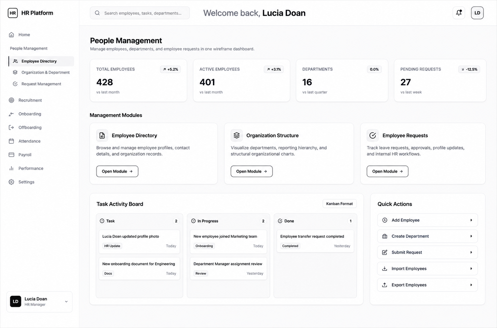
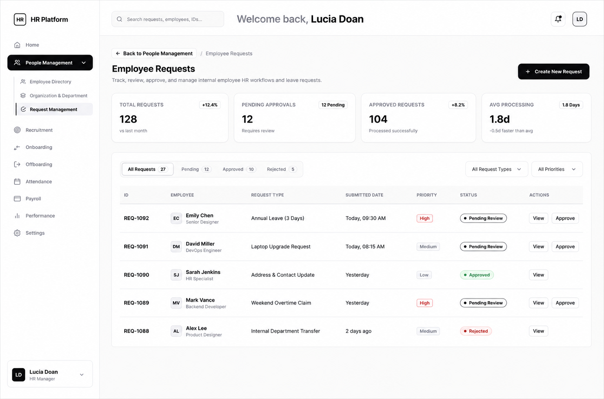
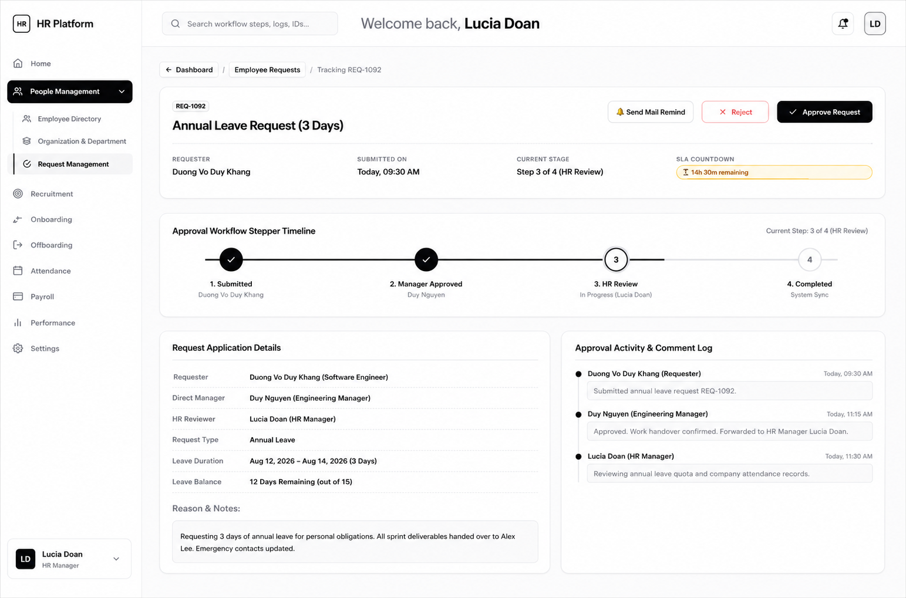
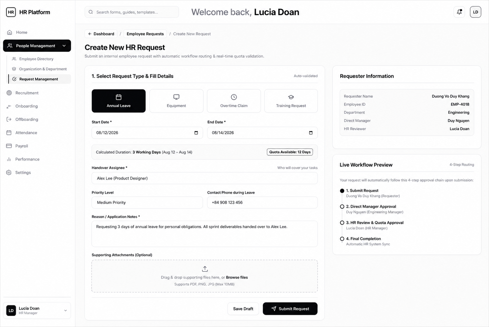

# Information Architecture & UI/UX Design Specifications

## 🎨 Design & Sitemap Links

- **Figma UI/UX Design**: [People Management Figma Wireframe](https://www.figma.com/design/D35Ut0x0TXeRGMjvLaNiIt/PeopleManagement?node-id=28-738&t=WYHn3MBdNy4BoqU3-0)
- **Relume Sitemap Project**: [Monitoring HR Relume Sitemap](https://www.relume.ai/app/project/P3513106_M_AsmXcsz2LE9p9i5egRRtV2aMuaJQ4-Pj5YjjiDkKo)

---

## 📁 Implemented Prototype Structure

### 1. People Management Dashboard
- **HTML**: [`IA/html/PeopleManagement.html`](html/PeopleManagement.html)
- **JS**: [`IA/js/PeopleManagement.js`](js/PeopleManagement.js)

- **Features**:
  - Unified Monochrome Wireframe Design System (Grayscale palette, 1px line-art borders).
  - Sidebar Navigation with `Home`, `People Management`, `Recruitment`, `Onboarding`, `Offboarding`, `Attendance`, `Payroll`, `Performance`, `Settings`.
  - Sub-sidebar Navigation under `People Management` (`Employee Directory`, `Organization & Department`, `Request Management`).
  - User Avatar at bottom sidebar (`Lucia Doan` - HR Manager) with Pop-up Menu (`Sign Out`, `Update Version`, `Help`).
  - Top Header with search bar and welcome message `Welcome back, Lucia Doan`.
  - KPI Metric cards with right-aligned percentage comparison trend badges (`+5.2%`, `+3.1%`, `0.0%`, `-12.5%`).
  - Task Activity Board in Kanban format (`Task` $\rightarrow$ `In Progress` $\rightarrow$ `Done`). Click cards to transition to Tracking Request.

### 2. Employee Requests Module
- **HTML**: [`IA/html/people_management/RequestManagement.html`](html/people_management/RequestManagement.html)
- **JS**: [`IA/js/people_management/RequestManagement.js`](js/people_management/RequestManagement.js)

- **Features**:
  - Direct workflow transition from `People Management` $\rightarrow$ `Employee Requests`.
  - Filter Tabs (`All Requests`, `Pending`, `Approved`, `Rejected`) and Select Dropdowns for Type & Priority.
  - Interactive Requests Data Table with status indicators.
  - Side Drawer Modal showing full request details, timeline, and quick `Approve` / `Reject` / `Track Timeline` actions.

### 3. Tracking Request Workflow Timeline
- **HTML**: [`IA/html/people_management/TrackingRequest.html`](html/people_management/TrackingRequest.html)
- **JS**: [`IA/js/people_management/TrackingRequest.js`](js/people_management/TrackingRequest.js)

- **Features**:
  - Visual 4-Step Workflow Stepper Timeline (`1. Submitted` $\rightarrow$ `2. Manager Approved` $\rightarrow$ `3. HR Review` $\rightarrow$ `4. Completed`).
  - Personnel Assignment: Requester (`Duong Vo Duy Khang`), Manager (`Duy Nguyen`), HR Manager (`Lucia Doan`).
  - SLA Countdown Badge (`14h 30m remaining for HR approval`).
  - Symmetric Sized Action Buttons (`Approve Request` & `Reject`).

### 4. Create New HR Request (Dynamic Smart Form)
- **HTML**: [`IA/html/people_management/CreateRequest.html`](html/people_management/CreateRequest.html)
- **JS**: [`IA/js/people_management/CreateRequest.js`](js/people_management/CreateRequest.js)

- **Features**:
  - Interactive Request Type Selection (Annual Leave, Equipment, Overtime Claim, Training Request).
  - Dynamic Form Field Rendering (Fields adjust automatically based on selected request type).
  - Real-time Workday & Quota Auto-Calculation (Automatically calculates working days excluding weekends & checks 12-day leave quota).
  - Live 4-Step Workflow Preview (Shows exact routing chain from Requester $\rightarrow$ Duy Nguyen $\rightarrow$ Lucia Doan $\rightarrow$ System Sync).
  - Drag & drop attachment dropzone and draft saving support.
