# HR Management Platform - System Sitemap & Information Architecture

This document provides the official Information Architecture (IA) and Sitemap for the **HR Management & Productivity Platform**, structured according to the full module hierarchy across **Home**, **People Management**, **Recruitment & ATS**, **Onboarding**, and **Offboarding**.

---

## 1. Visual Sitemap Flowchart (Flowchart Diagram)

```mermaid
flowchart TD
    %% Root Navigation Shell
    ROOT["🏠 HR Platform Shell"]

    %% Main Page Routes
    ROOT --> HOME["1. Home (Executive Hub)"]
    ROOT --> PPL["2. People Management"]
    ROOT --> REC["3. Recruitment & ATS"]
    ROOT --> ONB["4. Onboarding"]
    ROOT --> OFF["5. Offboarding"]

    %% 1. Home Sub-pages & Components
    HOME --> H_COMP["Clearance Matrix | Data Widgets | Statistics | Tasks | Upcoming Schedule"]
    HOME -.-> PPL
    HOME -.-> REC
    HOME -.-> ONB
    HOME -.-> OFF

    %% 2. People Management Nodes
    PPL --> P_EMP["2.1. Employee Directory"]
    PPL --> P_ORG["2.2. Organizational Structure & Hierarchy"]
    PPL --> P_REQ["2.3. Employee Request Hub"]

    P_EMP --> P_EMP_DET["Profile View Detail Drawer (Contract, Personal Info, Time/Leave, Assets)"]
    P_ORG --> P_ORG_MOD["Modals: Create/Edit Dept | Assign Leader | Dept Restructure"]
    P_REQ --> P_REQ_MOD["Modals: Request Form | Approval Timeline Drawer"]

    %% 3. Recruitment & ATS Nodes
    REC --> R_JOB["3.1. Job Openings Board"]
    REC --> R_KAN["3.2. Candidate Pipeline Kanban"]
    REC --> R_INT["3.3. Interview & Offer Management"]

    R_JOB --> R_JOB_MOD["Modals: Create/Edit Requisition | Job Post Approval"]
    R_KAN --> R_KAN_DET["Candidate Profile Detail (Resume, Activity History, Scorecards)"]
    R_INT --> R_INT_MOD["Modals: Schedule Interview | Auto Send Offer | E-Signature View"]

    %% 4. Onboarding Nodes
    ONB --> O_HUB["4.1. NewHire Onboarding Hub"]
    ONB --> O_AST["4.2. Asset Tracker"]
    ONB --> O_DAT["4.3. Candidate Data Conversion"]

    O_HUB --> O_HUB_MOD["Modals: Onboarding Templates | Task Sign-off | Credential Sender"]
    O_AST --> O_AST_MOD["Modals: Assign Hardware/License | Asset Receipt Form | E-Sign Contract"]
    O_DAT --> O_DAT_MOD["Modals: Third-Party ATS Config | Duplicate Check | Convert Profile"]

    %% 5. Offboarding Nodes
    OFF --> F_RES["5.1. Resignation & Exit Requests"]
    OFF --> F_CLR["5.2. Department Clearance"]
    OFF --> F_SET["5.3. Access Revocation & Settlement"]

    F_RES --> F_RES_MOD["Modals: Resignation Form | Clearance Approval Drawer | Notice Period Config"]
    F_CLR --> F_CLR_MOD["Modals: Asset Return Drawer | Knowledge Transfer | Department Sign-off"]
    F_SET --> F_SET_MOD["Modals: Access Revocation | Severance Settlement"]
```

---

## 2. Detailed Information Architecture & Page Specifications

### 2.1. Page: Home (`/home`)
* **Goal:** Central executive dashboard providing real-time statistics, data widgets, clearance matrix, and upcoming schedules.
* **Core Components:**
  * **Department Clearance Matrix:** Cross-department clearance status overview for onboarding/offboarding personnel.
  * **Data Widgets:** Quick KPI summaries (Headcount, Open Positions, Active Onboarding, Pending Approvals).
  * **Dashboard Statistics:** Attendance rates, turnover analytics, and productivity score trends.
  * **Timeline Task:** Interactive activity stream of pending HR tasks, approvals, and reminders.
  * **Upcoming Scheduling:** Calendar agenda for interviews, orientation sessions, and shift changes.
* **Sub-page Routes / Navigation:**
  * `People Management`
  * `Recruitment & ATS`
  * `Onboarding`
  * `Offboarding`

---

### 3.2. Page: People Management (`/people`)
* **Goal:** Main hub for personnel management, structural hierarchy, and employee request workflows.
* **Core Components:**
  * **Employee Information:** Centralized employee dataset and directory overview.
  * **Organization & Department:** Structural management of company divisions and sub-units.
  * **Request Management:** Oversight of employee leave, equipment, and administrative claims.
* **Sub-pages:**
  * `Employee Directory`
  * `Organizational Structure & Hierarchy`
  * `EMPLOYEE REQUEST`

---

### 3.3. Page: Employee Directory (`/people/directory`)
* **Goal:** Searchable and filterable roster of all company employees with slide-over detail views.
* **Core Components:**
  * **Table View Data:** Grid/Table listing employee names, IDs, departments, roles, contact info, and status pills.
  * **Employee Profile:** Compact summary card for individual staff members.
* **Sub-pages & Drawers:**
  * **Profile View Detail Drawer:**
    * **Contract & Document:** Employment contracts, NDAs, tax forms, and uploaded IDs.
    * **Overview & Personal Info:** Full name, DOB, phone, email, emergency contacts, bank accounts.
    * **Time, Leave & Attendance:** Shift history, remaining leave balance, punctuality record.
    * **Asset & Equipment:** List of hardware assets, serial numbers, and software licenses issued.

---

### 3.4. Page: Organizational Structure & Hierarchy (`/people/org-structure`)
* **Goal:** Visual tree canvas and master list for department architecture and reporting lines.
* **Core Components:**
  * **Org Chart Canvas:** Interactive graphical chart depicting CEO ➔ Divisions ➔ Departments ➔ Sub-teams.
  * **Department Master List View:** Tabular listing of departments, department leads, headcount, and budget.
  * **Department Detail View:** Dedicated breakdown of department scope, teams, and assigned personnel.
* **Sub-pages & Modals:**
  * **Modals & Action Screens:**
    * **Create / Edit Department Modal:** Form to configure department name, parent department, budget, and description.
    * **Assign / Reassign Department Leader Modal:** Selector tool to designate or transfer Department Leads/Managers.
    * **Department Restructure & Employee Transfer Modal:** Bulk workflow to merge departments or transfer staff between units.

---

### 3.5. Page: EMPLOYEE REQUEST (`/people/requests`)
* **Goal:** Central workflow hub for receiving, reviewing, and approving employee requests.
* **Core Components:**
  * **Employee Request Hub:** Dashboard tracking all incoming leave, OT, equipment, and training requests.
  * **Tracking Request:** Real-time stepper status monitor tracking approval progress across management layers.
* **Sub-pages & Modals:**
  * **Request Form Modal:**
    * **Request Form:** Dynamic smart form adapting fields based on request type (Leave, Equipment, OT).
    * **Request Detail & Approval Timeline Drawer:** Side-drawer presenting request details, attached files, SLA timers, and `Approve`/`Reject` action buttons.

---

### 3.6. Page: Recruitment & ATS (`/recruitment`)
* **Goal:** End-to-end recruitment management from job posting to candidate evaluation and offer letter signing.
* **Core Components:**
  * **Job Openings & Requisitions:** Master list of hiring requisitions and active job postings.
  * **Candidate Pipeline & Management:** Multi-stage applicant tracking from Application ➔ Interview ➔ Offer.
  * **Interview & Offer Management:** Interview scheduling, scorecard collection, and offer letter dispatch.
* **Sub-pages:**
  * `Job Openings Board`
  * `Candidate Pipeline Kanban`
  * `Interview & Offer Management Modal / Screen`

---

### 3.7. Page: Job Openings Board (`/recruitment/jobs`)
* **Goal:** Operational board managing job requisitions across all departments.
* **Core Components:**
  * **Department Clearance Matrix:** Recruitment quota and headcount gap matrix per department.
  * **Job Opening Detail View:** Full job description, salary range, required skills, and hiring team assignment.
* **Sub-pages & Modals:**
  * **Job Creation & Edit Modals:**
    * **Create / Edit Job Requisition Form:** Form to draft job openings, required experience, and budget code.
    * **Job Post Approval Workflow Modal:** Multi-step approval chain for HR Directors and Finance Leads before publishing.

---

### 3.8. Page: Candidate Pipeline Kanban (`/recruitment/pipeline`)
* **Goal:** Drag-and-drop Kanban view tracking candidates through recruitment stages.
* **Core Components:**
  * **Candidate Pipeline Kanban Board:** Kanban columns (Applied ➔ Screening ➔ Tech Interview ➔ Manager Interview ➔ Offer ➔ Hired).
  * **Candidate Data Table View:** Alternative tabular list view with search, filter, and sorting.
* **Sub-pages & Drawers:**
  * **Candidate Profile Detail:**
    * **Resume & Application Info:** Uploaded PDF resume parsing, contact info, and cover letter.
    * **Candidate Stage Activity History:** Chronological log of stage transitions, emails sent, and notes.
    * **Interview Scorecards & Notes:** Evaluator ratings, technical scores, and interviewer feedback.

---

### 3.9. Page: Interview & Offer Management Modal / Screen (`/recruitment/offers`)
* **Goal:** Management screen for scheduling interviews and tracking digital offer letter delivery.
* **Core Components:**
  * **Department Clearance Matrix:** Pre-offer headcount clearance verification.
  * **Offer Letter Tracker Table:** Status table of sent offer letters (Draft, Sent, Viewed, Signed, Declined).
* **Sub-pages & Modals:**
  * **Interview & Offer Modals:**
    * **Schedule Interview Modal:** Google Calendar / Outlook integration to pick time slots and interviewers.
    * **Auto Send Offer Letter Form:** Automated template generator with dynamic salary, start date, and benefits.
    * **Offer Acceptance & E-Signature View:** Digital signing portal view tracking e-signatures.

---

### 3.10. Page: Onboarding (`/onboarding`)
* **Goal:** Structured onboarding hub for newly hired employees, asset provisioning, and data conversion.
* **Core Components:**
  * **NewHire Onboarding Hub:** Orientation milestone tracking and welcome workflows.
  * **Asset Tracker:** IT hardware, keycards, and software access management.
  * **Candidate Data:** Data conversion bridge converting hired candidates into employee profiles.
* **Sub-pages:**
  * `Asset Tracker`
  * `NewHire Onboarding Hub`
  * `Candidate Data`

---

### 3.11. Page: Asset Tracker (`/onboarding/assets`)
* **Goal:** Provisioning table and handover log for IT hardware and company assets.
* **Core Components:**
  * **IT Asset & Equipment Provisioning Table:** Inventory tracking laptops, monitors, mobile devices, and serial numbers.
  * **Onboarding Document & E-Signature Hub:** Storage for signed asset policies, compliance agreements, and tax forms.
* **Sub-pages & Modals:**
  * **Handover & Sign-off Modals:**
    * **Assign Hardware & Software License Modal:** Form to assign laptop serials and software accounts (Slack, Email, Jira).
    * **Digital Asset Handover Receipt Form:** Digital receipt form signed by new hires upon asset receipt.
    * **E-Sign Tax and Employment Contract Drawer:** Side-drawer for completing digital employment onboarding contracts.

---

### 3.12. Page: NewHire Onboarding Hub (`/onboarding/hub`)
* **Goal:** Orientation checklist execution and onboarding task tracking for managers and HR.
* **Core Components:**
  * **Department Clearance Matrix:** Verification matrix ensuring departmental setup completion.
  * **Orientation Workflow View:** 30-60-90 day orientation roadmap and buddy assignment.
* **Sub-pages & Modals:**
  * **Onboarding Checklist and Task Modals:**
    * **Create and Assign Onboarding Template Form:** Template builder for department-specific onboarding task lists.
    * **Task Approval and Manager Sign-off Drawer:** Manager review panel to sign off completed onboarding milestones.
    * **Welcome Email and Portal Credential Sender Modal:** Automated dispatch tool for welcome emails and temporary passwords.

---

### 3.13. Page: Candidate Data (`/onboarding/candidate-conversion`)
* **Goal:** Data mapping engine converting recruitment ATS records into official employee profiles.
* **Core Components:**
  * **Department Clearance Matrix:** Clearance validation prior to profile creation.
  * **Candidate Field Mapping and Data Conversion Screen:** Data mapping interface (ATS fields ➔ HRIS database schema).
* **Sub-pages & Modals:**
  * **External Integration Modals:**
    * **Third-Party ATS API Key and Webhook Config:** Integration modal for Greenhouse, Lever, Workable APIs.
    * **Candidate Data Conflict and Duplicate Check:** Deduplication algorithm identifying duplicate SSNs or emails.
    * **One-Click Convert Candidate to Employee Profile:** Execution modal provisioning employee ID and initial contract.

---

### 3.14. Page: Offboarding (`/offboarding`)
* **Goal:** Complete offboarding workflow management, asset returns, clearance sign-offs, and final settlements.
* **Core Components:**
  * **Resignation & Exit Requests:** Processing employee resignations and termination notices.
  * **Department Clearance:** Inter-departmental sign-off matrix (IT, Finance, HR, Direct Manager).
  * **Access Revocation & Settlement:** Revoking credentials and calculating final payroll severance.
* **Sub-pages:**
  * `Resignation & Exit Requests`
  * `Department Clearance`
  * `Access Revocation & Settlement`

---

### 3.15. Page: Resignation & Exit Requests (`/offboarding/requests`)
* **Goal:** Central tracker for employee resignation notices and exit requests.
* **Core Components:**
  * **Resignation Requests Table:** List of active resignation notices, submission dates, notice periods, and status.
  * **Offboarding Tracker View:** Step-by-step progress monitor from notice submission to final day.
* **Sub-pages & Modals:**
  * **Resignation Request Modals:**
    * **Resignation Form:** Form to log resignation reason, last working day, and handover notes.
    * **Clearance Approval Drawer:** Management drawer for approving resignation and establishing exit timeline.
    * **Notice Period Config:** Settings drawer to configure standard notice period duration (30 days / 60 days).

---

### 3.16. Page: Department Clearance (`/offboarding/clearance`)
* **Goal:** Cross-department clearance tracking ensuring complete asset return and task handovers.
* **Core Components:**
  * **Department Clearance Matrix:** Departmental sign-off matrix (IT Asset Return, Finance Loan Settlement, HR Exit Interview, Manager Handover).
  * **Asset Return Table:** Checklist of issued items to be physically returned before exit.
* **Sub-pages & Modals:**
  * **Department Clearance Modals:**
    * **Asset Return Drawer:** Inspection form for returned laptops/keycards noting condition or damage fees.
    * **Knowledge Transfer Drawer:** Sign-off form confirming project documentation and task handover completion.
    * **Department Sign-off Modal:** Final departmental clearance confirmation modal.

---

### 3.17. Page: Access Revocation & Settlement (`/offboarding/settlement`)
* **Goal:** Automated system account revocation, exit analytics, and severance payroll processing.
* **Core Components:**
  * **Access Revocation Hub:** Single-click engine to revoke email, VPN, timer app, and portal access permissions.
  * **Exit Reason Analytics:** Graphical charts analyzing exit survey trends and employee turnover root causes.
* **Sub-pages & Modals:**
  * **Settlement Modals:**
    * **Access Revocation Modal:** Automated security execution modal revoking all SSO and active sessions.
    * **Severance Settlement Modal:** Final payroll calculation modal compiling unused leave payouts, last salary, and deductions.

---

## 4. Complete Sitemap Mapping Matrix

| Page Name | Main Features & Widgets | Sub-pages & Views | Action Modals & Drawers |
| :--- | :--- | :--- | :--- |
| **Home** | Department Clearance Matrix, Data Widgets, Statistics, Timeline Task, Upcoming Schedule | People Management, Recruitment & ATS, Onboarding, Offboarding | Quick Action Shortcuts |
| **People Management** | Employee Info, Org & Department, Request Management | Employee Directory, Org Structure, EMPLOYEE REQUEST | Master Action Drawer |
| **Employee Directory** | Table View Data, Employee Profile Cards | Profile View Detail | Contract, Personal Info, Time/Leave, Asset Drawers |
| **Organizational Structure** | Org Chart Canvas, Department Master List, Dept Detail View | Modals & Action Screens | Create/Edit Dept, Assign Leader, Restructure Modals |
| **EMPLOYEE REQUEST** | Request Hub, Tracking Request Timeline | Request Form Modal | Smart Request Form, Approval Timeline Drawer |
| **Recruitment & ATS** | Job Requisitions, Candidate Pipeline, Interview & Offer Hub | Job Openings Board, Candidate Pipeline, Interview & Offer | Pipeline Configuration Modals |
| **Job Openings Board** | Department Clearance Matrix, Job Opening Detail View | Job Creation & Edit Modals | Create/Edit Requisition, Approval Workflow Modal |
| **Candidate Pipeline Kanban** | Pipeline Kanban Board, Candidate Data Table View | Candidate Profile Detail | Resume Info, Stage History, Scorecards & Notes |
| **Interview & Offer** | Clearance Matrix, Offer Letter Tracker Table | Interview & Offer Modals | Schedule Interview, Send Offer, E-Sign Acceptance |
| **Onboarding** | NewHire Onboarding Hub, Asset Tracker, Candidate Data | Asset Tracker, Onboarding Hub, Candidate Data | Onboarding Master Drawer |
| **Asset Tracker** | IT Provisioning Table, Document & E-Sign Hub | Handover & Sign-off Modals | Assign Hardware/License, Asset Receipt, E-Sign Contract |
| **NewHire Onboarding Hub**| Clearance Matrix, Orientation Workflow View | Onboarding Checklist & Task Modals | Create Template Form, Task Sign-off Drawer, Credential Sender |
| **Candidate Data** | Clearance Matrix, Candidate Field Mapping Screen | External Integration Modals | Third-Party ATS API, Duplicate Check, Convert Profile Modal |
| **Offboarding** | Resignation Requests, Department Clearance, Access Settlement | Resignation Requests, Department Clearance, Access Revocation | Offboarding Master Hub |
| **Resignation & Exit** | Resignation Requests Table, Offboarding Tracker View | Resignation Request Modals | Resignation Form, Clearance Approval Drawer, Notice Config |
| **Department Clearance** | Department Clearance Matrix, Asset Return Table | Department Clearance Modals | Asset Return Drawer, Knowledge Transfer, Dept Sign-off Modal |
| **Access & Settlement** | Access Revocation Hub, Exit Reason Analytics | Settlement Modals | Access Revocation Execution, Severance Settlement Modal |
