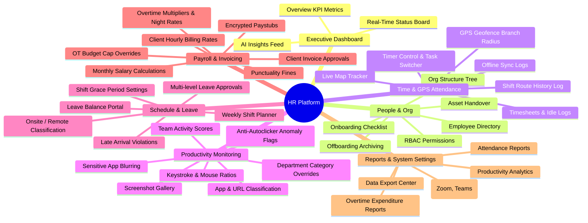

# HR Management Platform - System Sitemap & Information Architecture

This document provides the overall Information Architecture (IA) and Sitemap for the **HR Management & Productivity Platform**, optimized for a Single-Page Application (SPA) Web Dashboard layout.

---

## 1. Visual Sitemap Flowchart (Flowchart Diagram)

```mermaid
flowchart TD
    %% Root App Shell
    ROOT["🏠 HR Management Platform (App Shell)"]

    %% Global Header Controls
    ROOT --- HEADER["Global Header: Tenant Selector | Global Search | Anomaly Notifications | User Profile"]

    %% 7 Main Navigation Routes
    ROOT --> DASH["1. Executive Dashboard & Insights"]
    ROOT --> PPL["2. People Management & Org"]
    ROOT --> TIME["3. Time Tracking & GPS Attendance"]
    ROOT --> PROD["4. Productivity & Activity Monitoring"]
    ROOT --> SCHED["5. Scheduling & Time-Off"]
    ROOT --> PAY["6. Payroll & Client Invoicing"]
    ROOT --> REP["7. Reports & System Settings"]

    %% 1. Executive Dashboard Nodes
    DASH --> D1["Overview KPI Metrics Widget"]
    DASH --> D2["Real-time Employee Status Board"]
    DASH --> D3["AI Insights & Anomaly Feed"]

    %% 2. People & Org Nodes
    PPL --> P1["Employee Directory Grid"]
    P1 -.-> P1_M["Drawer: Employee Profile & Contract"]
    PPL --> P2["Interactive Org Structure Tree"]
    PPL --> P3["Onboarding & Offboarding Workflows"]
    PPL --> P4["RBAC Role & Permission Matrix"]

    %% 3. Time & GPS Attendance Nodes
    TIME --> T1["Timer Session & Timesheets Tab"]
    T1 -.-> T1_M["Modal: Idle Time Warning & Manual Request"]
    TIME --> T2["GPS Geofence Branch Settings"]
    TIME --> T3["Live Map Location & Shift Route History"]

    %% 4. Productivity Monitoring Nodes
    PROD --> PR1["Multi-Monitor Screenshot Gallery"]
    PR1 -.-> PR1_M["Modal: Sensitive App Blur / Unlock View"]
    PROD --> PR2["Keystroke & Mouse Activity Ratios"]
    PROD --> PR3["App & URL Categorization Rules"]
    PROD --> PR4["Weighted Activity Score Dashboard"]

    %% 5. Scheduling & Time-Off Nodes
    SCHED --> S1["Weekly Shift Planner Grid"]
    SCHED --> S2["Leave & Time-off Balance Portal"]
    S2 -.-> S2_M["Modal: Submit Leave Request with Medical Notes"]
    SCHED --> S3["Attendance Grace Period & Tardiness Penalties"]

    %% 6. Payroll & Invoicing Nodes
    PAY --> PY1["Automated Monthly Salary Calculation Sheet"]
    PAY --> PY2["Overtime (OT) Multipliers & Budget Cap Alerts"]
    PAY --> PY3["Client Billable Hours & Invoice Approval"]

    %% 7. Reports & Settings Nodes
    REP --> R1["Attendance & Productivity Analytics Summary"]
    REP --> R2["Data Export Center (CSV / PDF / Excel)"]
    REP --> R3["System Settings & Third-Party Integrations"]
```

---

## 2. Visual Sitemap Hierarchy (Mindmap View)

---

## 3. Detailed Structure of 7 Main Routes

### 3.1. Executive Dashboard & Insights (`/dashboard`)
* **Goal:** Provides real-time overview of personnel, work hours, and anomaly alerts.
* **UI Components:**
  * **Header Toolbar:** Quick filters by Date, Department, and Branch.
  * **KPI Summary Cards:** Total Work Hours, Attendance Rate, Average Productivity Score, Estimated OT Expense.
  * **Real-time Status Board:** Employee status list (Online, Idle, Out-of-geofence, On Leave).
  * **AI Insights & Anomaly Panel:** Automated alert feed (Social media > 30m, Auto-clicker detection, Unexcused absence).

### 3.2. People Management & Org (`/people`)
* **Goal:** Manages complete employee lifecycle from Onboarding to Offboarding and Permissions.
* **Tabs & Layout:**
  * **Tab 1: Employee Directory:** Roster table + Search/Filter. Click row ➔ Open *Slide-over Drawer* for detailed profile.
  * **Tab 2: Org Structure Tree:** Interactive company hierarchy tree (Company ➔ Department ➔ Team).
  * **Tab 3: Onboarding & Offboarding:** Task assignment checklists, hardware asset handover management.
  * **Tab 4: Role & Permission (RBAC):** Role-based action permission matrix (Admin-Tenant, Director, Manager, Staff).

### 3.3. Time Tracking & GPS Attendance (`/time-attendance`)
* **Goal:** Real-time Desktop/Mobile time tracking and field GPS location geofencing.
* **Tabs & Layout:**
  * **Tab 1: Timer & Timesheets:** Daily/weekly timesheet views, locked hours, idle time blocks.
  * **Tab 2: GPS Geofence Branch:** Lat/Long coordinates and perimeter radius setup per branch.
  * **Tab 3: Live Map & Route History:** Satellite map displaying field staff locations and movement route logs.

### 3.4. Productivity Monitoring (`/productivity`)
* **Goal:** Transparent work activity monitoring via screen captures and activity metrics.
* **UI Components:**
  * **Screenshot Gallery Grid:** Random hourly screen capture grid. Automatic blurring for sensitive apps (Banking, Passwords).
  * **Activity Metrics Panel:** Keyboard/mouse ratio charts per hour, Anomaly flags (Auto-clicker detection).
  * **App & Website Rules:** App/URL categorization rules (Productive, Unproductive, Neutral) with department overrides.

### 3.5. Scheduling & Time-Off (`/scheduling`)
* **Goal:** Shift roster planning, leave request workflows, and tardiness reconciliation.
* **UI Components:**
  * **Shift Planner Grid:** Weekly roster calendar matrix (Morning/Afternoon/Night shifts, Onsite/Remote).
  * **Leave Portal:** Annual leave balance tracker + Submit request button (Pop-up upload for medical notes).
  * **Attendance Reconciliation:** Grace period configuration (15m allowance) and punctuality violation logs.

### 3.6. Payroll & Invoicing (`/payroll`)
* **Goal:** Automated monthly payroll processing, overtime compensation, and client project invoicing.
* **UI Components:**
  * **Monthly Salary Sheet Table:** Automated payroll sheet integrating timesheets, tardiness deductions, encrypted PDF paystub export.
  * **Overtime (OT) Controls:** OT multiplier setup (150%, 200%, 300%), Night shift allowance, OT budget cap progress bar.
  * **Client Invoicing:** Filter billable project hours, apply hourly rate cards, export invoices to Client Portal.

### 3.7. Reports & System Settings (`/settings`)
* **Goal:** Comprehensive report extraction and third-party integration settings.
* **UI Components:**
  * **Analytics Center:** Deep-dive trend charts (Attendance Trends, Productivity Heatmap).
  * **Data Export:** Export report center for Excel / CSV / PDF formats.
  * **Integrations:** Integration setup for Zoom, Microsoft Teams, and Slack API.
