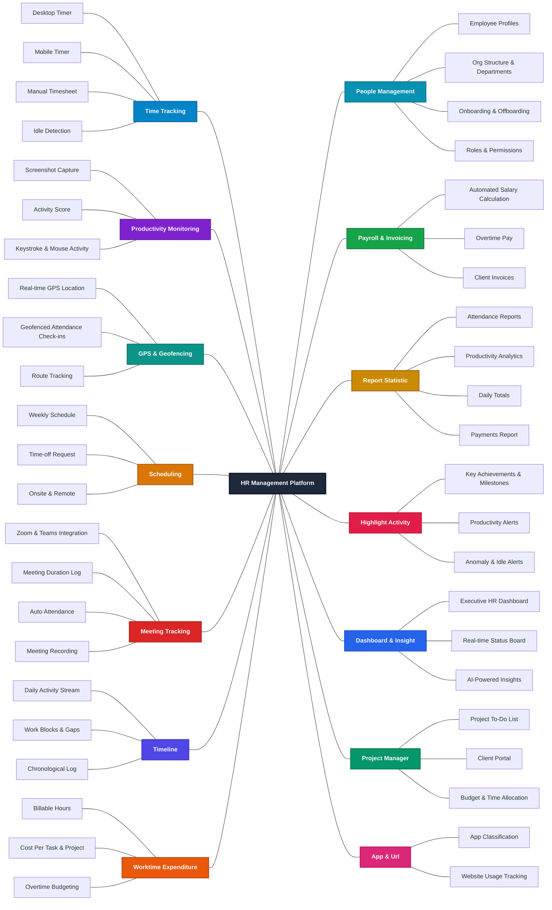

# HR Management Platform 
## Mindmap 2 layers

| Operational & Tracking | Management & Analytics |
| :--- | :--- |
| **1. Time Tracking** - Desktop Timer, Mobile Timer, Manual Timesheet, Idle Detection | **8. People Management** - Employee Profiles, Org Structure & Departments, Onboarding & Offboarding, Roles & Permissions |
| **2. Productivity Monitoring** - Screenshot Capture, Activity Score, Keystroke & Mouse Activity | **9. Payroll & Invoicing** - Automated Salary Calculation, Overtime Pay, Client Invoices |
| **3. GPS & Geofencing** - Real-time GPS Location, Geofenced Attendance Check-ins, Route Tracking | **10. Report Statistic** - Attendance Reports, Productivity Analytics, Daily Totals, Payments Report |
| **4. Scheduling** - Weekly Schedule, Time-off Request, Onsite & Remote | **11. Highlight Activity** - Key Achievements & Milestones, Productivity Alerts, Anomaly & Idle Alerts |
| **5. Meeting Tracking** - Zoom & Teams Integration, Meeting Duration Log, Auto Attendance, Meeting Recording | **12. Dashboard & Insight** - Executive HR Dashboard, Real-time Status Board, AI-Powered Insights |
| **6. Timeline** - Daily Activity Stream, Work Blocks & Gaps, Chronological Log | **13. Project Manager** - Project To-Do List, Client Portal, Budget & Time Allocation |
| **7. Worktime Expenditure** - Billable Hours, Cost Per Task & Project, Overtime Budgeting | **14. App & Url** - App Classification, Website Usage Tracking |