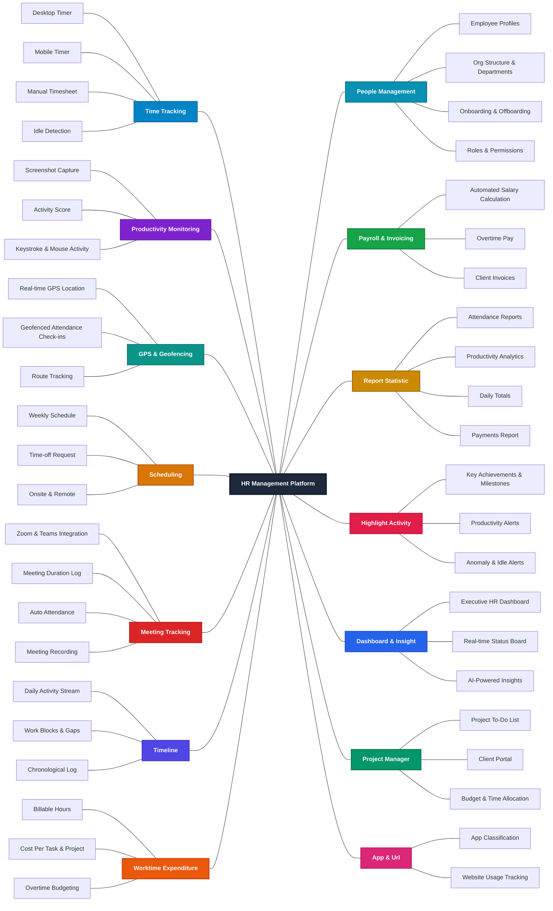
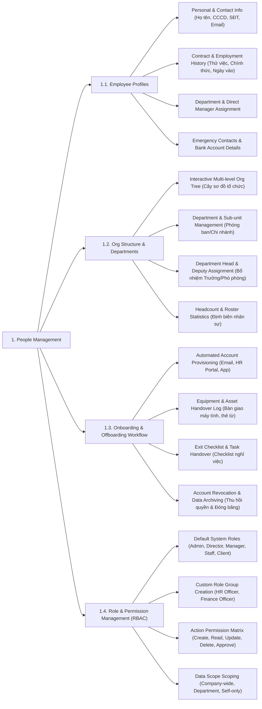
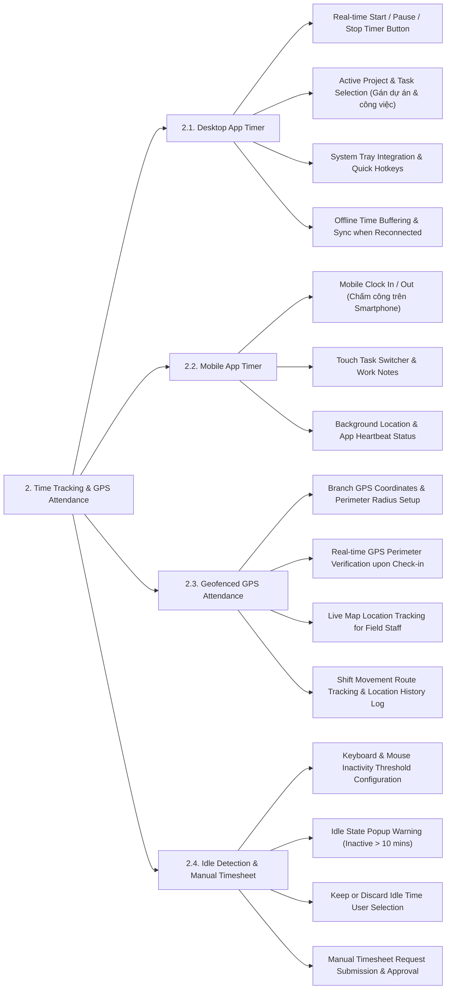
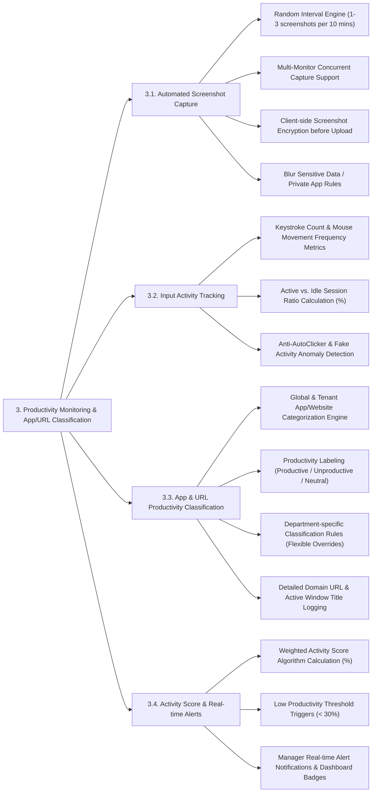
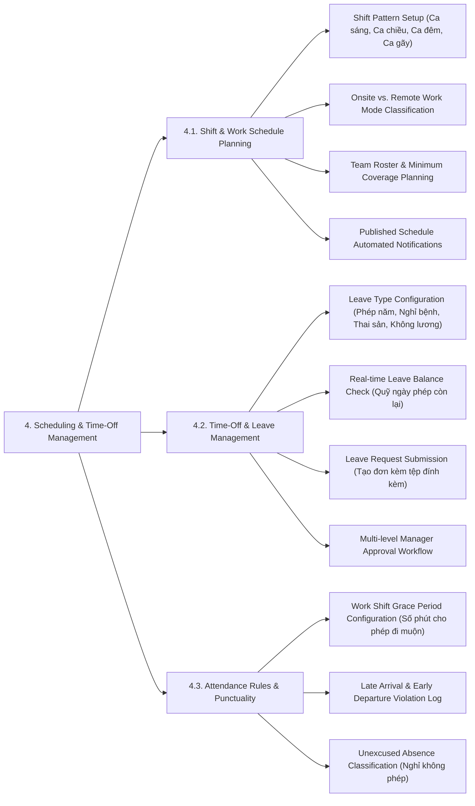
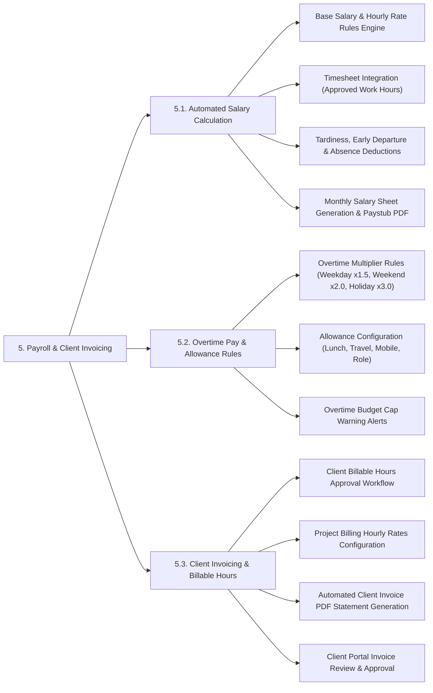

# HR Management Platform
## Mindmap 2 layers

| No. | Main Feature | Feature List |
| :---: | :--- | :--- |
| 1 | **Time Tracking** | Desktop Timer, Mobile Timer, Manual Timesheet, Idle Detection |
| 2 | **Productivity Monitoring** | Screenshot Capture, Activity Score, Keystroke & Mouse Activity |
| 3 | **GPS & Geofencing** | Real-time GPS Location, Geofenced Attendance Check-ins, Route Tracking |
| 4 | **Scheduling** | Weekly Schedule, Time-off Request, Onsite & Remote |
| 5 | **Meeting Tracking** | Zoom & Teams Integration, Meeting Duration Log, Auto Attendance, Meeting Recording |
| 6 | **Timeline** | Daily Activity Stream, Work Blocks & Gaps, Chronological Log |
| 7 | **Worktime Expenditure** | Billable Hours, Cost Per Task & Project, Overtime Budgeting |
| 8 | **People Management** | Employee Profiles, Org Structure & Departments, Onboarding & Offboarding, Roles & Permissions |
| 9 | **Payroll & Invoicing** | Automated Salary Calculation, Overtime Pay, Client Invoices |
| 10 | **Report Statistic** | Attendance Reports, Productivity Analytics, Daily Totals, Payments Report |
| 11 | **Highlight Activity** | Key Achievements & Milestones, Productivity Alerts, Anomaly & Idle Alerts |
| 12 | **Dashboard & Insight** | Executive HR Dashboard, Real-time Status Board, AI-Powered Insights |
| 13 | **Project Manager** | Project To-Do List, Client Portal, Budget & Time Allocation |
| 14 | **App & Url** | App Classification, Website Usage Tracking |

---

## Core Subsystem Feature Mindmaps & Flowcharts

This section details the 3 level feature breakdown flowcharts for the **Top 5 Essential Core Subsystems** of the HR Management Platform. Detailed documentation for each feature is available in [`docs/mindmap/`](docs/mindmap/).

### 1. People Management
Detailed Specifications: [`docs/mindmap/PeopleManagement.md`](docs/mindmap/PeopleManagement.md)

---

### 2. Time Tracking & GPS Attendance
Detailed Specifications: [`docs/mindmap/TimeTracking.md`](docs/mindmap/TimeTracking.md)

---

### 3. Productivity Monitoring & App/URL Classification
Detailed Specifications: [`docs/mindmap/ProductivityMonitoring.md`](docs/mindmap/ProductivityMonitoring.md)

---

### 4. Scheduling & Time-Off Management
Detailed Specifications: [`docs/mindmap/SchedulingLeave.md`](docs/mindmap/SchedulingLeave.md)

---

### 5. Payroll & Client Invoicing
Detailed Specifications: [`docs/mindmap/PayrollInvoicing.md`](docs/mindmap/PayrollInvoicing.md)

---

## System Actors Specification

The system identifies 6 primary actors in the Multi-Tenant HR Management Platform architecture:

| No. | Actor Code | Actor Name | Role Description & Scope of Authority |
| :--- | :--- | :--- | :--- |
| 1 | **ACT-01** | **System-Admin** | Super Administrator for the platform. Manages tenant accounts, subscription plans, platform quota limits, system monitoring, and global audit logs. |
| 2 | **ACT-02** | **Admin-Tenant** | Administrator for a specific tenant organization. Configures organizational structure, departments, roles & permissions, attendance policies, app/URL classifications, payroll rules, and client invoicing. |
| 3 | **ACT-03** | **Director** | Executive / C-Level manager. Views executive dashboards, AI-powered insights, company-wide productivity & financial reports, and manages overtime budgeting. |
| 4 | **ACT-04** | **Manager** | Department Head / Project Manager. Manages weekly work schedules, approves time-off requests, tracks project to-do lists, monitors real-time status, and reviews anomaly/idle alerts. |
| 5 | **ACT-05** | **Staff** | Internal Employee. Clocks in/out via Desktop/Mobile/GPS Geofencing timers, submits leave requests, views work schedules, attends integrated meetings, and tracks personal daily timelines. |
| 6 | **ACT-06** | **Client** | External Client / Partner. Accesses the Client Portal to track project progress, review billable hours, and view/download invoices. |

---

## Core Use Case Specifications & Architecture Mapping

This section outlines the core Use Cases of the HR Management Platform, mapped directly to system actors and architecture modules.

### 1. Core Use Cases Table

| UC ID | Use Case Name | Feature Module | Primary Actor | Secondary Actor | Description |
| :--- | :--- | :--- | :--- | :--- | :--- |
| **UC-CORE-01** | Tenant Provisioning & Subscription | System & Tenant Admin | System-Admin | System, Email | Initializes new tenant organizations, provisions primary Admin-Tenant credentials, and manages resource quota caps. |
| **UC-CORE-02** | Employee Profiles & Role RBAC | People Management | Admin-Tenant | Manager | Manages employee personal details, contracts, department assignments, and configures custom RBAC permissions. |
| **UC-CORE-03** | Work Timer Clock In/Out | Time Tracking | Staff | System | Toggles work timers on desktop client apps to record actual working hours and automated idle detection. |
| **UC-CORE-04** | Geofenced GPS Attendance Check-in | GPS & Geofencing | Staff | System | Restricts clock-in/out functionality to designated GPS coordinates and branch perimeter radii. |
| **UC-CORE-05** | Screenshot & Activity Tracking | Productivity Monitoring | System | Manager, Staff | Captures screen activity at random intervals and calculates weighted Activity Score (%). |
| **UC-CORE-06** | App & Website Classification | App & URL Classification | Admin-Tenant | Manager | Categorizes software and domain URLs into Productive, Unproductive, or Neutral status. |
| **UC-CORE-07** | Shift & Work Schedule Planning | Scheduling | Manager | Staff | Assigns weekly shift patterns, work locations (Onsite/Remote), and coverage plans. |
| **UC-CORE-08** | Time-off Request & Approval | Scheduling & Leave | Staff | Manager | Submits annual, sick, or personal leave requests for manager approval workflows. |
| **UC-CORE-09** | Project Task & Kanban Management | Project Management | Manager | Staff, Client | Manages project task lists, Kanban boards, task assignments, and estimated hours. |
| **UC-CORE-10** | Billable Hours & Cost Tracking | Worktime Expenditure | Staff | Manager, Client | Flags client-billable work hours and converts logged employee work time into project cost metrics. |
| **UC-CORE-11** | Automated Payroll & Overtime | Payroll & Invoicing | Admin-Tenant | System | Generates salary sheets automatically using timesheet data, shifts, and overtime multiplier rules. |
| **UC-CORE-12** | Executive Dashboard & AI Insights | Dashboard & Insights | Director | Manager | Displays executive-level KPIs, company-wide productivity trends, and AI turnover risk predictions. |

---

### 2. Master System Use Case Overview & Actor Mapping Table

This master table contains **all 91 Use Cases** across the 7 feature subsystems from High-Level (Level 1) down to Detailed Sub-Use Cases (Level 2 & Level 3), explicitly listing their **Hierarchy Level**, **Primary Actor** (initiator), and **Secondary Actor(s)** (supporting users or services):

| UC ID | Use Case Name | Hierarchy Level | Subsystem / Feature Module | Primary Actor | Secondary Actor(s) | Description |
| :--- | :--- | :---: | :--- | :--- | :--- | :--- |
| **UC-SYS-01** | Tenant Provisioning & Subscription | `L1 (High-Level)` | System & Tenant Admin | `System-Admin` | `System Service`, `Email Service` | Initializes new tenant organizations, provisions credentials, and sets quota caps. |
| **UC-SYS-01a** | Assign Default Admin Credentials | `L2 (Sub-UC)` | System & Tenant Admin | `System-Admin` | `System Service` | Provisions primary Admin-Tenant credentials and initial access rights. |
| **UC-SYS-01b** | Send Tenant Welcome Email | `L2 (Sub-UC)` | System & Tenant Admin | `System Service` | `Email Service` | Dispatches automated welcome emails with initial login credentials. |
| **UC-SYS-02** | Tenant Quota & Resource Cap Management | `L1 (High-Level)` | System & Tenant Admin | `System-Admin` | `System Service` | Manages storage, user seat limits, and platform resource caps per tenant. |
| **UC-SYS-02a** | Configure Storage & User Seat Limits | `L2 (Sub-UC)` | System & Tenant Admin | `System-Admin` | `System Service` | Sets max employee seat licenses and cloud screenshot storage limits. |
| **UC-SYS-03** | Global Platform Monitoring & Audit Logs | `L1 (High-Level)` | System & Tenant Admin | `System-Admin` | `System Service` | Tracks system uptime, server health, and platform-wide security audit logs. |
| **UC-SYS-04** | Platform API Key & Integration Management | `L1 (High-Level)` | System & Tenant Admin | `System-Admin` | `System Service` | Issues and revokes API keys for external ERP/HRIS integrations. |
| **UC-PPL-01** | Employee Profile Management | `L1 (High-Level)` | People Management | `Admin-Tenant` | `Manager`, `Staff` | Manages employee personal details, employment contracts, and bank account info. |
| **UC-PPL-01a** | Assign Department & Direct Manager | `L2 (Sub-UC)` | People Management | `Admin-Tenant` | `Manager` | Assigns employees to organizational departments and designates Direct Managers. |
| **UC-PPL-01b** | Record Emergency Contacts & Bank Info | `L2 (Sub-UC)` | People Management | `Admin-Tenant` | `Staff` | Records emergency contacts, tax IDs, and direct deposit bank accounts. |
| **UC-PPL-01c** | Import / Export Employee Records | `L2 (Sub-UC)` | People Management | `Admin-Tenant` | `System Service` | Bulk imports employee profiles from CSV/Excel or exports roster data. |
| **UC-PPL-01d** | Track Employment Contract History | `L2 (Sub-UC)` | People Management | `Admin-Tenant` | `Staff` | Logs probation periods, contract renewals, and salary change history. |
| **UC-PPL-02** | Organizational Structure Setup | `L1 (High-Level)` | People Management | `Admin-Tenant` | `Director`, `Manager` | Builds the multi-level org tree and appoints leadership roles. |
| **UC-PPL-02a** | Build Department & Sub-unit Tree | `L2 (Sub-UC)` | People Management | `Admin-Tenant` | `Manager` | Creates department hierarchies, branch offices, and team sub-units. |
| **UC-PPL-02b** | Assign Department Head & Deputies | `L2 (Sub-UC)` | People Management | `Admin-Tenant` | `Manager` | Appoints Department Heads, Deputy Heads, and Team Lead roles. |
| **UC-PPL-02c** | View Headcount & Roster Statistics | `L2 (Sub-UC)` | People Management | `Director` | `Admin-Tenant` | Displays headcount distribution and department roster capacity stats. |
| **UC-PPL-02d** | Merge / Dissolve Department | `L2 (Sub-UC)` | People Management | `Admin-Tenant` | `Director` | Handles department mergers, restructuring, and member reassignment. |
| **UC-PPL-03** | Onboarding & Offboarding Workflow | `L1 (High-Level)` | People Management | `Admin-Tenant` | `Manager`, `Email Service` | Automates account provisioning, asset handover logs, and exit checklists. |
| **UC-PPL-03a** | Automate Account Provisioning | `L2 (Sub-UC)` | People Management | `Admin-Tenant` | `Email Service` | Provisions Email, HR Portal, and Timer app accounts for new hires. |
| **UC-PPL-03b** | Track Equipment & Asset Handover | `L2 (Sub-UC)` | People Management | `Admin-Tenant` | `Staff` | Logs hardware assets (laptops, monitors, keycards) assigned to staff. |
| **UC-PPL-03c** | Process Exit Checklist & Task Handover | `L2 (Sub-UC)` | People Management | `Admin-Tenant` | `Manager` | Executes task handover checklists and approves resignation workflows. |
| **UC-PPL-03d** | Revoke Access & Archive Account | `L2 (Sub-UC)` | People Management | `Admin-Tenant` | `System Service` | Revokes system permissions and freezes departing employee accounts. |
| **UC-PPL-04** | Role & Permission Management (RBAC) | `L1 (High-Level)` | People Management | `System-Admin` | `Admin-Tenant`, `System Service` | Configures action permission matrices and data scope boundaries. |
| **UC-PPL-04a** | Assign Default System Roles | `L2 (Sub-UC)` | People Management | `System-Admin` | `Admin-Tenant` | Assigns system default roles (Admin, Director, Manager, Staff, Client). |
| **UC-PPL-04b** | Configure Action Permission Matrix | `L2 (Sub-UC)` | People Management | `System-Admin` | `Admin-Tenant` | Sets CRUD and Approval permission checkboxes per feature screen. |
| **UC-PPL-04c** | Create Custom Role Groups | `L2 (Sub-UC)` | People Management | `System-Admin` | `Admin-Tenant` | Defines custom role groups (e.g. HR Officer, Payroll Accountant). |
| **UC-PPL-04d** | Configure Data Scope Scoping | `L2 (Sub-UC)` | People Management | `System-Admin` | `System Service` | Restricts data scope boundaries (Company-wide, Department, Self-only). |
| **UC-TIME-01** | Desktop Work Timer Control | `L1 (High-Level)` | Time Tracking | `Staff` | `Desktop Agent Service` | Toggles real-time work timers on desktop client apps with active task tagging. |
| **UC-TIME-01a** | Select Active Project & Task | `L2 (Sub-UC)` | Time Tracking | `Staff` | `Desktop Agent Service` | Tags current work session with active project and task names. |
| **UC-TIME-01b** | System Tray Integration & Hotkeys | `L2 (Sub-UC)` | Time Tracking | `Staff` | `Desktop Agent Service` | Minimizes timer to System Tray and supports quick hotkeys (`Ctrl+Shift+S`). |
| **UC-TIME-01c** | Buffer Offline Work Time | `L2 (Sub-UC)` | Time Tracking | `Staff` | `Desktop Agent Service` | Stores encrypted work logs locally when Internet connection drops. |
| **UC-TIME-01d** | Sync Offline Timesheet when Reconnected | `L3 (Sub-UC)` | Time Tracking | `Desktop Agent Service` | `System Service` | Synchronizes buffered offline timesheets to cloud servers when online. |
| **UC-TIME-02** | Mobile Clock In / Out & Task Switcher | `L1 (High-Level)` | Time Tracking | `Staff` | `Mobile Service` | Enables mobile check-in/out, task switching, and heartbeat logs for field staff. |
| **UC-TIME-02a** | Touch Task Switcher & Work Notes | `L2 (Sub-UC)` | Time Tracking | `Staff` | `Mobile Service` | Provides touch interface to switch tasks and attach brief work notes. |
| **UC-TIME-02b** | Send App Heartbeat Status | `L2 (Sub-UC)` | Time Tracking | `Mobile Service` | `System Service` | Transmits periodic heartbeat pings to verify active mobile app session. |
| **UC-TIME-02c** | Attach Field Photo Note | `L3 (Sub-UC)` | Time Tracking | `Staff` | `Mobile Service` | Attaches real-time site photos to mobile clock-in records. |
| **UC-TIME-03** | Idle Inactivity Detection & Timesheet | `L1 (High-Level)` | Time Tracking | `Staff` | `Manager`, `Desktop Agent Service` | Detects keyboard/mouse inactivity and submits manual timesheet requests. |
| **UC-TIME-03a** | Detect Keyboard/Mouse Inactivity Threshold | `L2 (Sub-UC)` | Time Tracking | `Desktop Agent Service` | `Staff` | Monitors input inactivity and triggers idle state after 10 mins. |
| **UC-TIME-03b** | Prompt Inactive State Warning Popup | `L2 (Sub-UC)` | Time Tracking | `Desktop Agent Service` | `Staff` | Prompts popup asking user to keep or discard inactive work time. |
| **UC-TIME-03c** | Keep or Discard Idle Time Selection | `L3 (Sub-UC)` | Time Tracking | `Staff` | `Desktop Agent Service` | User chooses to keep valid offline discussions or discard idle time. |
| **UC-TIME-03d** | Submit Manual Timesheet Request | `L3 (Sub-UC)` | Time Tracking | `Staff` | `Manager` | Submits manual timesheet adjustment requests for manager approval. |
| **UC-GPS-01** | Geofenced GPS Check-in | `L1 (High-Level)` | GPS Attendance | `Staff` | `Admin-Tenant`, `Location Service` | Restricts check-in/out to authorized GPS coordinates and branch perimeter radii. |
| **UC-GPS-01a** | Configure Branch GPS Coordinates & Radius | `L2 (Sub-UC)` | GPS Attendance | `Admin-Tenant` | `Location Service` | Sets branch latitude, longitude, and allowed geofence perimeter radius. |
| **UC-GPS-01b** | Verify Real-time GPS Location upon Check-in | `L2 (Sub-UC)` | GPS Attendance | `Location Service` | `Staff` | Compares device GPS coordinates with geofence perimeter radius. |
| **UC-GPS-01c** | Reject Out-of-Perimeter Check-in | `L3 (Sub-UC)` | GPS Attendance | `Location Service` | `Staff` | Blocks check-in attempts outside authorized geofence perimeters. |
| **UC-GPS-02** | Live Map & Shift Route Tracking | `L1 (High-Level)` | GPS Attendance | `Manager` | `Staff`, `GPS Location Service` | Tracks real-time field staff positions on a live map and logs movement routes. |
| **UC-GPS-02a** | Track Real-time Field Staff Position | `L2 (Sub-UC)` | GPS Attendance | `Manager` | `GPS Location Service` | Displays real-time GPS locations of field service staff on interactive map. |
| **UC-GPS-02b** | Log Shift Movement Route History | `L2 (Sub-UC)` | GPS Attendance | `GPS Location Service` | `Manager` | Logs chronological movement route history during active work shifts. |
| **UC-GPS-02c** | Export Route Movement Log | `L3 (Sub-UC)` | GPS Attendance | `Manager` | `System Service` | Exports field staff movement route history logs for auditing. |
| **UC-PROD-01** | Random Automated Screenshot Capture | `L1 (High-Level)` | Productivity Monitoring | `System Service` | `Manager`, `Staff` | Captures multi-monitor screen activity at random intervals with encryption. |
| **UC-PROD-01a** | Multi-Monitor Concurrent Capture | `L2 (Sub-UC)` | Productivity Monitoring | `System Service` | `Desktop Agent Service` | Captures all connected displays simultaneously in multi-monitor setups. |
| **UC-PROD-01b** | Client-side Screenshot Encryption | `L2 (Sub-UC)` | Productivity Monitoring | `Desktop Agent Service` | `System Service` | Encrypts captured screenshots on client device before cloud upload. |
| **UC-PROD-01c** | Blur Sensitive Data & App Window | `L3 (Sub-UC)` | Productivity Monitoring | `Desktop Agent Service` | `Staff` | Blurs sensitive app windows (banking, password managers) automatically. |
| **UC-PROD-02** | Keystroke & Mouse Input Activity | `L1 (High-Level)` | Productivity Monitoring | `Desktop Agent Service` | `Staff` | Measures input activity frequency and detects anti-autoclicker tools. |
| **UC-PROD-02a** | Calculate Active vs Idle Session Ratio (%) | `L2 (Sub-UC)` | Productivity Monitoring | `Desktop Agent Service` | `System Service` | Computes active vs inactive time ratio percentage per minute. |
| **UC-PROD-02b** | Detect Anti-AutoClicker & Fake Activity | `L3 (Sub-UC)` | Productivity Monitoring | `Desktop Agent Service` | `System Service` | Detects artificial mouse jigglers and auto-clicker software anomalies. |
| **UC-PROD-03** | App & Website Classification | `L1 (High-Level)` | Productivity Monitoring | `Admin-Tenant` | `Manager` | Categorizes apps and URLs into Productive, Unproductive, or Neutral status. |
| **UC-PROD-03a** | Assign Productivity Labels | `L2 (Sub-UC)` | Productivity Monitoring | `Admin-Tenant` | `Manager` | Assigns Productive, Unproductive, or Neutral tags to software and URLs. |
| **UC-PROD-03b** | Log Active Window Title & Domain URL | `L2 (Sub-UC)` | Productivity Monitoring | `Desktop Agent Service` | `System Service` | Records specific website domain URLs and active window titles. |
| **UC-PROD-03c** | Configure Department Overrides | `L3 (Sub-UC)` | Productivity Monitoring | `Admin-Tenant` | `Manager` | Sets department-specific rules (e.g. Facebook is Productive for Marketing). |
| **UC-PROD-04** | Activity Score & Real-time Alerts | `L1 (High-Level)` | Productivity Monitoring | `Manager` | `System Service`, `Director` | Computes Activity Score (%) and triggers low-productivity alerts (< 30%). |
| **UC-PROD-04a** | Calculate Weighted Activity Score (%) | `L2 (Sub-UC)` | Productivity Monitoring | `System Service` | `Manager` | Runs weighted algorithm combining input activity and productive app time. |
| **UC-PROD-04b** | Trigger Low Productivity Alert (< 30%) | `L2 (Sub-UC)` | Productivity Monitoring | `System Service` | `Manager` | Triggers alert when employee Activity Score drops below 30% threshold. |
| **UC-PROD-04c** | Dispatch Real-time Push Notification | `L3 (Sub-UC)` | Productivity Monitoring | `System Service` | `Manager` | Sends instant mobile push notification and email alert to Manager. |
| **UC-SCHED-01** | Weekly Shift & Work Schedule Planning | `L1 (High-Level)` | Scheduling & Time-Off | `Manager` | `Staff` | Assigns shift patterns, Onsite/Remote work modes, and publishes rosters. |
| **UC-SCHED-01a** | Assign Shift Patterns | `L2 (Sub-UC)` | Scheduling & Time-Off | `Manager` | `Staff` | Configures morning, afternoon, night, or split shift schedules. |
| **UC-SCHED-01b** | Classify Onsite vs Remote Work Mode | `L2 (Sub-UC)` | Scheduling & Time-Off | `Manager` | `Staff` | Designates whether shift is executed Onsite or Remote/Work-From-Home. |
| **UC-SCHED-01c** | Publish Schedule & Notify Team Roster | `L3 (Sub-UC)` | Scheduling & Time-Off | `Manager` | `Staff` | Dispatches roster notification alerts to assigned staff members. |
| **UC-SCHED-02** | Time-off & Leave Request Management | `L1 (High-Level)` | Scheduling & Time-Off | `Staff` | `Manager`, `Admin-Tenant` | Submits leave requests with attachments and executes multi-level approvals. |
| **UC-SCHED-02a** | Check Available Leave Balance | `L2 (Sub-UC)` | Scheduling & Time-Off | `Staff` | `System Service` | Validates remaining annual leave balance before request submission. |
| **UC-SCHED-02b** | Submit Leave Request with Attachments | `L2 (Sub-UC)` | Scheduling & Time-Off | `Staff` | `Manager` | Submits annual, sick, or personal leave requests with doctor notes. |
| **UC-SCHED-02c** | Multi-level Manager & HR Approval | `L3 (Sub-UC)` | Scheduling & Time-Off | `Manager` | `Admin-Tenant` | Executes sequential approval workflow (Direct Manager -> HR Admin). |
| **UC-SCHED-02d** | Deduct Approved Leave Balance | `L3 (Sub-UC)` | Scheduling & Time-Off | `Admin-Tenant` | `System Service` | Deducts approved leave days automatically from employee annual quota. |
| **UC-SCHED-03** | Attendance Rules & Punctuality Log | `L1 (High-Level)` | Scheduling & Time-Off | `System Service` | `Manager`, `Admin-Tenant` | Applies shift grace periods and logs late arrival / early departure violations. |
| **UC-SCHED-03a** | Apply Work Shift Grace Period | `L2 (Sub-UC)` | Scheduling & Time-Off | `System Service` | `Manager` | Allows 15-minute grace period before marking clock-in as late. |
| **UC-SCHED-03b** | Log Late Arrival & Early Departure | `L2 (Sub-UC)` | Scheduling & Time-Off | `System Service` | `Manager` | Records exact minutes of tardiness or early shift departure. |
| **UC-SCHED-03c** | Flag Unexcused Absence | `L3 (Sub-UC)` | Scheduling & Time-Off | `System Service` | `Manager`, `Admin-Tenant` | Marks unexcused absence if staff fails to clock in without approved leave. |
| **UC-PAY-01** | Automated Monthly Salary Calculation | `L1 (High-Level)` | Payroll & Invoicing | `Admin-Tenant` | `System Service`, `Staff` | Calculates monthly salary sheets automatically using timesheets and deductions. |
| **UC-PAY-01a** | Integrate Timesheet Approved Work Hours | `L2 (Sub-UC)` | Payroll & Invoicing | `System Service` | `Admin-Tenant` | Fetches verified working hours automatically from Time Tracking. |
| **UC-PAY-01b** | Apply Tardiness & Absence Deductions | `L2 (Sub-UC)` | Payroll & Invoicing | `Admin-Tenant` | `System Service` | Deducts salary penalties for unexcused absences and tardiness. |
| **UC-PAY-01c** | Generate Monthly Salary Sheet | `L3 (Sub-UC)` | Payroll & Invoicing | `Admin-Tenant` | `System Service` | Compiles company-wide monthly payroll sheet for payout. |
| **UC-PAY-01d** | Export Personal Paystub PDF | `L3 (Sub-UC)` | Payroll & Invoicing | `Admin-Tenant` | `Staff` | Dispatches individual encrypted PDF paystubs to employees via email. |
| **UC-PAY-02** | Overtime Pay & Allowance Management | `L1 (High-Level)` | Payroll & Invoicing | `Admin-Tenant` | `Director` | Applies overtime multipliers (x1.5, x2.0, x3.0) and monitors OT budget caps. |
| **UC-PAY-02a** | Apply Overtime Multipliers | `L2 (Sub-UC)` | Payroll & Invoicing | `Admin-Tenant` | `System Service` | Multiplies OT pay rates (Weekday 150%, Weekend 200%, Holiday 300%). |
| **UC-PAY-02b** | Calculate Fixed & Variable Allowances | `L2 (Sub-UC)` | Payroll & Invoicing | `Admin-Tenant` | `System Service` | Adds lunch, travel, mobile phone, and role allowance items. |
| **UC-PAY-02c** | Trigger Overtime Budget Cap Warning | `L3 (Sub-UC)` | Payroll & Invoicing | `System Service` | `Director` | Sends warning alert when department OT expenses exceed budget cap. |
| **UC-PAY-03** | Client Invoicing & Billable Hours | `L1 (High-Level)` | Payroll & Invoicing | `Manager` | `Client`, `Billing System` | Approves project billable hours and generates client invoice PDF statements. |
| **UC-PAY-03a** | Approve Client Project Billable Hours | `L2 (Sub-UC)` | Payroll & Invoicing | `Manager` | `Client` | Reviews and approves billable work hours tagged to client projects. |
| **UC-PAY-03b** | Apply Hourly Billing Rates per Role | `L2 (Sub-UC)` | Payroll & Invoicing | `Manager` | `Billing System` | Multiplies billable hours by billing rate per role (e.g. Senior Dev $40/h). |
| **UC-PAY-03c** | Generate Client Invoice PDF Statement | `L3 (Sub-UC)` | Payroll & Invoicing | `Billing System` | `Manager` | Compiles itemized billing statements and exports official PDF invoice. |
| **UC-PAY-03d** | Client Portal Invoice Download & Review | `L3 (Sub-UC)` | Payroll & Invoicing | `Client` | `Billing System` | Client logs into portal to review, approve, and download PDF invoice. |

---

### 3. Detailed Sub-Use Cases Inventory (Level 2 & Level 3)

This section lists all **70 Detailed Sub-Use Cases (Level 2 & Level 3)** grouped by subsystem, detailing the specific operational steps (`<<include>>` and `<<extend>>` workflows):

#### 1. System & Tenant Admin Subsystem
* **`UC-SYS-01a`** Assign Default Admin Credentials `[L2]` – Provisions primary Admin-Tenant credentials and initial access rights.
* **`UC-SYS-01b`** Send Tenant Welcome Email `[L2]` – Dispatches automated welcome emails with initial login credentials.
* **`UC-SYS-02a`** Configure Storage & User Seat Limits `[L2]` – Sets max employee seat licenses and cloud screenshot storage limits.

#### 2. People Management Subsystem
* **`UC-PPL-01a`** Assign Department & Direct Manager `[L2]` – Assigns employees to organizational departments and designates Direct Managers.
* **`UC-PPL-01b`** Record Emergency Contacts & Bank Info `[L2]` – Records emergency contacts, tax IDs, and direct deposit bank accounts.
* **`UC-PPL-01c`** Import / Export Employee Records `[L2]` – Bulk imports employee profiles from CSV/Excel or exports roster data.
* **`UC-PPL-01d`** Track Employment Contract History `[L2]` – Logs probation periods, contract renewals, and salary change history.
* **`UC-PPL-02a`** Build Department & Sub-unit Tree `[L2]` – Creates department hierarchies, branch offices, and team sub-units.
* **`UC-PPL-02b`** Assign Department Head & Deputies `[L2]` – Appoints Department Heads, Deputy Heads, and Team Lead roles.
* **`UC-PPL-02c`** View Headcount & Roster Statistics `[L2]` – Displays headcount distribution and department roster capacity stats.
* **`UC-PPL-02d`** Merge / Dissolve Department `[L2]` – Handles department mergers, restructuring, and member reassignment.
* **`UC-PPL-03a`** Automate Account Provisioning `[L2]` – Provisions Email, HR Portal, and Timer app accounts for new hires.
* **`UC-PPL-03b`** Track Equipment & Asset Handover `[L2]` – Logs hardware assets (laptops, monitors, keycards) assigned to staff.
* **`UC-PPL-03c`** Process Exit Checklist & Task Handover `[L2]` – Executes task handover checklists and approves resignation workflows.
* **`UC-PPL-03d`** Revoke Access & Archive Account `[L2]` – Revokes system permissions and freezes departing employee accounts.
* **`UC-PPL-04a`** Assign Default System Roles `[L2]` – Assigns system default roles (Admin, Director, Manager, Staff, Client).
* **`UC-PPL-04b`** Configure Action Permission Matrix `[L2]` – Sets CRUD and Approval permission checkboxes per feature screen.
* **`UC-PPL-04c`** Create Custom Role Groups `[L2]` – Defines custom role groups (e.g. HR Officer, Payroll Accountant).
* **`UC-PPL-04d`** Configure Data Scope Scoping `[L2]` – Restricts data scope boundaries (Company-wide, Department, Self-only).

#### 3. Time Tracking Subsystem
* **`UC-TIME-01a`** Select Active Project & Task `[L2]` – Tags current work session with active project and task names.
* **`UC-TIME-01b`** System Tray Integration & Hotkeys `[L2]` – Minimizes timer to System Tray and supports quick hotkeys (`Ctrl+Shift+S`).
* **`UC-TIME-01c`** Buffer Offline Work Time `[L2]` – Stores encrypted work logs locally when Internet connection drops.
* **`UC-TIME-01d`** Sync Offline Timesheet when Reconnected `[L3]` – Synchronizes buffered offline timesheets to cloud servers when online.
* **`UC-TIME-02a`** Touch Task Switcher & Work Notes `[L2]` – Provides touch interface to switch tasks and attach brief work notes.
* **`UC-TIME-02b`** Send App Heartbeat Status `[L2]` – Transmits periodic heartbeat pings to verify active mobile app session.
* **`UC-TIME-02c`** Attach Field Photo Note `[L3]` – Attaches real-time site photos to mobile clock-in records.
* **`UC-TIME-03a`** Detect Keyboard/Mouse Inactivity Threshold `[L2]` – Monitors input inactivity and triggers idle state after 10 mins.
* **`UC-TIME-03b`** Prompt Inactive State Warning Popup `[L2]` – Prompts popup asking user to keep or discard inactive work time.
* **`UC-TIME-03c`** Keep or Discard Idle Time Selection `[L3]` – User chooses to keep valid offline discussions or discard idle time.
* **`UC-TIME-03d`** Submit Manual Timesheet Request `[L3]` – Submits manual timesheet adjustment requests for manager approval.

#### 4. GPS Attendance Subsystem
* **`UC-GPS-01a`** Configure Branch GPS Coordinates & Radius `[L2]` – Sets branch latitude, longitude, and allowed geofence perimeter radius.
* **`UC-GPS-01b`** Verify Real-time GPS Location upon Check-in `[L2]` – Compares device GPS coordinates with geofence perimeter radius.
* **`UC-GPS-01c`** Reject Out-of-Perimeter Check-in `[L3]` – Blocks check-in attempts outside authorized geofence perimeters.
* **`UC-GPS-02a`** Track Real-time Field Staff Position `[L2]` – Displays real-time GPS locations of field service staff on interactive map.
* **`UC-GPS-02b`** Log Shift Movement Route History `[L2]` – Logs chronological movement route history during active work shifts.
* **`UC-GPS-02c`** Export Route Movement Log `[L3]` – Exports field staff movement route history logs for auditing.

#### 5. Productivity Monitoring Subsystem
* **`UC-PROD-01a`** Multi-Monitor Concurrent Capture `[L2]` – Captures all connected displays simultaneously in multi-monitor setups.
* **`UC-PROD-01b`** Client-side Screenshot Encryption `[L2]` – Encrypts captured screenshots on client device before cloud upload.
* **`UC-PROD-01c`** Blur Sensitive Data & App Window `[L3]` – Blurs sensitive app windows (banking, password managers) automatically.
* **`UC-PROD-02a`** Calculate Active vs Idle Session Ratio (%) `[L2]` – Computes active vs inactive time ratio percentage per minute.
* **`UC-PROD-02b`** Detect Anti-AutoClicker & Fake Activity `[L3]` – Detects artificial mouse jigglers and auto-clicker software anomalies.
* **`UC-PROD-03a`** Assign Productivity Labels `[L2]` – Assigns Productive, Unproductive, or Neutral tags to software and URLs.
* **`UC-PROD-03b`** Log Active Window Title & Domain URL `[L2]` – Records specific website domain URLs and active window titles.
* **`UC-PROD-03c`** Configure Department Overrides `[L3]` – Sets department-specific rules (e.g. Facebook is Productive for Marketing).
* **`UC-PROD-04a`** Calculate Weighted Activity Score (%) `[L2]` – Runs weighted algorithm combining input activity and productive app time.
* **`UC-PROD-04b`** Trigger Low Productivity Alert (< 30%) `[L2]` – Triggers alert when employee Activity Score drops below 30% threshold.
* **`UC-PROD-04c`** Dispatch Real-time Push Notification `[L3]` – Sends instant mobile push notification and email alert to Manager.

#### 6. Scheduling & Time-Off Subsystem
* **`UC-SCHED-01a`** Assign Shift Patterns `[L2]` – Configures morning, afternoon, night, or split shift schedules.
* **`UC-SCHED-01b`** Classify Onsite vs Remote Work Mode `[L2]` – Designates whether shift is executed Onsite or Remote/Work-From-Home.
* **`UC-SCHED-01c`** Publish Schedule & Notify Team Roster `[L3]` – Dispatches roster notification alerts to assigned staff members.
* **`UC-SCHED-02a`** Check Available Leave Balance `[L2]` – Validates remaining annual leave balance before request submission.
* **`UC-SCHED-02b`** Submit Leave Request with Attachments `[L2]` – Submits annual, sick, or personal leave requests with doctor notes.
* **`UC-SCHED-02c`** Multi-level Manager & HR Approval `[L3]` – Executes sequential approval workflow (Direct Manager -> HR Admin).
* **`UC-SCHED-02d`** Deduct Approved Leave Balance `[L3]` – Deducts approved leave days automatically from employee annual quota.
* **`UC-SCHED-03a`** Apply Work Shift Grace Period `[L2]` – Allows 15-minute grace period before marking clock-in as late.
* **`UC-SCHED-03b`** Log Late Arrival & Early Departure `[L2]` – Records exact minutes of tardiness or early shift departure.
* **`UC-SCHED-03c`** Flag Unexcused Absence `[L3]` – Marks unexcused absence if staff fails to clock in without approved leave.

#### 7. Payroll & Client Invoicing Subsystem
* **`UC-PAY-01a`** Integrate Timesheet Approved Work Hours `[L2]` – Fetches verified working hours automatically from Time Tracking.
* **`UC-PAY-01b`** Apply Tardiness & Absence Deductions `[L2]` – Deducts salary penalties for unexcused absences and tardiness.
* **`UC-PAY-01c`** Generate Monthly Salary Sheet `[L3]` – Compiles company-wide monthly payroll sheet for payout.
* **`UC-PAY-01d`** Export Personal Paystub PDF `[L3]` – Dispatches individual encrypted PDF paystubs to employees via email.
* **`UC-PAY-02a`** Apply Overtime Multipliers `[L2]` – Multiplies OT pay rates (Weekday 150%, Weekend 200%, Holiday 300%).
* **`UC-PAY-02b`** Calculate Fixed & Variable Allowances `[L2]` – Adds lunch, travel, mobile phone, and role allowance items.
* **`UC-PAY-02c`** Trigger Overtime Budget Cap Warning `[L3]` – Sends warning alert when department OT expenses exceed budget cap.
* **`UC-PAY-03a`** Approve Client Project Billable Hours `[L2]` – Reviews and approves billable work hours tagged to client projects.
* **`UC-PAY-03b`** Apply Hourly Billing Rates per Role `[L2]` – Multiplies billable hours by billing rate per role (e.g. Senior Dev $40/h).
* **`UC-PAY-03c`** Generate Client Invoice PDF Statement `[L3]` – Compiles itemized billing statements and exports official PDF invoice.
* **`UC-PAY-03d`** Client Portal Invoice Download & Review `[L3]` – Client logs into portal to review, approve, and download PDF invoice.

---

### 4. Total Use Case Summary & Actor Coverage Matrix

| Actor Code | Actor Name | Role Category | Direct Core Use Cases | Total Use Case Count |
| :--- | :--- | :--- | :--- | :---: |
| **ACT-01** | **System-Admin** | Super Administrator | `UC-CORE-01` | **1** |
| **ACT-02** | **Admin-Tenant** | HR Administrator | `UC-CORE-02`, `UC-CORE-06`, `UC-CORE-11` | **3** |
| **ACT-03** | **Director** | Executive C-Level | `UC-CORE-10`, `UC-CORE-12` | **2** |
| **ACT-04** | **Manager** | Department / Project Head | `UC-CORE-05`, `UC-CORE-06`, `UC-CORE-07`, `UC-CORE-08`, `UC-CORE-09`, `UC-CORE-10`, `UC-CORE-12` | **7** |
| **ACT-05** | **Staff** | Internal Employee | `UC-CORE-03`, `UC-CORE-04`, `UC-CORE-05`, `UC-CORE-07`, `UC-CORE-08`, `UC-CORE-09`, `UC-CORE-10` | **7** |
| **ACT-06** | **Client** | External Partner | `UC-CORE-09`, `UC-CORE-10` | **2** |
| **TOTAL** | **6 System Actors** | **5 System Subsystems** | **12 Core System Use Cases** | **12 Core UCs** |

---

## Use Case Diagrams Gallery

All diagrams are modeled in PlantUML and rendered in standard high resolution.

### 1. System Overview High-Level Use Case Diagram

---

### 2. System-Admin Detailed Use Case Diagram

---

### 3. Admin-Tenant (HR Admin) Detailed Use Case Diagram

---

### 4. Director Detailed Use Case Diagram

---

### 5. Manager Detailed Use Case Diagram

---

### 6. Staff (Employee) Detailed Use Case Diagram

---

### 7. Client Detailed Use Case Diagram
