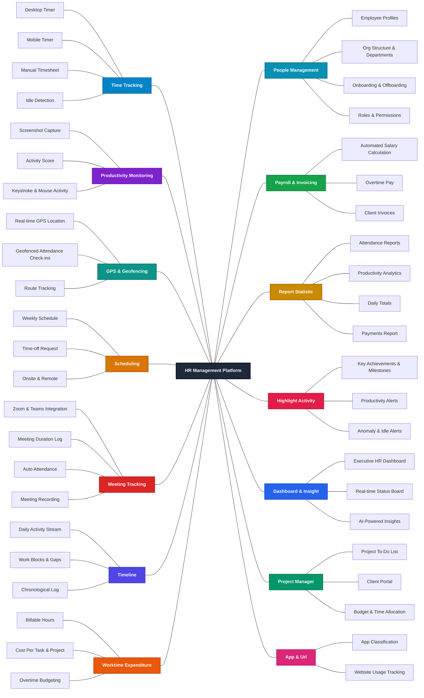
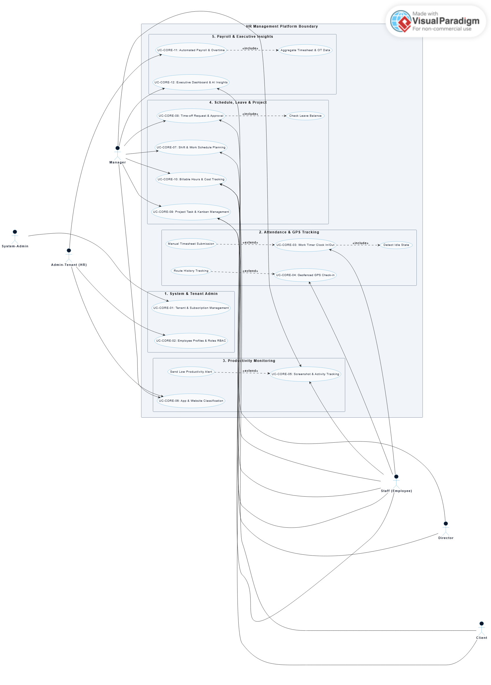
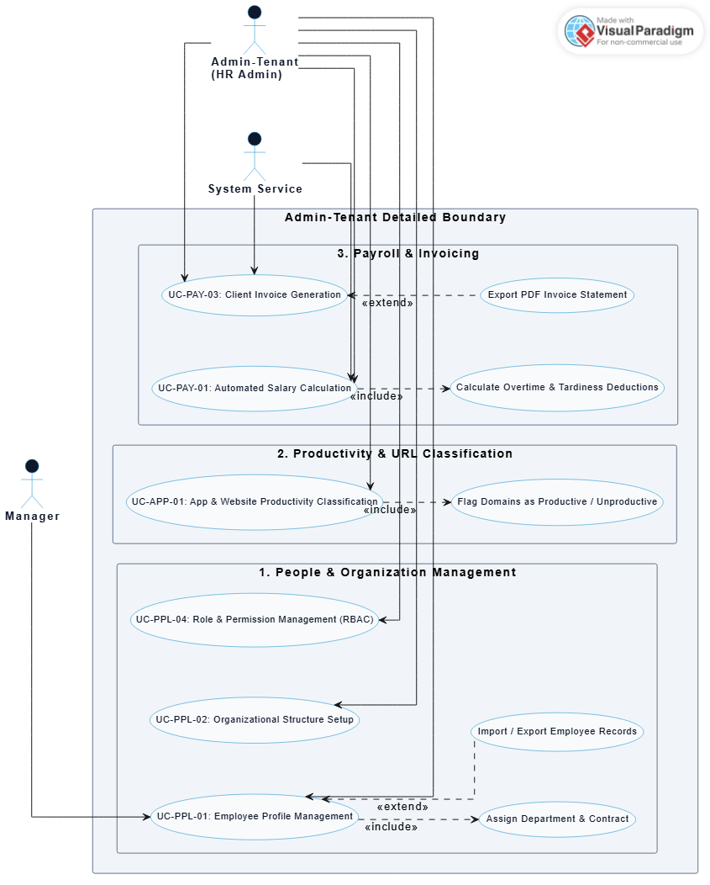
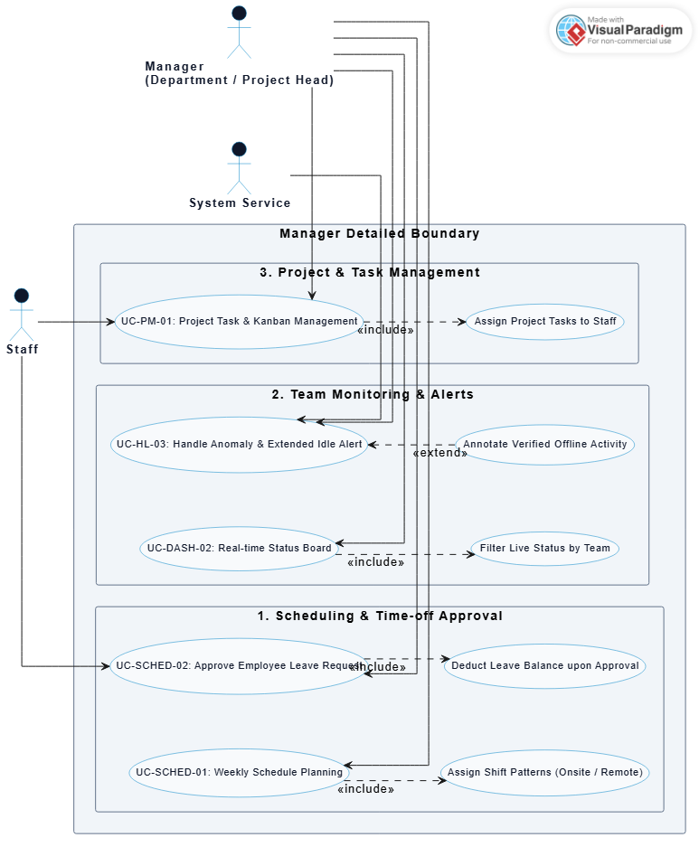
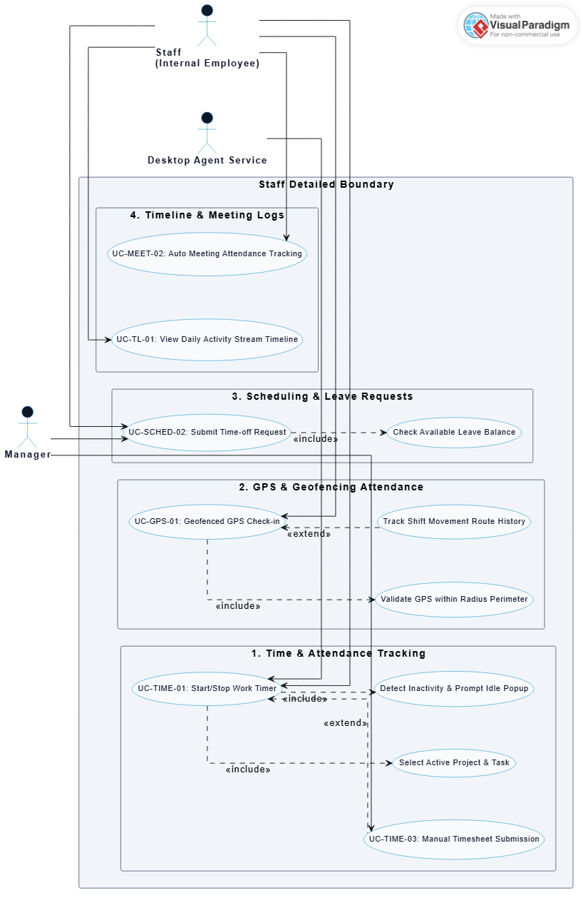
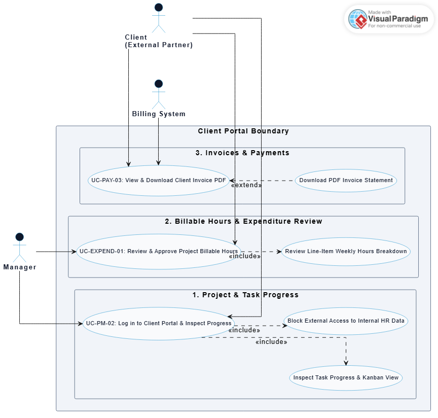

# HR Management Platform
## Mindmap 2 layers

| No. | Main Feature | Feature List |
| :---: | :--- | :--- |
| 1 | **Time Tracking** | Desktop Timer, Mobile Timer, Manual Timesheet, Idle Detection |
| 2 | **Productivity Monitoring** | Screenshot Capture, Activity Score, Keystroke & Mouse Activity |
| 3 | **GPS & Geofencing** | Real-time GPS Location, Geofenced Attendance Check-ins, Route Tracking |
| 4 | **Scheduling** | Weekly Schedule, Time-off Request, Onsite & Remote |
| 5 | **Meeting Tracking** | Zoom & Teams Integration, Meeting Duration Log, Auto Attendance, Meeting Recording |
| 6 | **Timeline** | Daily Activity Stream, Work Blocks & Gaps, Chronological Log |
| 7 | **Worktime Expenditure** | Billable Hours, Cost Per Task & Project, Overtime Budgeting |
| 8 | **People Management** | Employee Profiles, Org Structure & Departments, Onboarding & Offboarding, Roles & Permissions |
| 9 | **Payroll & Invoicing** | Automated Salary Calculation, Overtime Pay, Client Invoices |
| 10 | **Report Statistic** | Attendance Reports, Productivity Analytics, Daily Totals, Payments Report |
| 11 | **Highlight Activity** | Key Achievements & Milestones, Productivity Alerts, Anomaly & Idle Alerts |
| 12 | **Dashboard & Insight** | Executive HR Dashboard, Real-time Status Board, AI-Powered Insights |
| 13 | **Project Manager** | Project To-Do List, Client Portal, Budget & Time Allocation |
| 14 | **App & Url** | App Classification, Website Usage Tracking |

---

## System Actors Specification

The system identifies 6 primary actors in the Multi-Tenant HR Management Platform architecture:

| No. | Actor Code | Actor Name | Role Description & Scope of Authority |
| :--- | :--- | :--- | :--- |
| 1 | **ACT-01** | **System-Admin** | Super Administrator for the platform. Manages tenant accounts, subscription plans, platform quota limits, system monitoring, and global audit logs. |
| 2 | **ACT-02** | **Admin-Tenant** | Administrator for a specific tenant organization. Configures organizational structure, departments, roles & permissions, attendance policies, app/URL classifications, payroll rules, and client invoicing. |
| 3 | **ACT-03** | **Director** | Executive / C-Level manager. Views executive dashboards, AI-powered insights, company-wide productivity & financial reports, and manages overtime budgeting. |
| 4 | **ACT-04** | **Manager** | Department Head / Project Manager. Manages weekly work schedules, approves time-off requests, tracks project to-do lists, monitors real-time status, and reviews anomaly/idle alerts. |
| 5 | **ACT-05** | **Staff** | Internal Employee. Clocks in/out via Desktop/Mobile/GPS Geofencing timers, submits leave requests, views work schedules, attends integrated meetings, and tracks personal daily timelines. |
| 6 | **ACT-06** | **Client** | External Client / Partner. Accesses the Client Portal to track project progress, review billable hours, and view/download invoices. |

---

## Core Use Case Specifications & Architecture Mapping

This section outlines the core Use Cases of the HR Management Platform, mapped directly to system actors and architecture modules.

### 1. Core Use Cases Table

| UC ID | Use Case Name | Feature Module | Primary Actor | Secondary Actor | Description |
| :--- | :--- | :--- | :--- | :--- | :--- |
| **UC-CORE-01** | Tenant Provisioning & Subscription | System & Tenant Admin | System-Admin | System, Email | Initializes new tenant organizations, provisions primary Admin-Tenant credentials, and manages resource quota caps. |
| **UC-CORE-02** | Employee Profiles & Role RBAC | People Management | Admin-Tenant | Manager | Manages employee personal details, contracts, department assignments, and configures custom RBAC permissions. |
| **UC-CORE-03** | Work Timer Clock In/Out | Time Tracking | Staff | System | Toggles work timers on desktop client apps to record actual working hours and automated idle detection. |
| **UC-CORE-04** | Geofenced GPS Attendance Check-in | GPS & Geofencing | Staff | System | Restricts clock-in/out functionality to designated GPS coordinates and branch perimeter radii. |
| **UC-CORE-05** | Screenshot & Activity Tracking | Productivity Monitoring | System | Manager, Staff | Captures screen activity at random intervals and calculates weighted Activity Score (%). |
| **UC-CORE-06** | App & Website Classification | App & URL Classification | Admin-Tenant | Manager | Categorizes software and domain URLs into Productive, Unproductive, or Neutral status. |
| **UC-CORE-07** | Shift & Work Schedule Planning | Scheduling | Manager | Staff | Assigns weekly shift patterns, work locations (Onsite/Remote), and coverage plans. |
| **UC-CORE-08** | Time-off Request & Approval | Scheduling & Leave | Staff | Manager | Submits annual, sick, or personal leave requests for manager approval workflows. |
| **UC-CORE-09** | Project Task & Kanban Management | Project Management | Manager | Staff, Client | Manages project task lists, Kanban boards, task assignments, and estimated hours. |
| **UC-CORE-10** | Billable Hours & Cost Tracking | Worktime Expenditure | Staff | Manager, Client | Flags client-billable work hours and converts logged employee work time into project cost metrics. |
| **UC-CORE-11** | Automated Payroll & Overtime | Payroll & Invoicing | Admin-Tenant | System | Generates salary sheets automatically using timesheet data, shifts, and overtime multiplier rules. |
| **UC-CORE-12** | Executive Dashboard & AI Insights | Dashboard & Insights | Director | Manager | Displays executive-level KPIs, company-wide productivity trends, and AI turnover risk predictions. |

---

### 2. Total Use Case Summary & Actor Coverage Matrix

| Actor Code | Actor Name | Role Category | Direct Core Use Cases | Total Use Case Count |
| :--- | :--- | :--- | :--- | :---: |
| **ACT-01** | **System-Admin** | Super Administrator | `UC-CORE-01` | **1** |
| **ACT-02** | **Admin-Tenant** | HR Administrator | `UC-CORE-02`, `UC-CORE-06`, `UC-CORE-11` | **3** |
| **ACT-03** | **Director** | Executive C-Level | `UC-CORE-10`, `UC-CORE-12` | **2** |
| **ACT-04** | **Manager** | Department / Project Head | `UC-CORE-05`, `UC-CORE-06`, `UC-CORE-07`, `UC-CORE-08`, `UC-CORE-09`, `UC-CORE-10`, `UC-CORE-12` | **7** |
| **ACT-05** | **Staff** | Internal Employee | `UC-CORE-03`, `UC-CORE-04`, `UC-CORE-05`, `UC-CORE-07`, `UC-CORE-08`, `UC-CORE-09`, `UC-CORE-10` | **7** |
| **ACT-06** | **Client** | External Partner | `UC-CORE-09`, `UC-CORE-10` | **2** |
| **TOTAL** | **6 System Actors** | **5 System Subsystems** | **12 Core System Use Cases** | **12 Core UCs** |

---

## Use Case Diagrams Gallery

All diagrams are modeled in PlantUML and rendered in standard high resolution.

### 1. System Overview High-Level Use Case Diagram

---

### 2. System-Admin Detailed Use Case Diagram

---

### 3. Admin-Tenant (HR Admin) Detailed Use Case Diagram

---

### 4. Director Detailed Use Case Diagram

---

### 5. Manager Detailed Use Case Diagram

---

### 6. Staff (Employee) Detailed Use Case Diagram

---

### 7. Client Detailed Use Case Diagram
