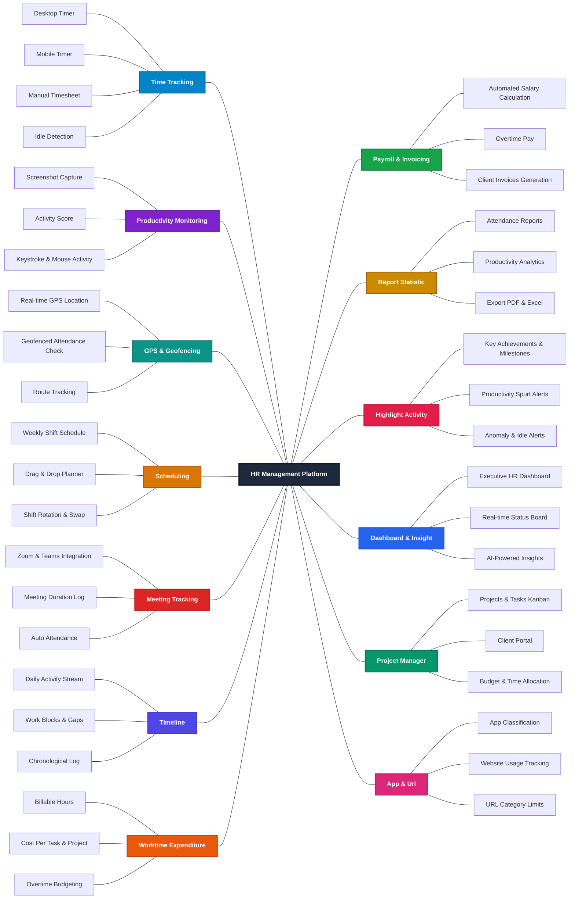

# Monitoring_HR - HR Management Platform

Hệ thống quản lý nhân sự và giám sát năng suất làm việc toàn diện (**HR Management Platform**).

---

## 📐 System Feature Flowchart

Sơ đồ tính năng hệ thống với nút trung tâm hình vuông **HR Management Platform**, kết nối bằng các đường nối thẳng đơn giản không mũi tên (`---`), được bố trí cân đối chia đều **2 bên (Trái & Phải)** và mỗi tính năng chính được phân biệt bằng **màu sắc riêng biệt**:

> 📄 Xem sơ đồ luồng tại: [docs/Mindmap.md](docs/Mindmap.md)

---

## 📋 Danh Sách Tính Năng Hệ Thống (Feature Breakdown)

| 👈 **Bên Trái (Operational & Tracking)** | 👉 **Bên Phải (Management & Analytics)** |
| :--- | :--- |
| **1. Time Tracking** - Desktop / Mobile Timer, Manual Timesheet, Idle Detection | **8. Payroll & Invoicing** - Automated Salary Calculation, Overtime Pay, Invoices |
| **2. Productivity Monitoring** - Screenshot Capture, Activity Score, Mouse/Keystroke | **9. Report Statistic** - Attendance Reports, Productivity Analytics, Export PDF/Excel |
| **3. GPS & Geofencing** - Real-time Location, Geofenced Attendance Check, Route Tracking | **10. Highlight Activity** - Key Milestones, Productivity Spurt Alerts, Idle Alerts |
| **4. Scheduling** - Weekly Shift Schedule, Drag & Drop Planner, Shift Swap | **11. Dashboard & Insight** - Executive HR Dashboard, Real-time Status, AI Insights |
| **5. Meeting Tracking** - Zoom/Teams Integration, Meeting Log, Auto Attendance | **12. Project Manager** - Projects & Tasks Kanban, Client Portal, Budget Tracking |
| **6. Timeline** - Daily Activity Stream, Work Blocks, Chronological Log | **13. App & Url** - App Classification, Website Usage Tracking, Category Limits |
| **7. Worktime Expenditure** - Billable Hours, Cost Per Task/Project, Overtime Budgeting | |