# HR Management Platform - Master Diagram Documentation

This document serves as the **Master Architecture Diagram Documentation** for the HR Management Platform. It presents the System Actors Overview, followed by all Consolidated Subsystem Use Case Diagrams and Process Swimlane Activity Diagrams.

---

## Sitemap url: https://www.relume.ai/app/project/P3513106_M_AsmXcsz2LE9p9i5egRRtV2aMuaJQ4-Pj5YjjiDkKo

## 1. System Actors Overview

The table below outlines all **Primary Actors** (human users initiating use cases) and **Secondary Actors** (supporting background services, engines, and external systems) across the platform:

| No. | Actor Category | Type | Actor Name | Titles / Sub-Roles | Description |
| :---: | :--- | :--- | :--- | :--- | :--- |
| **1** | Human / User | **Primary Actor** | **System-Admin** | • Global System Administrator • Multi-tenant Platform Admin | Top-level system manager; configures global settings, manages tenants, and defines multi-tenant RBAC permissions. |
| **2** | Human / User | **Primary Actor** | **Admin-Tenant** | • Company Admin • Tenant Administrator • HR Director | Manages enterprise-wide configurations (org structure, geofence rules, productivity rules, shift policies, and leave policies). |
| **3** | Human / User | **Primary Actor** | **Director** | • Executive Director • Chief Executive Officer (CEO) • Board Member | Executive leadership; reviews overall strategic productivity reports, anomaly trends, and company-wide performance metrics. |
| **4** | Human / User | **Primary Actor** | **Manager** *(Includes Accountant)* | • **Department Manager / Team Lead** • **HR Manager / Recruiter** • **Accountant / Payroll Specialist** | Middle management & specialized roles: Manages teams, approves leave/timesheets, schedules shifts, monitors GPS/productivity, executes recruitment (HR), and audits/calculates monthly payroll (Accountant). |
| **5** | Human / User | **Primary Actor** | **Staff** | • Full-time / Part-time Employee • Field Worker • Remote Worker / Freelancer | End-users; operates desktop/mobile work timers, performs geofenced GPS check-ins, submits leave requests, and justifies idle time. |
| **6** | Human / User | **Primary Actor** | **Client** | • Client Representative • External Project Owner | External partner/client; accesses the Client Portal to review billable project hours, approve invoices, and process payments. |
| **7** | Human / User | **Primary Actor** | **Candidate** | • Job Applicant • Candidate | Recruitment applicant; receives interview schedules, responds to pipeline stages, and signs digital offer letters. |
| **8** | System / Service | **Secondary Actor** | **Desktop Agent Service** | • Desktop Client App • Background Tracker Agent | Background desktop application/service monitoring keyboard/mouse input activity, capturing automated screenshots, and detecting idle time. |
| **9** | System / Service | **Secondary Actor** | **Mobile App Service** | • Mobile Location Tracker • Field Check-in Agent | Mobile background service collecting real-time GPS coordinates and facilitating field service geofenced check-ins. |
| **10** | System / Service | **Secondary Actor** | **GPS / Location Service** | • Geofencing API • GIS Map Route Service | Validates branch geofence radii, renders real-time location maps, and records staff shift movement routes. |
| **11** | System / Service | **Secondary Actor** | **Productivity AI Engine** | • Classification Engine • Anomaly Detection Engine | Automatically classifies app/web usage (Productive/Unproductive), calculates team productivity scores, and triggers anomaly alerts. |
| **12** | System / Service | **Secondary Actor** | **Scheduling & Leave Engine** | • Shift Conflict Validator • Leave Quota Calculator | Validates shift schedules against conflict rules and automatically calculates/deducts remaining employee leave quotas. |
| **13** | System / Service | **Secondary Actor** | **Payroll & Billing Engine** | • Salary Calculation Engine • Invoice Generator Service | Aggregates timesheet data, applies overtime multipliers, calculates monthly payroll, and generates client invoices. |
| **14** | System / Service | **Secondary Actor** | **Email Service** | • SMTP Gateway • Notification Service | Sends automated notifications for interview schedules, digital offer letters, late arrival violations, and anomaly alerts. |
| **15** | System / Service | **Secondary Actor** | **Cloud Storage** | • Encrypted Storage Bucket • S3 Screenshot Storage | Securely stores encrypted employee screenshot images and application media assets. |

---

## 2. Use Case Diagrams Gallery

### 2.1. People Management Subsystem

#### Employee Profiles & Organizational Structure Diagram
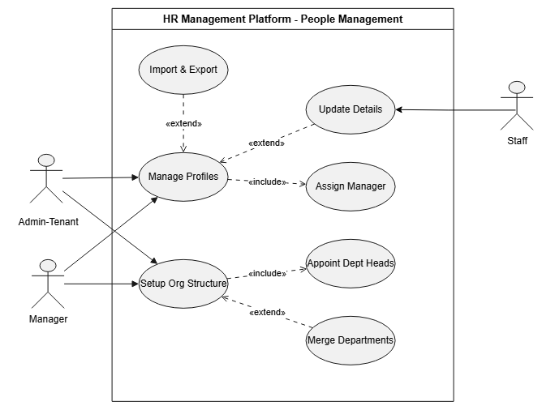

#### Onboarding, Offboarding & RBAC Permissions Diagram
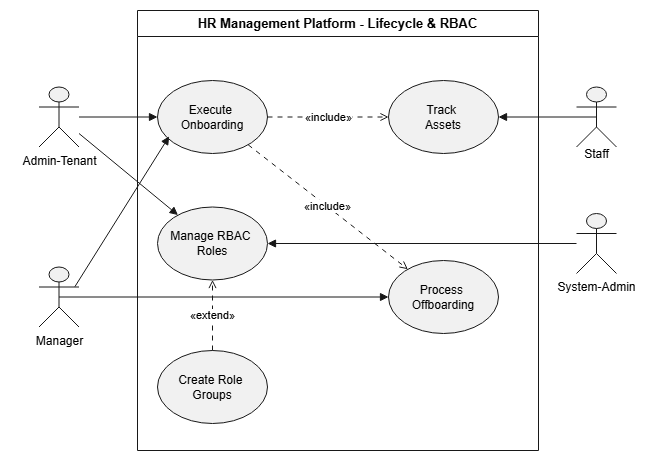

#### Recruitment & Applicant Tracking System (ATS) Diagram
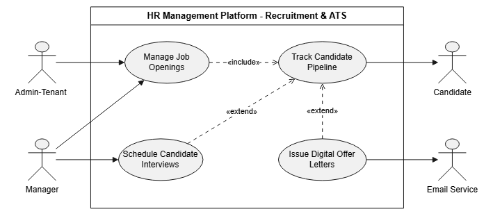

---

### 2.2. Time Tracking Subsystem

#### Desktop & Mobile Work Timer Control Diagram
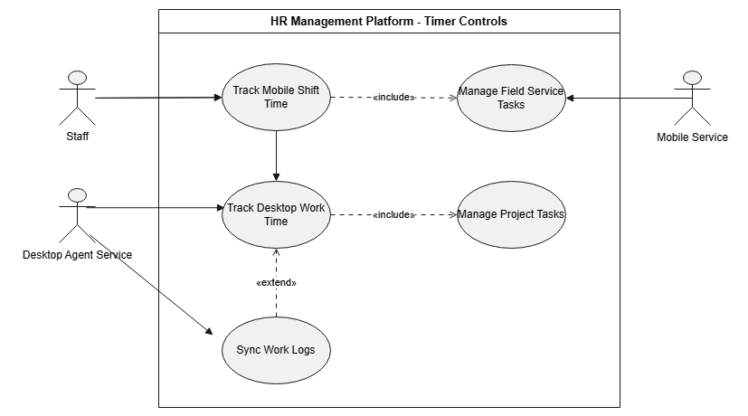

#### Idle Inactivity Detection & Manual Timesheet Diagram
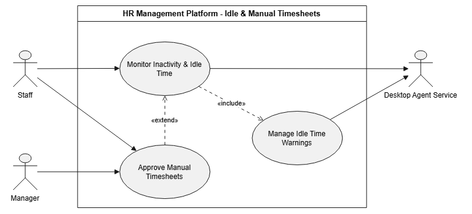

---

### 2.3. GPS Attendance Subsystem

#### Geofenced GPS Check-in Diagram

#### Live Map & Shift Route Tracking Diagram
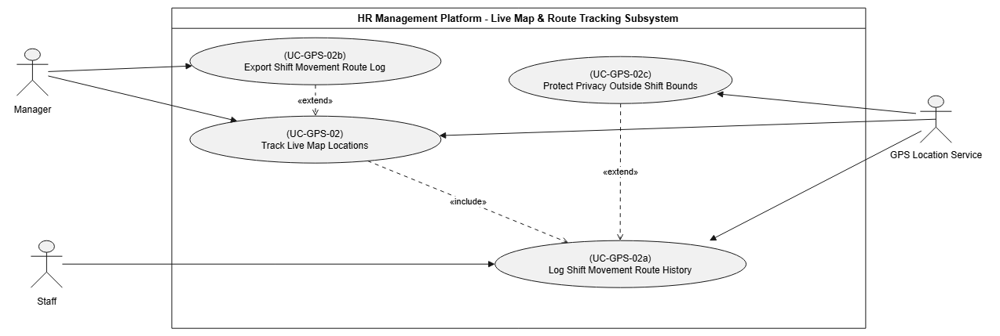

---

### 2.4. Productivity Monitoring Subsystem

#### Automated Screenshots & Input Activity Diagram
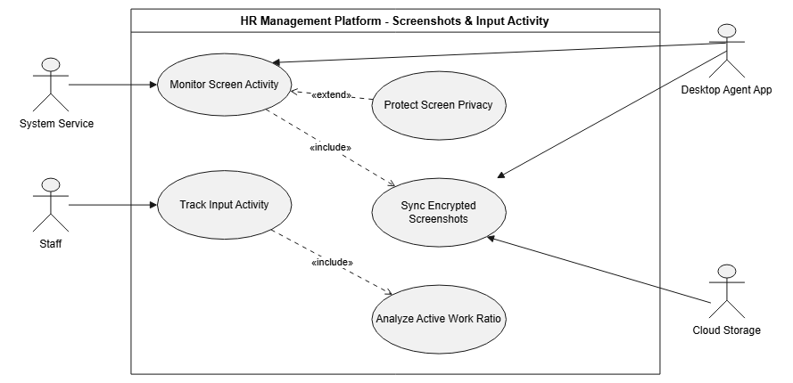

#### App & Website Classification Diagram
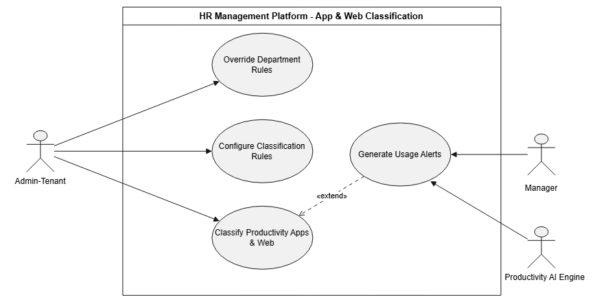

#### Productivity Scores & Anomaly Alerts Diagram
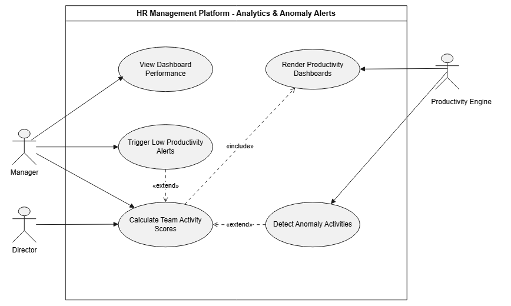

---

### 2.5. Scheduling & Time-Off Subsystem

#### Weekly Shift Planning & Attendance Rules Diagram
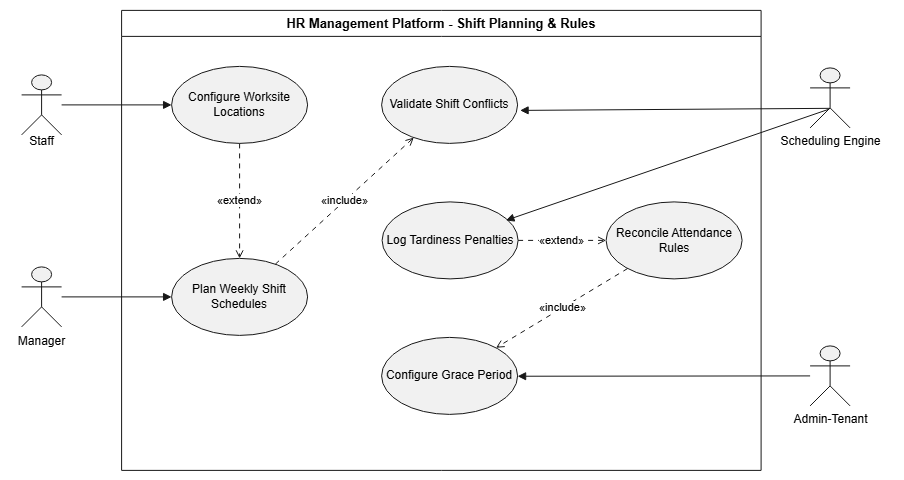

#### Time-off & Leave Management Approval Diagram
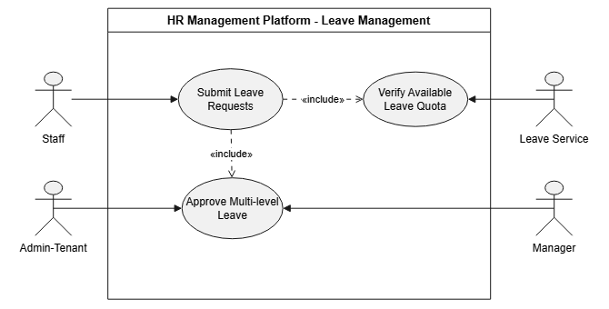

---

### 2.6. Payroll & Client Invoicing Subsystem

#### Automated Monthly Salary & Overtime Pay Diagram
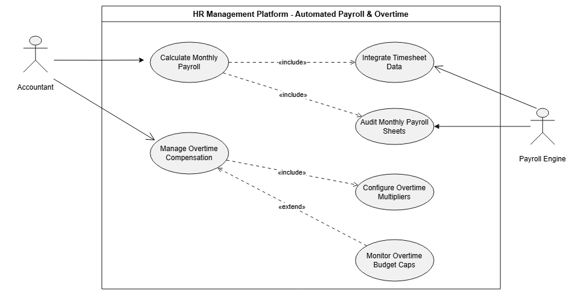

#### Client Invoicing & Portal Payment Diagram
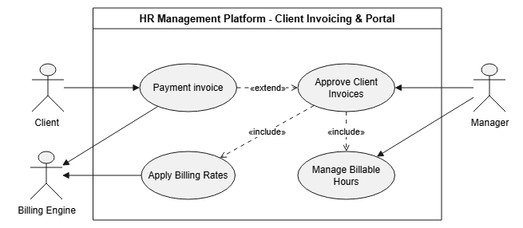

---

## 3. Process Swimlane Diagrams Gallery

### 3.1. People Management Swimlanes

#### Employee Profile Management Swimlane

#### Organizational Structure Setup Swimlane

#### Onboarding & Offboarding Swimlane

#### Role & Permission Management (RBAC) Swimlane

---

### 3.2. Time Tracking Swimlanes

#### Desktop Work Timer Control Swimlane

#### Mobile Clock In / Out Swimlane

#### Idle Inactivity Detection & Manual Timesheet Swimlane

---

### 3.3. GPS Attendance Swimlanes

#### Geofenced GPS Check-in Swimlane

#### Live Map & Shift Route Tracking Swimlane

---

### 3.4. Productivity Monitoring Swimlanes

#### Automated Screenshot Capture Swimlane

#### Input Activity Tracking Swimlane

#### App & Website Classification Swimlane

#### Activity Score & Real-time Alerts Swimlane

---

### 3.5. Scheduling & Time-Off Swimlanes

#### Weekly Shift Planning Swimlane

#### Time-off & Leave Management Swimlane

#### Attendance Rules & Violation Log Swimlane

---

### 3.6. Payroll & Client Invoicing Swimlanes

#### Automated Monthly Salary Calculation Swimlane

#### Overtime Pay & Allowance Management Swimlane

#### Client Invoicing & Billable Hours Swimlane

