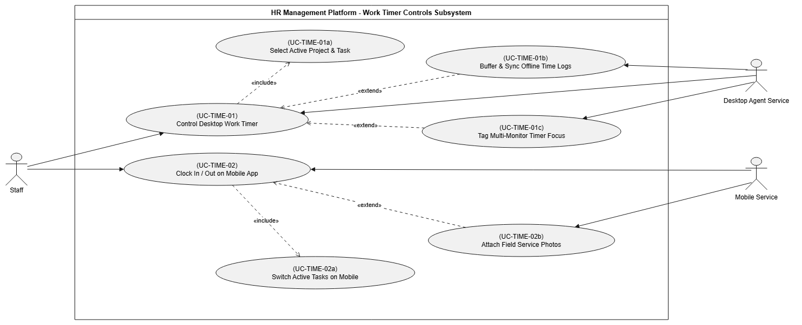
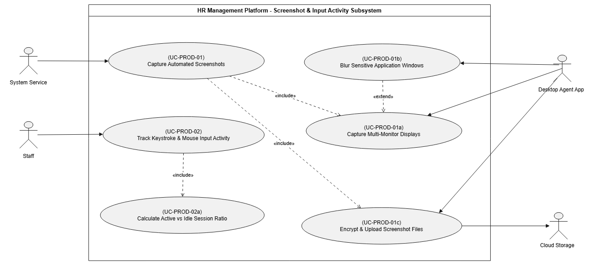
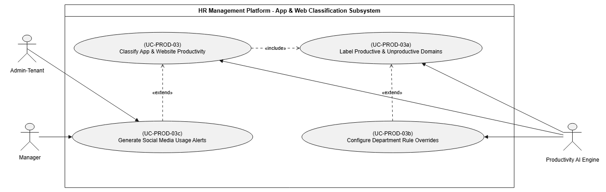
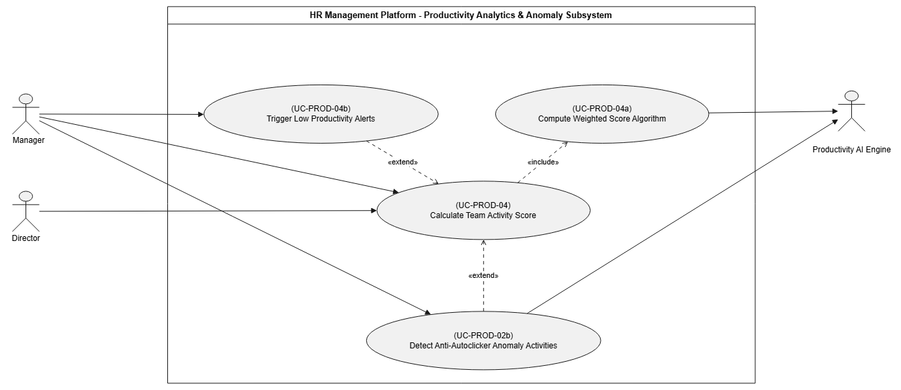

# HR Management Platform - Master Specification & Diagram Documentation

This document serves as the **Master Architecture Documentation** for the HR Management Platform, organizing all Consolidated Subsystem Use Case Diagrams and Process Swimlane Activity Diagrams.

---

## Table of Contents
1. [Subsystem 1: People Management](#1-people-management-subsystem)
2. [Subsystem 2: Time Tracking](#2-time-tracking-subsystem)
3. [Subsystem 3: GPS Attendance](#3-gps-attendance-subsystem)
4. [Subsystem 4: Productivity Monitoring](#4-productivity-monitoring-subsystem)
5. [Subsystem 5: Scheduling & Time-Off](#5-scheduling--time-off-subsystem)
6. [Subsystem 6: Payroll & Client Invoicing](#6-payroll--client-invoicing-subsystem)

---

## 1. People Management Subsystem

### Consolidated Use Case Diagrams

#### 1. Employee Profiles & Organizational Structure Diagram

#### 2. Onboarding, Offboarding & RBAC Permissions Diagram

### Process Swimlane (Activity) Diagrams

#### 1. Employee Profile Management Swimlane

#### 2. Organizational Structure Setup Swimlane

#### 3. Onboarding & Offboarding Swimlane

#### 4. Role & Permission Management (RBAC) Swimlane

---

## 2. Time Tracking Subsystem

### Consolidated Use Case Diagrams

#### 1. Work Timer Controls Diagram (Desktop & Mobile)

#### 2. Idle Detection & Manual Timesheet Approvals Diagram

### Process Swimlane (Activity) Diagrams

#### 1. Desktop Work Timer Control Swimlane

#### 2. Mobile Clock In / Out Swimlane

#### 3. Idle Inactivity Detection & Manual Timesheet Swimlane

---

## 3. GPS Attendance Subsystem

### Consolidated Use Case Diagrams

#### 1. Geofenced GPS Check-in Diagram

#### 2. Live Map & Route History Tracking Diagram

### Process Swimlane (Activity) Diagrams

#### 1. Geofenced GPS Check-in Swimlane

#### 2. Live Map & Shift Route Tracking Swimlane

---

## 4. Productivity Monitoring Subsystem

### Consolidated Use Case Diagrams

#### 1. Screenshot Capture & Input Activity Diagram

#### 2. App & Website Productivity Classification Diagram

#### 3. Activity Score & Anti-Autoclicker Anomaly Alerts Diagram

### Process Swimlane (Activity) Diagrams

#### 1. Automated Screenshot Capture Swimlane

#### 2. Input Activity Tracking Swimlane

#### 3. App & Website Classification Swimlane

#### 4. Activity Score & Real-time Alerts Swimlane

---

## 5. Scheduling & Time-Off Subsystem

### Consolidated Use Case Diagrams

#### 1. Weekly Shift Planning & Attendance Rules Diagram

#### 2. Time-off & Leave Management Approval Diagram

### Process Swimlane (Activity) Diagrams

#### 1. Weekly Shift Planning Swimlane

#### 2. Time-off & Leave Management Swimlane

#### 3. Attendance Rules & Violation Log Swimlane

---

## 6. Payroll & Client Invoicing Subsystem

### Consolidated Use Case Diagrams

#### 1. Automated Monthly Salary & Overtime Pay Diagram

#### 2. Client Invoicing & Portal Payment Diagram

### Process Swimlane (Activity) Diagrams

#### 1. Automated Monthly Salary Calculation Swimlane

#### 2. Overtime Pay & Allowance Management Swimlane

#### 3. Client Invoicing & Billable Hours Swimlane

