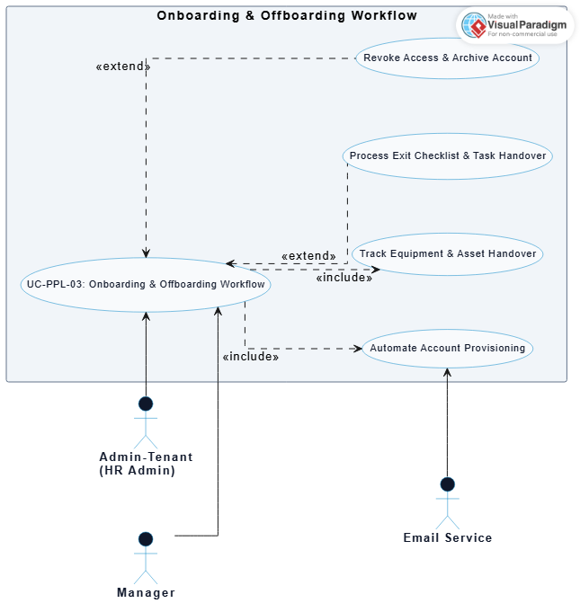
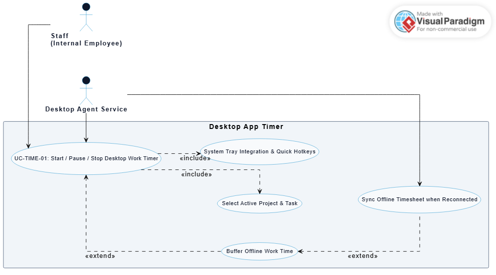
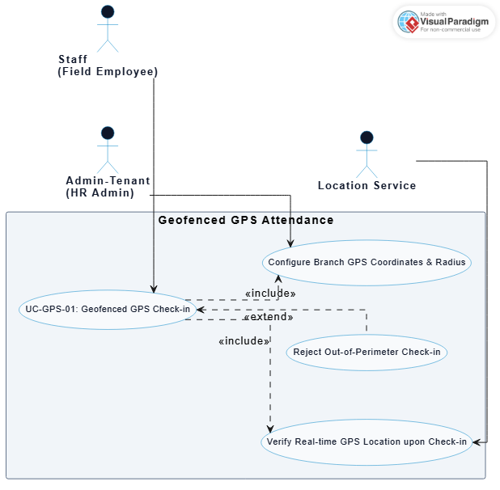
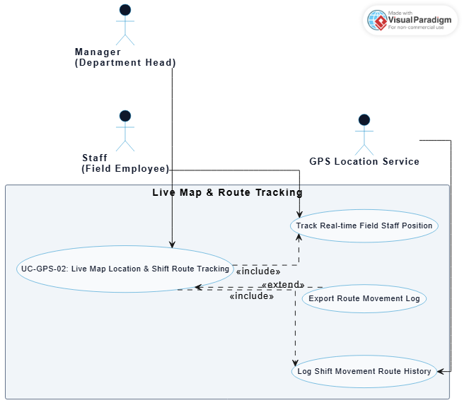

# HR Management Platform - Detailed Use Case Documentation

This document contains detailed Use Case specifications and diagram galleries for the core subsystems of the HR Management Platform.

---

## 1. People Management Subsystem

### Use Case Specifications

| ID | Name | Actor | Description |
| :--- | :--- | :--- | :--- |
| **UC-PPL-01** | Employee Profile Management | `Admin-Tenant`, `Manager`, `Staff` | Manages employee personal details, employment contracts, work history, and bank account information. |
| **UC-PPL-01a** | Assign Department & Direct Manager | `Admin-Tenant` | Assigns employees to organizational departments/branches and configures their designated Direct Manager. |
| **UC-PPL-01b** | Import / Export Employee Records | `Admin-Tenant` | Imports employee profile records in bulk from Excel/CSV files or exports company-wide roster data. |
| **UC-PPL-02** | Organizational Structure Setup | `Admin-Tenant`, `Director`, `Manager` | Builds and manages the multi-level organizational tree from company, department, sub-unit to project teams. |
| **UC-PPL-02a** | Assign Department Head & Deputies | `Admin-Tenant` | Appoints and manages Department Heads, Deputy Heads, and Team Lead leadership roles. |
| **UC-PPL-03** | Onboarding Workflow Execution | `Admin-Tenant`, `Manager`, `Email Service` | Automatically provisions user accounts, dispatches welcome emails, and assigns onboarding task checklists to new hires. |
| **UC-PPL-03a** | Asset Handover & Revocation Tracking | `Admin-Tenant`, `Manager`, `Staff` | Logs hardware/equipment handover (laptops, keycards) and tracks asset retrieval upon employee offboarding. |
| **UC-PPL-03b** | Offboarding & Account Archiving | `Admin-Tenant`, `Manager` | Processes exit checklists, approves task handovers, and revokes system access permissions upon departure. |
| **UC-PPL-04** | Role & Permission Management (RBAC) | `System-Admin`, `Admin-Tenant` | Configures granular action permission matrices (Create, Read, Update, Delete, Approve) for default system roles. |
| **UC-PPL-04a** | Create Custom Role Groups | `System-Admin` | Defines custom role groups (e.g., HR Officer, Payroll Accountant, Warehouse Lead) tailored to business needs. |
| **UC-PPL-04b** | Configure Data Scope Scoping | `System-Admin`, `System Service` | Restricts data visibility boundaries across levels: Company-wide, Department-only, or Self-only. |

### Diagrams Gallery

#### 1.1. Employee Profile Management Diagram

---

#### 1.2. Organizational Structure Setup Diagram

---

#### 1.3. Onboarding & Offboarding Workflow Diagram

---

#### 1.4. Role & Permission Management (RBAC) Diagram

---

## 2. Time Tracking Subsystem

### Use Case Specifications

| ID | Name | Actor | Description |
| :--- | :--- | :--- | :--- |
| **UC-TIME-01** | Desktop Work Timer Control | `Staff`, `Desktop Agent Service` | Starts, pauses, and stops real-time work timers on desktop client apps with active project and task tagging. |
| **UC-TIME-01a** | Active Project & Task Selection | `Staff` | Selects designated projects and active work items before toggling timer sessions. |
| **UC-TIME-01b** | Offline Time Buffering & Sync | `Staff`, `Desktop Agent Service` | Buffers work time locally during network outages and automatically syncs timesheets upon reconnection. |
| **UC-TIME-02** | Mobile Clock In / Out & Task Switcher | `Staff`, `Mobile Service` | Allows field staff to clock in/out, switch work tasks, add notes, and transmit app heartbeat status on mobile devices. |
| **UC-TIME-03** | Idle Inactivity Detection & Timesheet Approval | `Staff`, `Manager`, `Desktop Agent Service` | Detects keyboard/mouse inactivity thresholds, prompts idle warning popups, and submits manual timesheet requests for manager approval. |

### Diagrams Gallery

#### 2.1. Desktop App Timer Diagram

---

#### 2.2. Mobile App Timer Diagram

---

#### 2.3. Idle Inactivity Detection & Manual Timesheet Diagram

---

## 3. GPS Attendance Subsystem

### Use Case Specifications

| ID | Name | Actor | Description |
| :--- | :--- | :--- | :--- |
| **UC-GPS-01** | Geofenced GPS Check-in | `Staff`, `Admin-Tenant`, `Location Service` | Restricts employee attendance check-in/out to authorized GPS coordinates and branch perimeter radii. |
| **UC-GPS-01a** | Configure Branch GPS Coordinates & Perimeter | `Admin-Tenant` | Sets branch latitude, longitude, and allowed geofence perimeter radius. |
| **UC-GPS-01b** | Verify Real-time GPS Location & Perimeter | `Staff`, `Location Service` | Verifies device GPS position against the geofence perimeter and rejects out-of-bounds check-ins. |
| **UC-GPS-02** | Live Map Location & Shift Route Tracking | `Manager`, `Staff`, `GPS Location Service` | Tracks real-time field staff positions on a live map and logs movement route history throughout the work shift. |
| **UC-GPS-02a** | Export Shift Route Movement Log | `Manager` | Exports detailed shift route history movement logs for compliance auditing. |

### Diagrams Gallery

#### 3.1. Geofenced GPS Attendance Check-in Diagram

---

#### 3.2. Live Map Location & Shift Route Tracking Diagram

