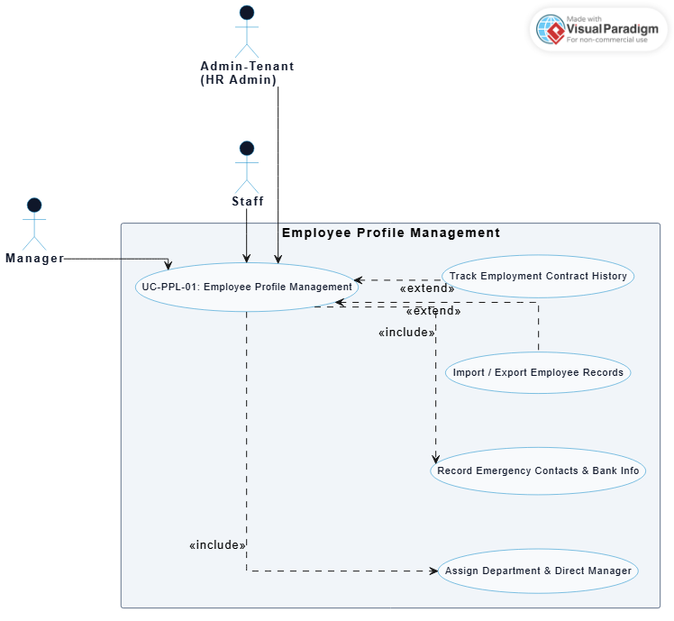
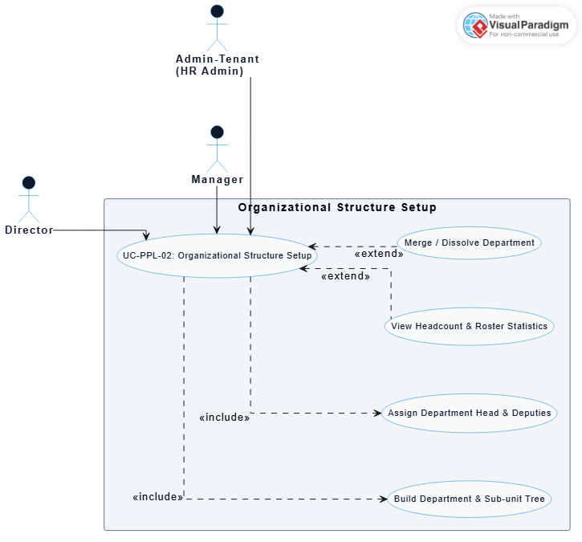
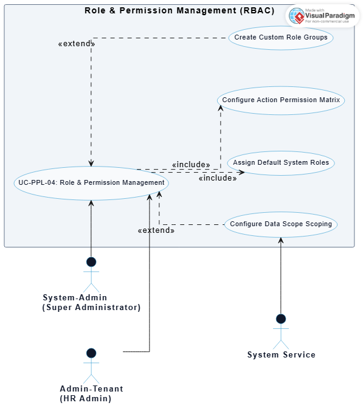

# HR Management Platform - Documentation

## People Management Use Case Specifications

This section details all Use Cases belonging to the **People Management** subsystem (Employee Profiles, Org Structure, Onboarding/Offboarding, and Role RBAC).

| ID | Name | Actor | Description |
| :--- | :--- | :--- | :--- |
| **UC-PPL-01** | Employee Profile Management | `Admin-Tenant`, `Manager`, `Staff` | Manages employee personal details, employment contracts, work history, and bank account information. |
| **UC-PPL-01a** | Assign Department & Direct Manager | `Admin-Tenant` | Assigns employees to organizational departments/branches and configures their designated Direct Manager. |
| **UC-PPL-01b** | Import / Export Employee Records | `Admin-Tenant` | Imports employee profile records in bulk from Excel/CSV files or exports company-wide roster data. |
| **UC-PPL-02** | Organizational Structure Setup | `Admin-Tenant`, `Director`, `Manager` | Builds and manages the multi-level organizational tree from company, department, sub-unit to project teams. |
| **UC-PPL-02a** | Assign Department Head & Deputies | `Admin-Tenant` | Appoints and manages Department Heads, Deputy Heads, and Team Lead leadership roles. |
| **UC-PPL-03** | Onboarding Workflow Execution | `Admin-Tenant`, `Manager`, `Email Service` | Automatically provisions user accounts, dispatches welcome emails, and assigns onboarding task checklists to new hires. |
| **UC-PPL-03a** | Asset Handover & Revocation Tracking | `Admin-Tenant`, `Manager`, `Staff` | Logs hardware/equipment handover (laptops, keycards) and tracks asset retrieval upon employee offboarding. |
| **UC-PPL-03b** | Offboarding & Account Archiving | `Admin-Tenant`, `Manager` | Processes exit checklists, approves task handovers, and revokes system access permissions upon departure. |
| **UC-PPL-04** | Role & Permission Management (RBAC) | `System-Admin`, `Admin-Tenant` | Configures granular action permission matrices (Create, Read, Update, Delete, Approve) for default system roles. |
| **UC-PPL-04a** | Create Custom Role Groups | `System-Admin` | Defines custom role groups (e.g., HR Officer, Payroll Accountant, Warehouse Lead) tailored to business needs. |
| **UC-PPL-04b** | Configure Data Scope Scoping | `System-Admin`, `System Service` | Restricts data visibility boundaries across levels: Company-wide, Department-only, or Self-only. |

---

## Detailed Use Case Diagrams Gallery

### 1. Employee Profile Management Diagram

---

### 2. Organizational Structure Setup Diagram

---

### 3. Onboarding & Offboarding Workflow Diagram

---

### 4. Role & Permission Management (RBAC) Diagram

