# HR Management Platform - Detailed Use Case & Process Swimlane Documentation

This document contains detailed Use Case specifications, Use Case diagram galleries, and Process Swimlane Activity diagram galleries for the core subsystems of the HR Management Platform.

---

## 1. People Management Subsystem

### Use Case Specifications

| ID | Name | Actor | Description |
| :--- | :--- | :--- | :--- |
| **UC-PPL-01** | Employee Profile Management | `Admin-Tenant`, `Manager`, `Staff` | Manages employee personal details, employment contracts, work history, and bank account information. |
| **UC-PPL-01a** | Assign Department & Direct Manager | `Admin-Tenant` | Assigns employees to organizational departments/branches and configures their designated Direct Manager. |
| **UC-PPL-01b** | Import / Export Employee Records | `Admin-Tenant` | Imports employee profile records in bulk from Excel/CSV files or exports company-wide roster data. |
| **UC-PPL-02** | Organizational Structure Setup | `Admin-Tenant`, `Director`, `Manager` | Builds and manages the multi-level organizational tree from company, department, sub-unit to project teams. |
| **UC-PPL-02a** | Assign Department Head & Deputies | `Admin-Tenant` | Appoints and manages Department Heads, Deputy Heads, and Team Lead leadership roles. |
| **UC-PPL-03** | Onboarding Workflow Execution | `Admin-Tenant`, `Manager`, `Email Service` | Automatically provisions user accounts, dispatches welcome emails, and assigns onboarding task checklists to new hires. |
| **UC-PPL-03a** | Asset Handover & Revocation Tracking | `Admin-Tenant`, `Manager`, `Staff` | Logs hardware/equipment handover (laptops, keycards) and tracks asset retrieval upon employee offboarding. |
| **UC-PPL-03b** | Offboarding & Account Archiving | `Admin-Tenant`, `Manager` | Processes exit checklists, approves task handovers, and revokes system access permissions upon departure. |
| **UC-PPL-04** | Role & Permission Management (RBAC) | `System-Admin`, `Admin-Tenant` | Configures granular action permission matrices (Create, Read, Update, Delete, Approve) for default system roles. |
| **UC-PPL-04a** | Create Custom Role Groups | `System-Admin` | Defines custom role groups (e.g., HR Officer, Payroll Accountant, Warehouse Lead) tailored to business needs. |
| **UC-PPL-04b** | Configure Data Scope Scoping | `System-Admin`, `System Service` | Restricts data visibility boundaries across levels: Company-wide, Department-only, or Self-only. |

### Use Case Diagrams Gallery

#### 1.1. Employee Profile Management Diagram

---

#### 1.2. Organizational Structure Setup Diagram

---

#### 1.3. Onboarding & Offboarding Workflow Diagram

---

#### 1.4. Role & Permission Management (RBAC) Diagram
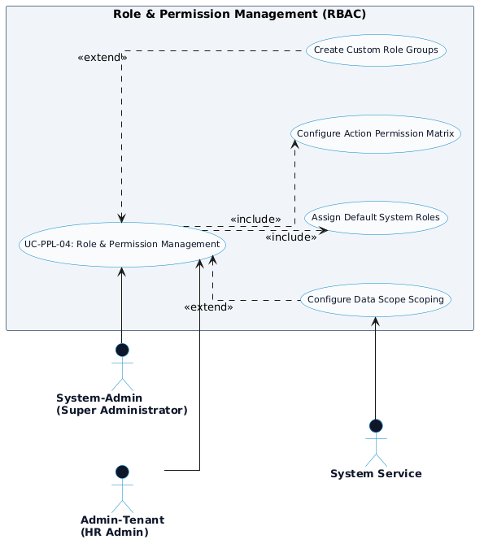

---

### Process Swimlane Diagrams Gallery

#### 1.5. Onboarding & Offboarding Swimlane Process Diagram

---

#### 1.6. Role & Permission Management (RBAC) Swimlane Process Diagram

---

#### 1.7. Employee Profile Management Swimlane Process Diagram

---

#### 1.8. Organizational Structure Setup Swimlane Process Diagram

---

## 2. Time Tracking Subsystem

### Use Case Specifications

| ID | Name | Actor | Description |
| :--- | :--- | :--- | :--- |
| **UC-TIME-01** | Desktop Work Timer Control | `Staff`, `Desktop Agent Service` | Starts, pauses, and stops real-time work timers on desktop client apps with active project and task tagging. |
| **UC-TIME-01a** | Active Project & Task Selection | `Staff` | Selects designated projects and active work items before toggling timer sessions. |
| **UC-TIME-01b** | Offline Time Buffering & Sync | `Staff`, `Desktop Agent Service` | Buffers work time locally during network outages and automatically syncs timesheets upon reconnection. |
| **UC-TIME-02** | Mobile Clock In / Out & Task Switcher | `Staff`, `Mobile Service` | Allows field staff to clock in/out, switch work tasks, add notes, and transmit app heartbeat status on mobile devices. |
| **UC-TIME-03** | Idle Inactivity Detection & Timesheet Approval | `Staff`, `Manager`, `Desktop Agent Service` | Detects keyboard/mouse inactivity thresholds, prompts idle warning popups, and submits manual timesheet requests for manager approval. |

### Use Case Diagrams Gallery

#### 2.1. Desktop App Timer Diagram

---

#### 2.2. Mobile App Timer Diagram
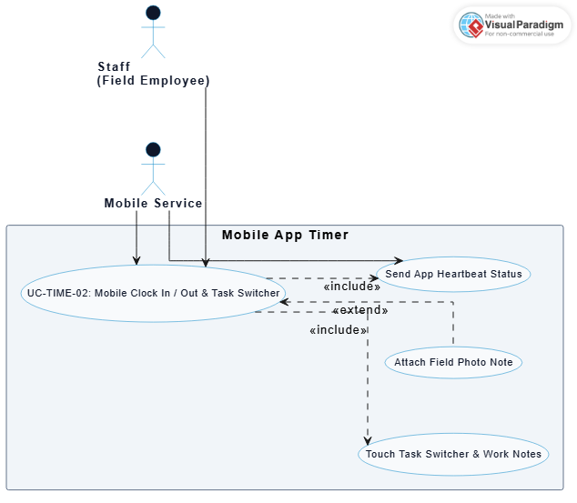

---

#### 2.3. Idle Inactivity Detection & Manual Timesheet Diagram
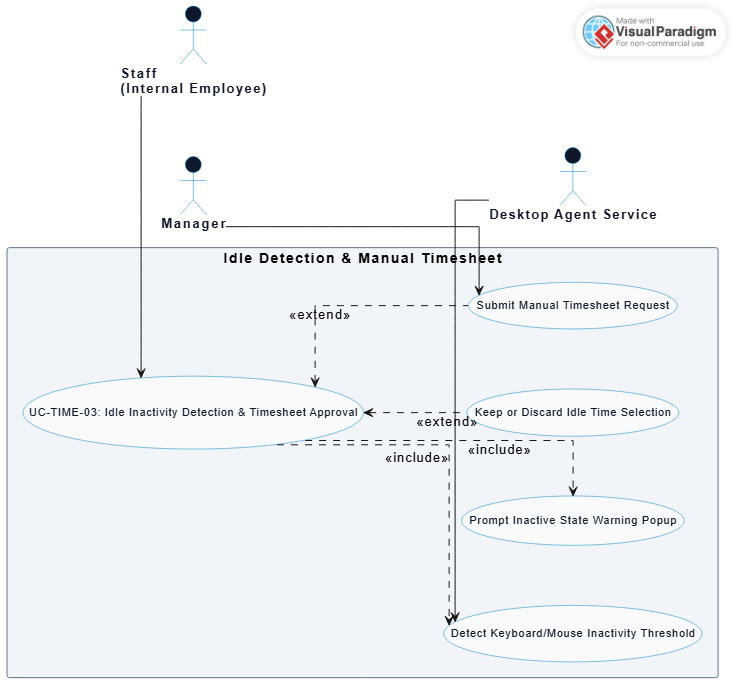

---

### Process Swimlane Diagrams Gallery

#### 2.4. Desktop Work Timer Swimlane Process Diagram

---

#### 2.5. Mobile Clock In / Out Swimlane Process Diagram

---

#### 2.6. Idle Inactivity Detection & Manual Timesheet Swimlane Process Diagram

---

## 3. GPS Attendance Subsystem

### Use Case Specifications

| ID | Name | Actor | Description |
| :--- | :--- | :--- | :--- |
| **UC-GPS-01** | Geofenced GPS Check-in | `Staff`, `Admin-Tenant`, `Location Service` | Restricts employee attendance check-in/out to authorized GPS coordinates and branch perimeter radii. |
| **UC-GPS-01a** | Configure Branch GPS Coordinates & Perimeter | `Admin-Tenant` | Sets branch latitude, longitude, and allowed geofence perimeter radius. |
| **UC-GPS-01b** | Verify Real-time GPS Location & Perimeter | `Staff`, `Location Service` | Verifies device GPS position against the geofence perimeter and rejects out-of-bounds check-ins. |
| **UC-GPS-02** | Live Map Location & Shift Route Tracking | `Manager`, `Staff`, `GPS Location Service` | Tracks real-time field staff positions on a live map and logs movement route history throughout the work shift. |
| **UC-GPS-02a** | Export Shift Route Movement Log | `Manager` | Exports detailed shift route history movement logs for compliance auditing. |

### Use Case Diagrams Gallery

#### 3.1. Geofenced GPS Attendance Check-in Diagram
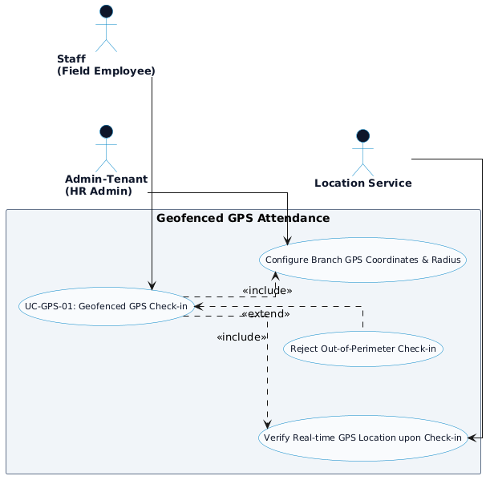

---

#### 3.2. Live Map Location & Shift Route Tracking Diagram

---

### Process Swimlane Diagrams Gallery

#### 3.3. Geofenced GPS Check-in Swimlane Process Diagram

---

#### 3.4. Live Map & Shift Route Tracking Swimlane Process Diagram

---

## 4. Productivity Monitoring Subsystem

### Use Case Specifications

| ID | Name | Actor | Description |
| :--- | :--- | :--- | :--- |
| **UC-PROD-01** | Random Automated Screenshot Capture | `System Service`, `Manager`, `Staff` | Captures multi-monitor screen activity at random intervals with client-side encryption and sensitive data blurring. |
| **UC-PROD-02** | Keystroke & Mouse Input Activity Tracking | `Desktop Agent Service`, `Staff` | Measures keystrokes and mouse movement frequency to calculate active vs. idle session ratios and detect anti-autoclickers. |
| **UC-PROD-03** | App & Website Productivity Classification | `Admin-Tenant`, `Manager` | Categorizes active window titles and domain URLs into Productive, Unproductive, or Neutral status with department-level rules. |
| **UC-PROD-04** | Activity Score Calculation & Real-time Alerts | `Manager`, `System Service`, `Director` | Computes weighted Activity Score (%) metrics and triggers real-time alerts when productivity drops below designated thresholds (< 30%). |

### Use Case Diagrams Gallery

#### 4.1. Automated Screenshot Capture Diagram
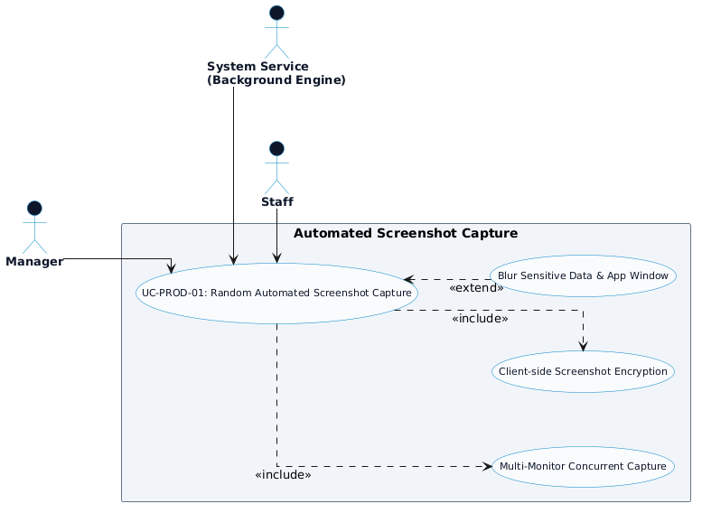

---

#### 4.2. Input Activity Tracking Diagram
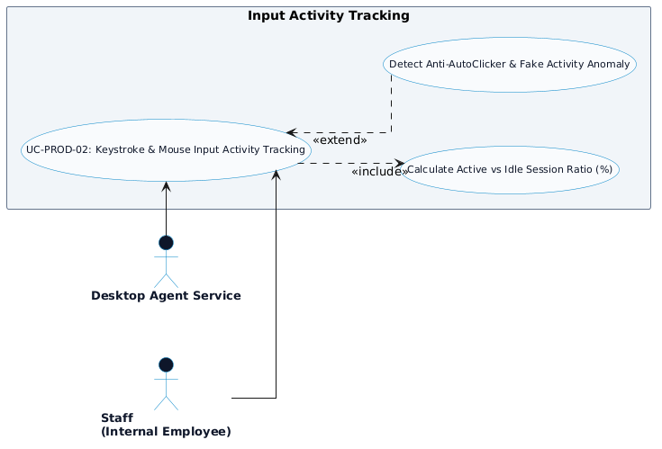

---

#### 4.3. App & Website Productivity Classification Diagram
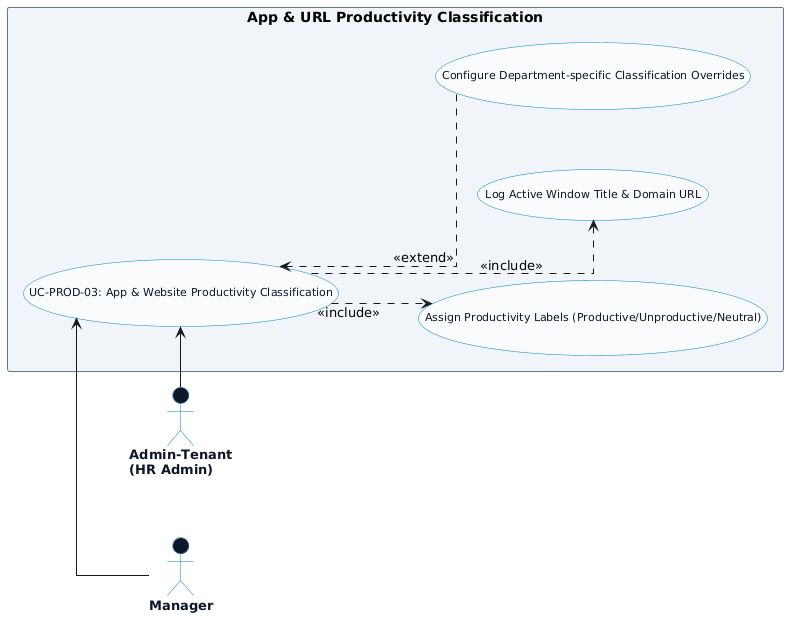

---

#### 4.4. Activity Score Calculation & Real-time Alerts Diagram
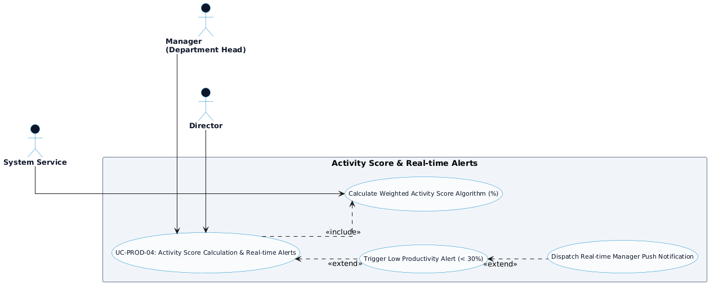

---

### Process Swimlane Diagrams Gallery

#### 4.5. Automated Screenshot Capture Swimlane Process Diagram

---

#### 4.6. Input Activity Tracking Swimlane Process Diagram

---

#### 4.7. App & Website Classification Swimlane Process Diagram

---

#### 4.8. Activity Score & Real-time Alerts Swimlane Process Diagram

---

## 5. Scheduling & Time-Off Subsystem

### Use Case Specifications

| ID | Name | Actor | Description |
| :--- | :--- | :--- | :--- |
| **UC-SCHED-01** | Weekly Shift & Work Schedule Planning | `Manager`, `Staff` | Assigns morning, afternoon, night, or split shift patterns, classifies Onsite/Remote work modes, and publishes roster schedules. |
| **UC-SCHED-02** | Time-off & Leave Request Management | `Staff`, `Manager`, `Admin-Tenant` | Verifies available leave balances, submits leave requests with supporting attachments, and executes multi-level manager approvals. |
| **UC-SCHED-03** | Attendance Rules & Punctuality Violation Log | `System Service`, `Manager`, `Admin-Tenant` | Applies work shift grace periods, logs late arrival and early departure violations, and flags unexcused absences. |

### Use Case Diagrams Gallery

#### 5.1. Weekly Shift & Work Schedule Planning Diagram
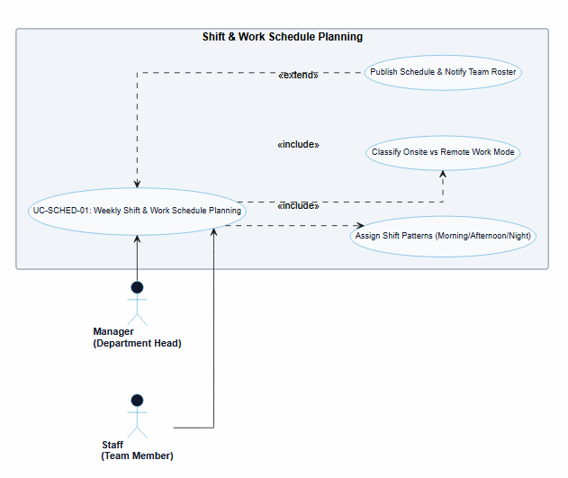

---

#### 5.2. Time-off & Leave Request Management Diagram
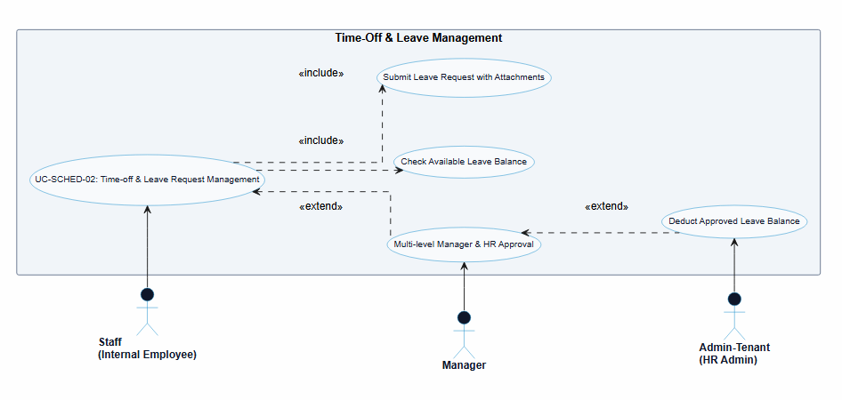

---

#### 5.3. Attendance Rules & Punctuality Violation Log Diagram
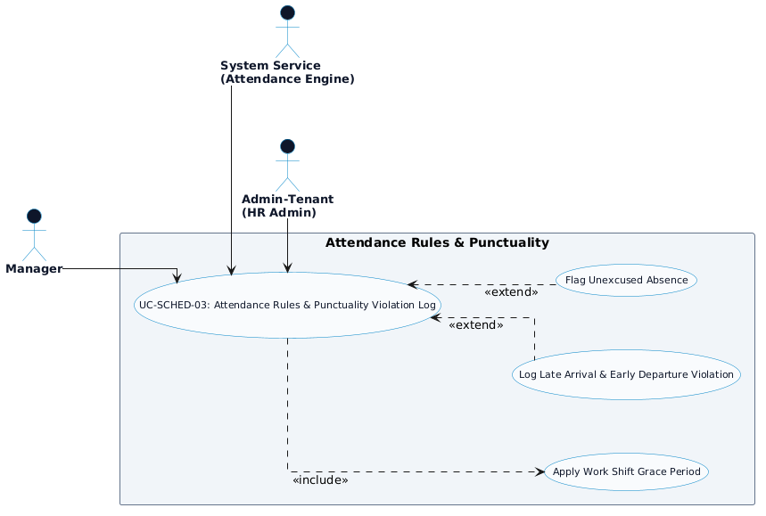

---

### Process Swimlane Diagrams Gallery

#### 5.4. Weekly Shift Planning Swimlane Process Diagram

---

#### 5.5. Time-off & Leave Request Management Swimlane Process Diagram

---

#### 5.6. Attendance Rules & Punctuality Violation Log Swimlane Process Diagram

---

## 6. Payroll & Client Invoicing Subsystem

### Use Case Specifications

| ID | Name | Actor | Description |
| :--- | :--- | :--- | :--- |
| **UC-PAY-01** | Automated Monthly Salary Calculation | `Admin-Tenant`, `System Service`, `Staff` | Calculates monthly salary sheets automatically using approved timesheets, base pay rates, and tardiness/absence deductions. |
| **UC-PAY-02** | Overtime Pay & Allowance Management | `Admin-Tenant`, `Director` | Applies overtime multipliers (Weekday x1.5, Weekend x2.0, Holiday x3.0), computes allowances, and monitors overtime budget caps. |
| **UC-PAY-03** | Client Invoicing & Billable Hours Approval | `Manager`, `Client`, `Billing System` | Approves client-billable project work hours, applies role-based hourly billing rates, and generates client invoice PDF statements. |

### Use Case Diagrams Gallery

#### 6.1. Automated Monthly Salary Calculation Diagram
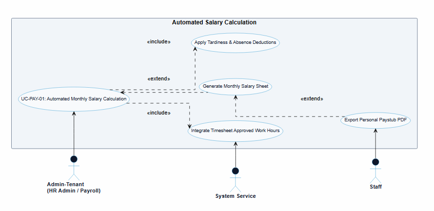

---

#### 6.2. Overtime Pay & Allowance Management Diagram
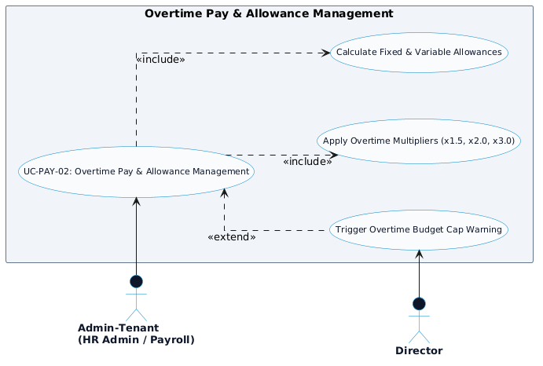

---

#### 6.3. Client Invoicing & Billable Hours Approval Diagram
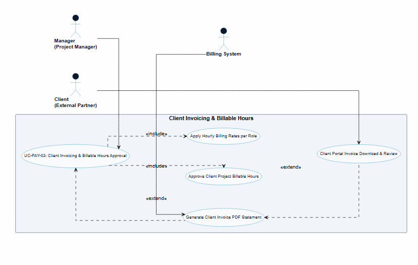

---

### Process Swimlane Diagrams Gallery

#### 6.4. Automated Monthly Salary Calculation Swimlane Process Diagram

---

#### 6.5. Overtime Pay & Allowance Management Swimlane Process Diagram

---

#### 6.6. Client Invoicing & Billable Hours Swimlane Process Diagram

