# HR Management Platform - Detailed Use Case & Process Swimlane Documentation

This document contains detailed Use Case specifications, independent Use Case diagram galleries, and Process Swimlane Activity diagram galleries for the core subsystems of the HR Management Platform.

---

## 1. People Management Subsystem

### Use Case Specifications

| ID | Name | Actor | Description |
| :--- | :--- | :--- | :--- |
| **UC-PPL-01** | Employee Profile Management | `Admin-Tenant`, `Manager`, `Staff` | Manages employee personal details, employment contracts, work history, and bank account information. |
| **UC-PPL-01a** | Assign Department & Direct Manager | `Admin-Tenant` | Assigns employees to organizational departments/branches and configures their designated Direct Manager. |
| **UC-PPL-01b** | Import / Export Employee Records | `Admin-Tenant` | Imports employee profile records in bulk from Excel/CSV files or exports company-wide roster data. |
| **UC-PPL-01c** | Update Personal & Emergency Details | `Staff`, `Admin-Tenant` | Allows staff to submit emergency contact updates for HR Admin approval. |
| **UC-PPL-02** | Organizational Structure Setup | `Admin-Tenant`, `Director`, `Manager` | Builds and manages the multi-level organizational tree from company, department, sub-unit to project teams. |
| **UC-PPL-02a** | Assign Department Head & Deputies | `Admin-Tenant` | Appoints and manages Department Heads, Deputy Heads, and Team Lead leadership roles. |
| **UC-PPL-02b** | Department Merger & Dissolution | `Admin-Tenant`, `System Service` | Executes department mergers, reassigns employee tree nodes, and re-routes reporting lines. |
| **UC-PPL-03** | Onboarding Workflow Execution | `Admin-Tenant`, `Manager`, `Email Service` | Automatically provisions user accounts, dispatches welcome emails, and assigns onboarding task checklists to new hires. |
| **UC-PPL-03a** | Asset Handover Tracking | `Admin-Tenant`, `Manager`, `Staff` | Logs hardware/equipment handover (laptops, keycards) and tracks asset retrieval upon employee offboarding. |
| **UC-PPL-03b** | Offboarding & Account Archiving | `Admin-Tenant`, `Manager`, `Security Service` | Processes exit checklists, approves task handovers, and revokes system access permissions upon departure. |
| **UC-PPL-04** | Role & Permission Management (RBAC) | `System-Admin`, `Admin-Tenant` | Configures granular action permission matrices (Create, Read, Update, Delete, Approve) for default system roles. |
| **UC-PPL-04a** | Create Custom Role Groups | `System-Admin` | Defines custom role groups (e.g., HR Officer, Payroll Accountant, Warehouse Lead) tailored to business needs. |

### Detailed Use Case Diagrams Gallery

#### 1.1. UC-PPL-01: Employee Profile Management
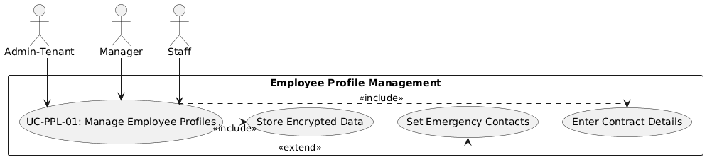

---

#### 1.2. UC-PPL-01a: Assign Department & Direct Manager
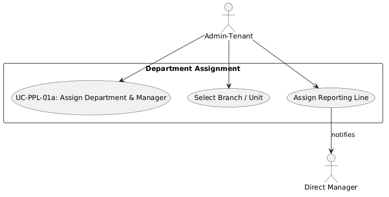

---

#### 1.3. UC-PPL-01b: Import / Export Employee Records
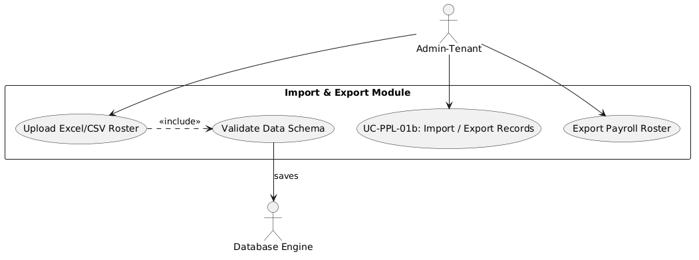

---

#### 1.4. UC-PPL-01c: Update Personal & Emergency Details
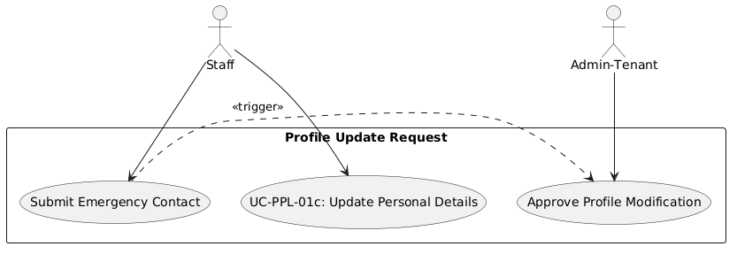

---

#### 1.5. UC-PPL-02: Organizational Structure Setup
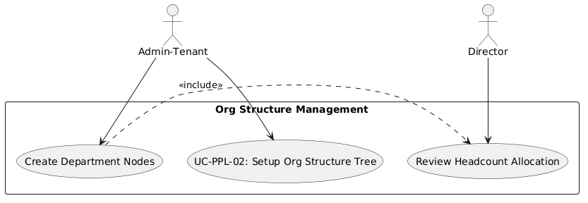

---

#### 1.6. UC-PPL-02a: Assign Department Head & Deputy Leads
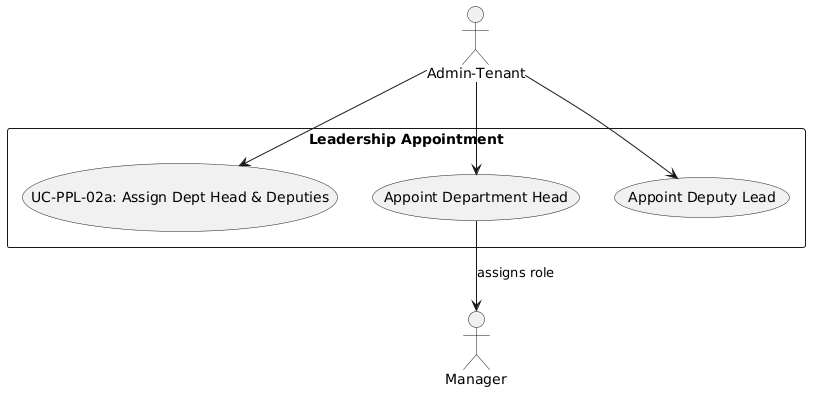

---

#### 1.7. UC-PPL-02b: Department Merger & Dissolution
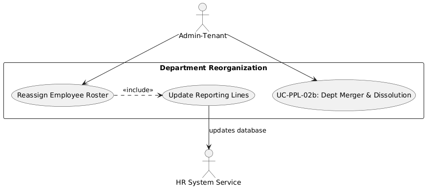

---

#### 1.8. UC-PPL-03: Onboarding Workflow Execution
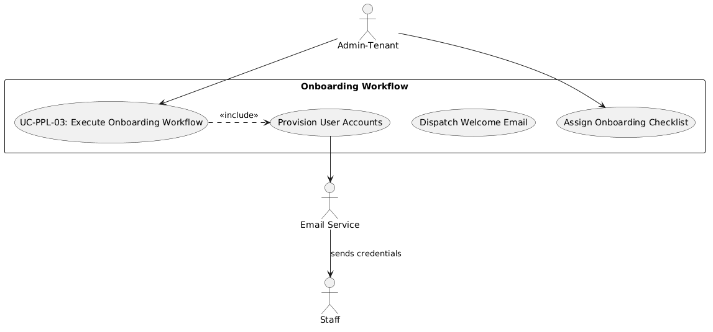

---

#### 1.9. UC-PPL-03a: Hardware Asset Handover Tracking
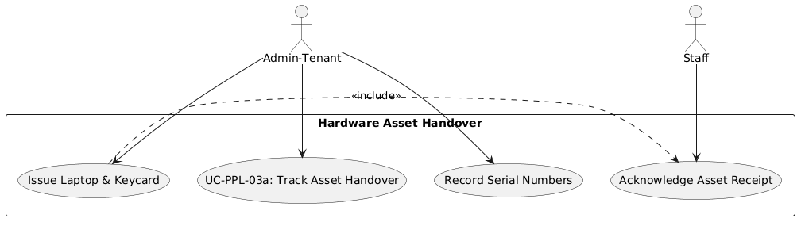

---

#### 1.10. UC-PPL-03b: Offboarding & Account Archiving
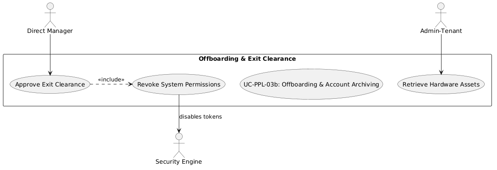

---

#### 1.11. UC-PPL-04: Role & Permission Management (RBAC)
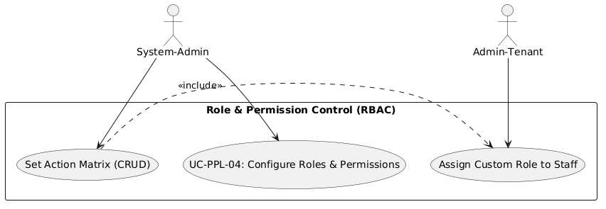

---

#### 1.12. UC-PPL-04a: Create Custom Role Groups
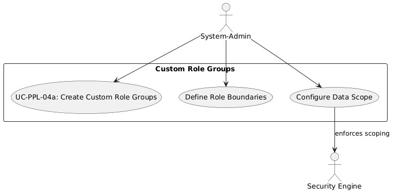

---

### Process Swimlane Diagrams Gallery

#### 1.13. Onboarding & Offboarding Swimlane Process Diagram
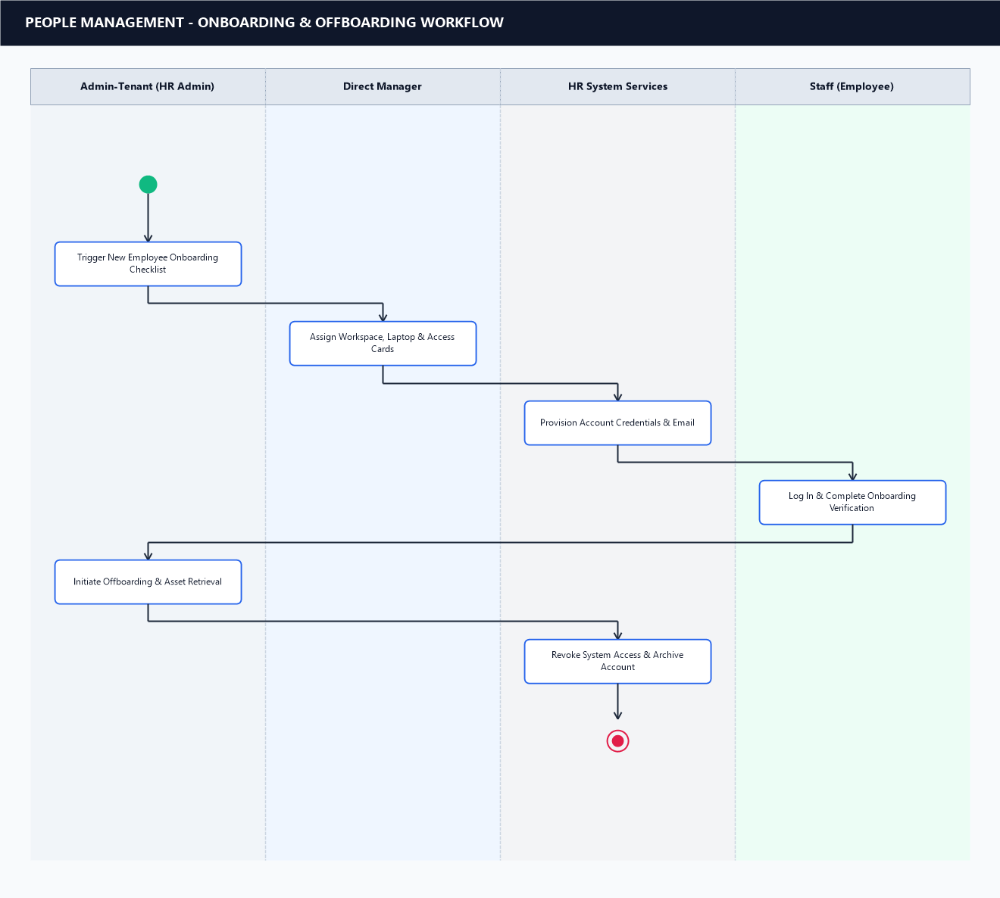

---

#### 1.14. Role & Permission Management (RBAC) Swimlane Process Diagram
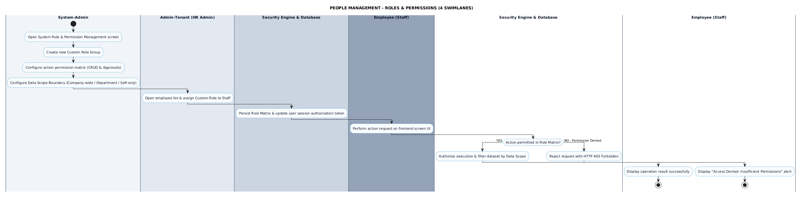

---

#### 1.15. Employee Profile Management Swimlane Process Diagram
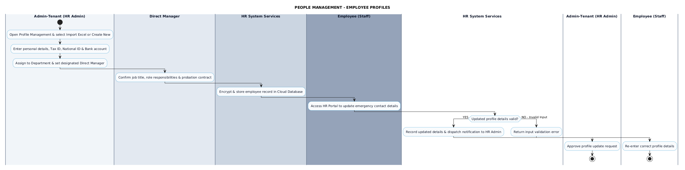

---

#### 1.16. Organizational Structure Setup Swimlane Process Diagram
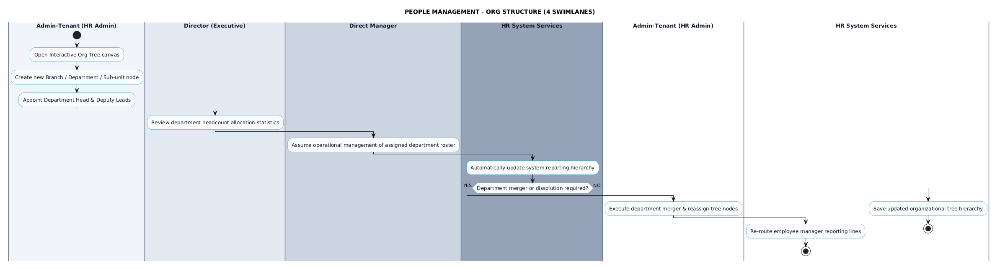

---

## 2. Time Tracking Subsystem

### Use Case Specifications

| ID | Name | Actor | Description |
| :--- | :--- | :--- | :--- |
| **UC-TIME-01** | Desktop Work Timer Control | `Staff`, `Desktop Agent Service` | Starts, pauses, and stops real-time work timers on desktop client apps with active project and task tagging. |
| **UC-TIME-01a** | Active Project & Task Selection | `Staff` | Selects designated projects and active work items before toggling timer sessions. |
| **UC-TIME-01b** | Offline Time Buffering & Sync | `Staff`, `Desktop Agent Service` | Buffers work time locally during network outages and automatically syncs timesheets upon reconnection. |
| **UC-TIME-01c** | Multi-Monitor Timer Tagging | `Desktop Agent Service` | Detects multi-monitor setups and tags active screen window focus timestamps. |
| **UC-TIME-02** | Mobile Clock In / Out | `Staff`, `Mobile Service` | Allows field staff to clock in/out, switch work tasks, add notes, and transmit app heartbeat status on mobile devices. |
| **UC-TIME-02a** | Mobile Task Switcher | `Staff` | Switches active work items on mobile device with notes and task duration tracking. |
| **UC-TIME-02b** | Field Photo Attachment | `Staff`, `Cloud Storage` | Attaches field service photos to active shift tasks for supervisor verification. |
| **UC-TIME-03** | Idle Inactivity Detection | `Staff`, `Manager`, `Desktop Agent Service` | Detects keyboard/mouse inactivity thresholds, prompts idle warning popups, and submits manual timesheet requests for manager approval. |
| **UC-TIME-03a** | Idle Warning Popup | `Staff`, `Desktop Agent Service` | Prompts user popup to keep or discard inactive time blocks upon detecting idle state. |
| **UC-TIME-03b** | Manual Timesheet Approval | `Staff`, `Manager` | Submits manual timesheet adjustment requests with reasons for manager approval. |

### Detailed Use Case Diagrams Gallery

#### 2.1. UC-TIME-01: Desktop Work Timer Control
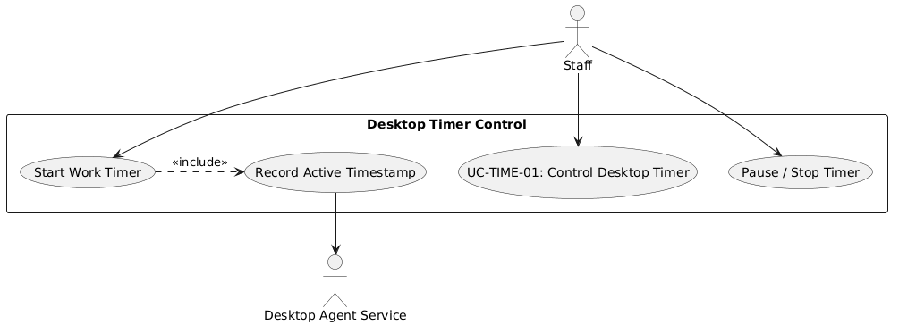

---

#### 2.2. UC-TIME-01a: Active Project & Task Selection
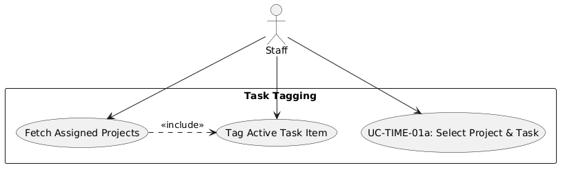

---

#### 2.3. UC-TIME-01b: Offline Time Buffering & Sync
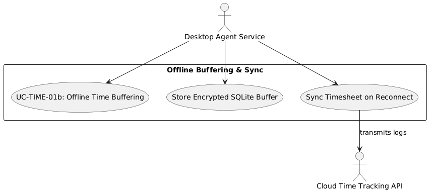

---

#### 2.4. UC-TIME-01c: Multi-Monitor Timer Tagging
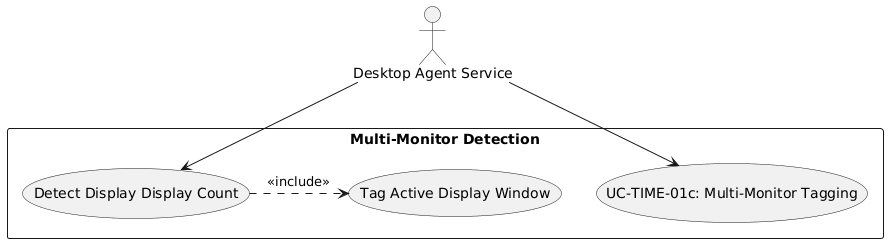

---

#### 2.5. UC-TIME-02: Mobile Clock In / Out
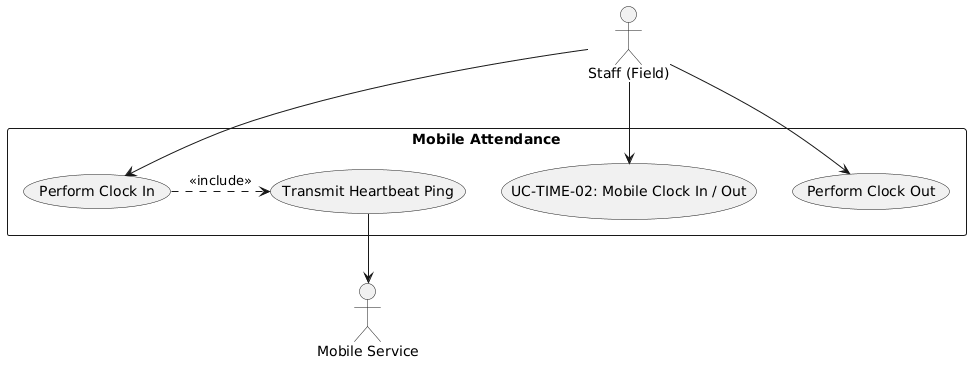

---

#### 2.6. UC-TIME-02a: Mobile Task Switcher
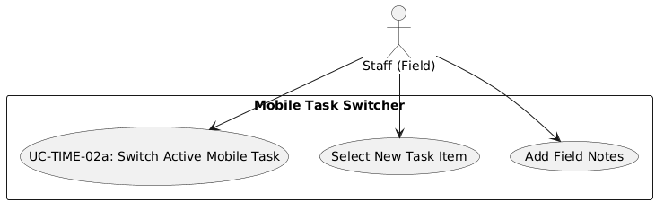

---

#### 2.7. UC-TIME-02b: Field Photo Attachment
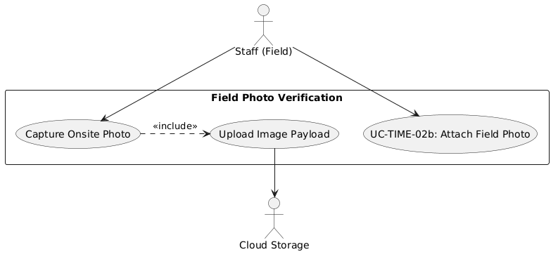

---

#### 2.8. UC-TIME-03: Idle Inactivity Detection
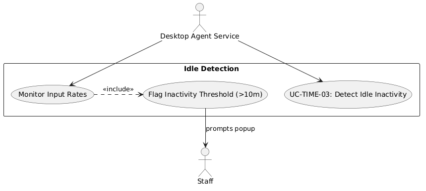

---

#### 2.9. UC-TIME-03a: Idle Warning Popup
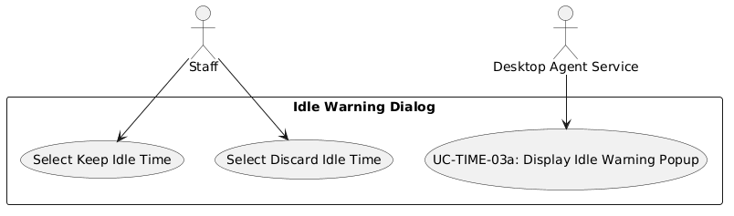

---

#### 2.10. UC-TIME-03b: Manual Timesheet Approval
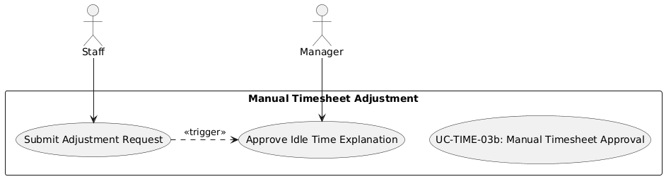

---

### Process Swimlane Diagrams Gallery

#### 2.11. Desktop Work Timer Swimlane Process Diagram
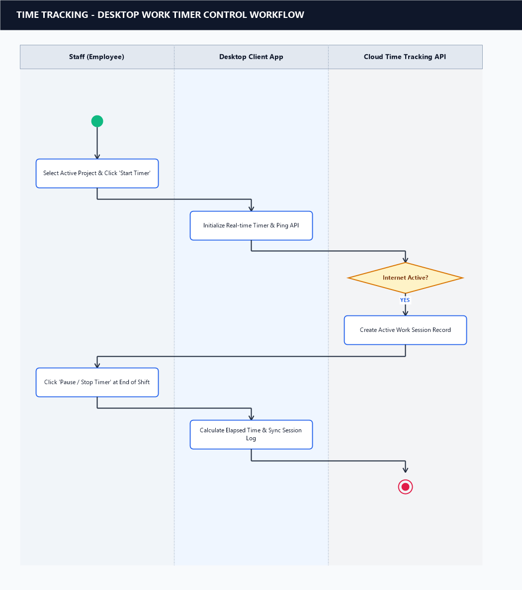

---

#### 2.12. Mobile Clock In / Out Swimlane Process Diagram
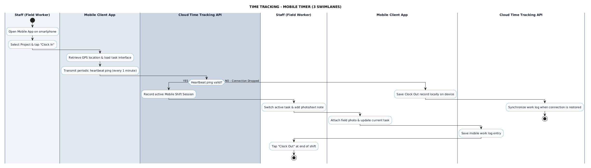

---

#### 2.13. Idle Inactivity Detection & Manual Timesheet Swimlane Process Diagram
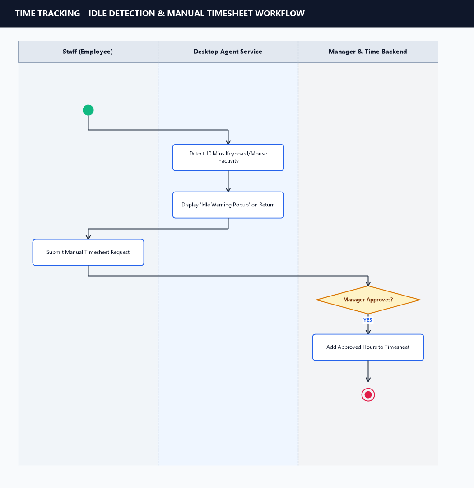

---

## 3. GPS Attendance Subsystem

### Use Case Specifications

| ID | Name | Actor | Description |
| :--- | :--- | :--- | :--- |
| **UC-GPS-01** | Geofenced GPS Check-in | `Staff`, `Admin-Tenant`, `Location Service` | Restricts employee attendance check-in/out to authorized GPS coordinates and branch perimeter radii. |
| **UC-GPS-01a** | Configure Branch Geofence Radius | `Admin-Tenant` | Sets branch latitude, longitude, and allowed geofence perimeter radius. |
| **UC-GPS-01b** | Verify Real-time GPS Location | `Staff`, `Location Service` | Verifies device GPS position against the geofence perimeter using Haversine algorithm. |
| **UC-GPS-01c** | Out-of-Bounds Check-in Rejection | `Staff`, `Location Service` | Rejects attendance check-in attempts outside authorized geofence radius. |
| **UC-GPS-02** | Live Map Location Tracking | `Manager`, `Staff`, `GPS Location Service` | Tracks real-time field staff positions on a live map and logs movement route history throughout the work shift. |
| **UC-GPS-02a** | Shift Route History Logging | `Staff`, `GPS Location Service` | Logs chronological GPS movement coordinates during active field shifts. |
| **UC-GPS-02b** | Export Shift Route Log | `Manager` | Exports detailed shift route history movement logs in PDF/CSV format. |
| **UC-GPS-02c** | Privacy Protection Outside Shift | `GPS Location Service` | Halts GPS location tracking automatically when employee clocks out. |

### Detailed Use Case Diagrams Gallery

#### 3.1. UC-GPS-01: Geofenced GPS Check-in
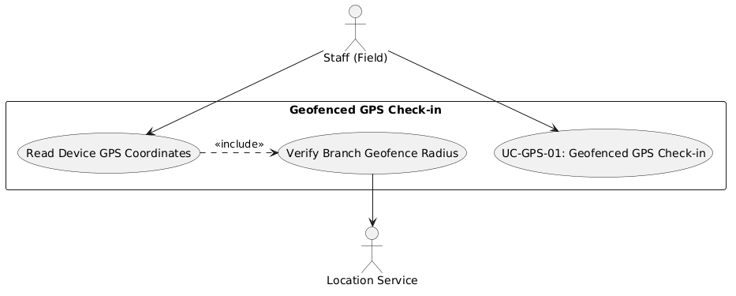

---

#### 3.2. UC-GPS-01a: Configure Branch Geofence Radius
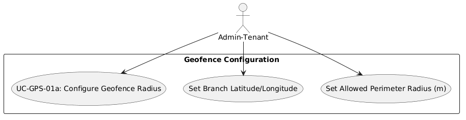

---

#### 3.3. UC-GPS-01b: Verify Real-time GPS Location
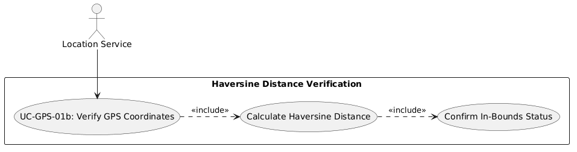

---

#### 3.4. UC-GPS-01c: Out-of-Bounds Check-in Rejection
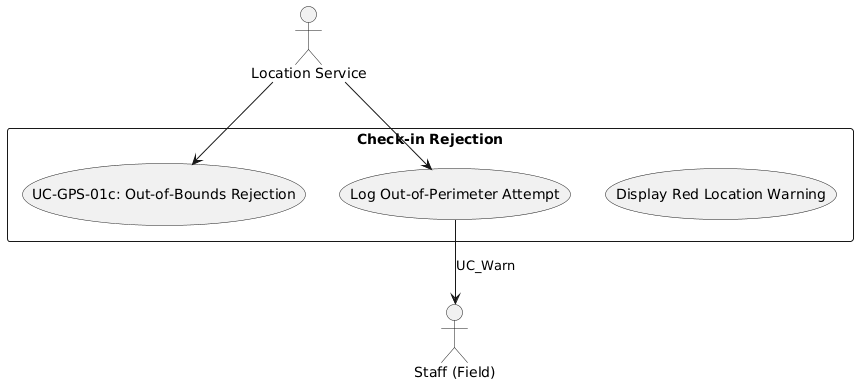

---

#### 3.5. UC-GPS-02: Live Map Location Tracking
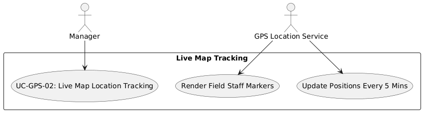

---

#### 3.6. UC-GPS-02a: Shift Route History Logging
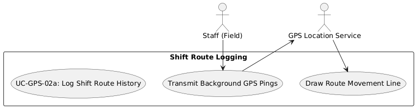

---

#### 3.7. UC-GPS-02b: Export Shift Route Log
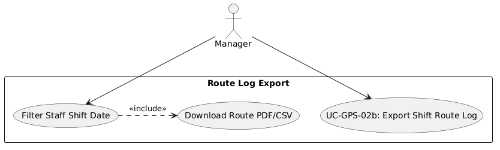

---

#### 3.8. UC-GPS-02c: Privacy Protection Outside Shift
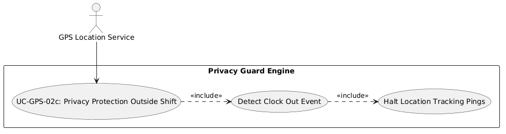

---

### Process Swimlane Diagrams Gallery

#### 3.9. Geofenced GPS Check-in Swimlane Process Diagram
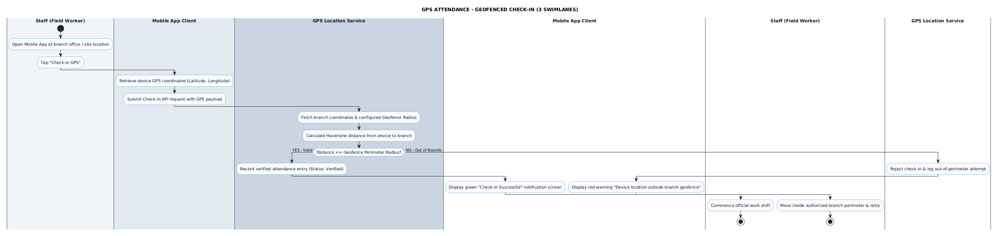

---

#### 3.10. Live Map & Shift Route Tracking Swimlane Process Diagram
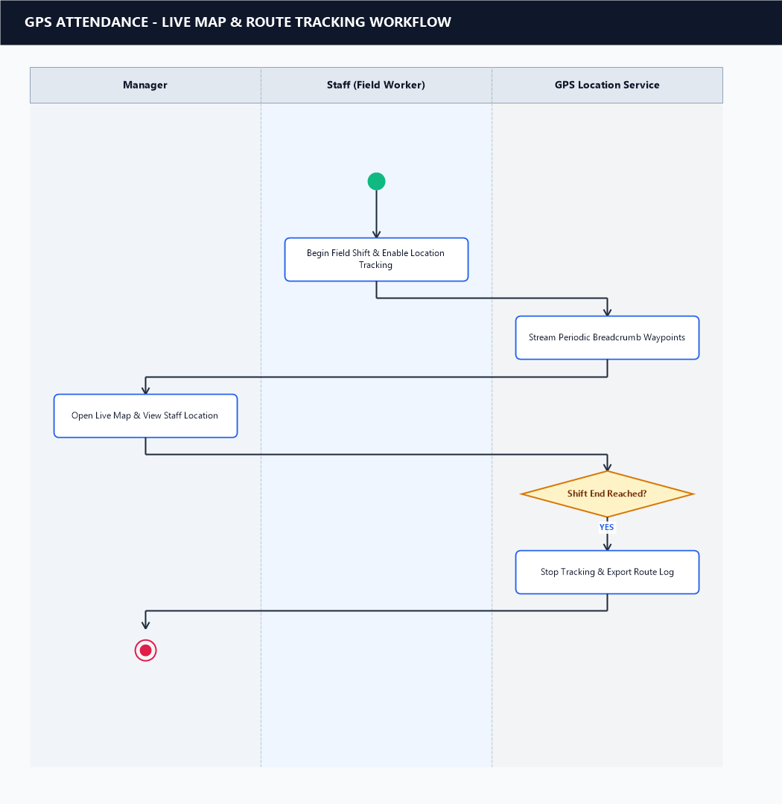

---

## 4. Productivity Monitoring Subsystem

### Use Case Specifications

| ID | Name | Actor | Description |
| :--- | :--- | :--- | :--- |
| **UC-PROD-01** | Random Automated Screenshot Capture | `System Service`, `Manager`, `Staff` | Captures multi-monitor screen activity at random intervals with client-side encryption and sensitive data blurring. |
| **UC-PROD-01a** | Multi-Monitor Screen Capture | `Desktop Agent App` | Captures all active displays simultaneously in multi-monitor workstations. |
| **UC-PROD-01b** | Sensitive App Blurring | `Desktop Agent App` | Automatically blurs sensitive application windows (Banking, Passwords) prior to upload. |
| **UC-PROD-01c** | Client-Side Encryption Upload | `Desktop Agent App`, `Cloud Storage` | Encrypts captured images with AES-256 on client device before transmitting. |
| **UC-PROD-02** | Keystroke & Mouse Activity Tracking | `Desktop Agent Service`, `Staff` | Measures keystrokes and mouse movement frequency to calculate active vs. idle session ratios. |
| **UC-PROD-02a** | Active vs Idle Ratio Calculation | `Productivity AI Engine` | Computes percentage of active input time per hour. |
| **UC-PROD-02b** | Anti-Autoclicker Anomaly Detection | `Productivity AI Engine`, `Manager` | Detects artificial auto-clickers and mouse jigglers, flagging compliance anomalies. |
| **UC-PROD-03** | App & Website Productivity Classification | `Admin-Tenant`, `Manager` | Categorizes active window titles and domain URLs into Productive, Unproductive, or Neutral status. |
| **UC-PROD-03a** | Productive / Unproductive Labeling | `Admin-Tenant` | Configures classification status labels for applications and domain names. |
| **UC-PROD-03b** | Department-Level Rule Overrides | `Admin-Tenant` | Sets department-specific overrides (e.g., Marketing allowed Social Media). |
| **UC-PROD-03c** | Social Media Alert Generation | `Productivity AI Engine`, `Manager` | Generates alerts when unproductive web usage exceeds 30 minutes. |
| **UC-PROD-04** | Activity Score Calculation | `Manager`, `System Service`, `Director` | Computes weighted Activity Score (%) metrics and renders team productivity dashboards. |
| **UC-PROD-04a** | Weighted Score Algorithm | `Productivity AI Engine` | Combines input frequency (60%) and productive app usage (40%) into unified score. |
| **UC-PROD-04b** | Low Productivity Alerts | `Productivity AI Engine`, `Manager` | Triggers real-time alerts when activity score drops below threshold (< 30%) for 2 hours. |

### Detailed Use Case Diagrams Gallery

#### 4.1. UC-PROD-01: Random Automated Screenshot Capture
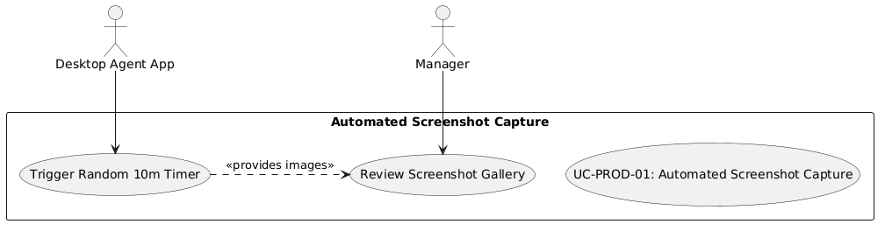

---

#### 4.2. UC-PROD-01a: Multi-Monitor Screen Capture

---

#### 4.3. UC-PROD-01b: Sensitive App Blurring
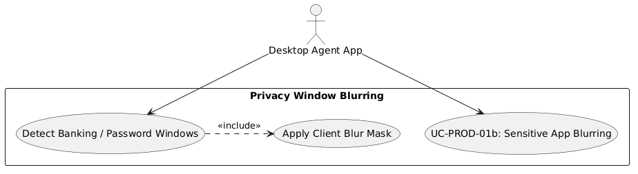

---

#### 4.4. UC-PROD-01c: Client-Side Encryption Upload
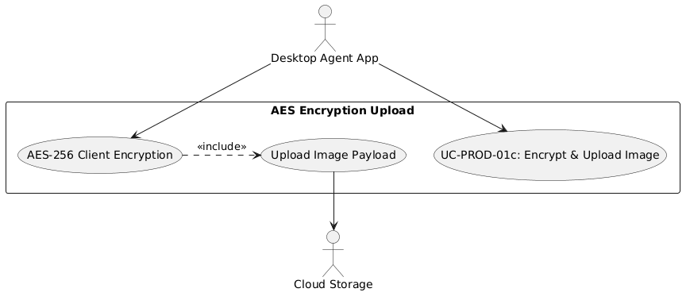

---

#### 4.5. UC-PROD-02: Keystroke & Mouse Input Activity Tracking
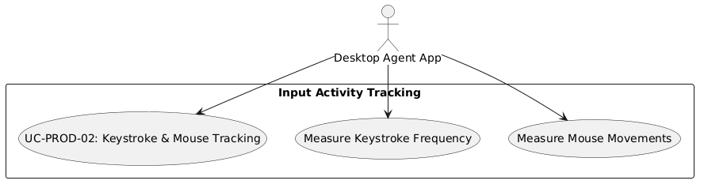

---

#### 4.6. UC-PROD-02a: Active vs Idle Ratio Calculation
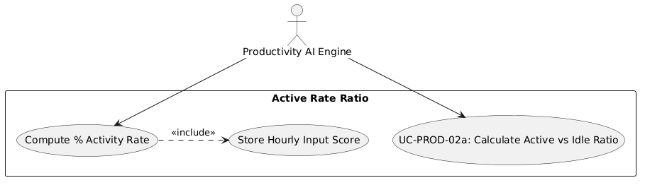

---

#### 4.7. UC-PROD-02b: Anti-Autoclicker Anomaly Detection
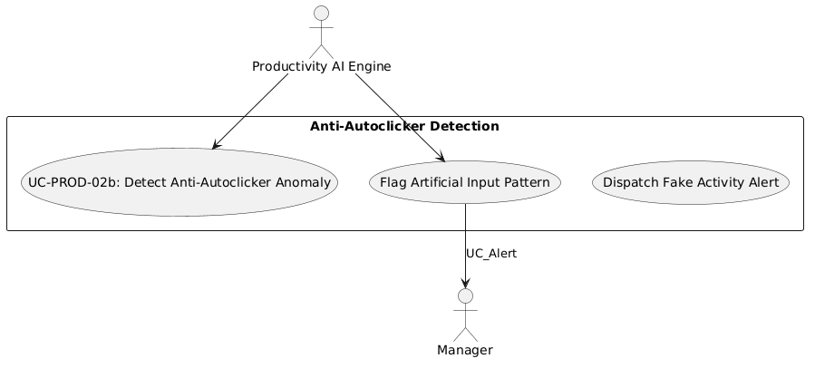

---

#### 4.8. UC-PROD-03: App & Website Productivity Classification
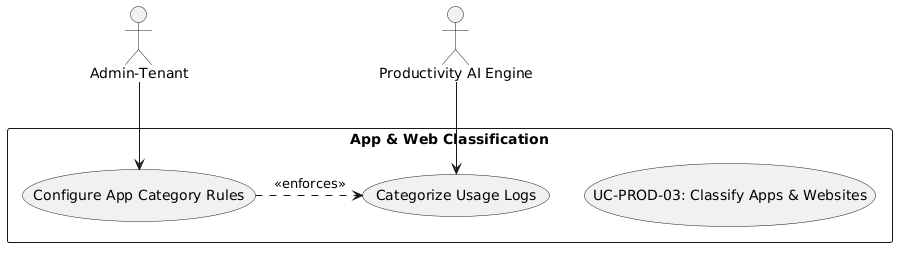

---

#### 4.9. UC-PROD-03a: Productive / Unproductive Labeling
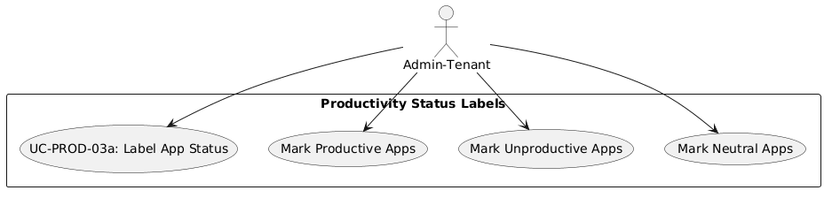

---

#### 4.10. UC-PROD-03b: Department-Level Rule Overrides
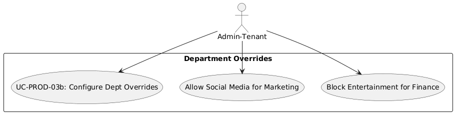

---

#### 4.11. UC-PROD-03c: Social Media Alert Generation
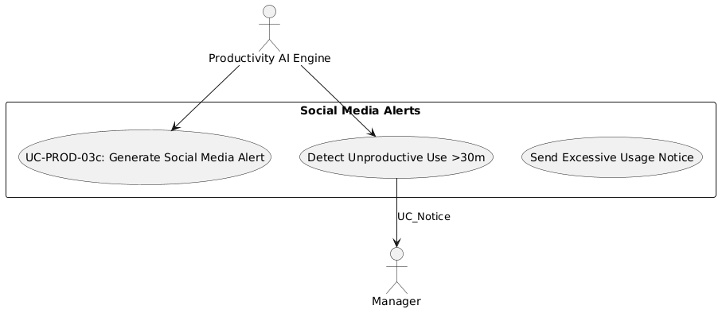

---

#### 4.12. UC-PROD-04: Activity Score Calculation
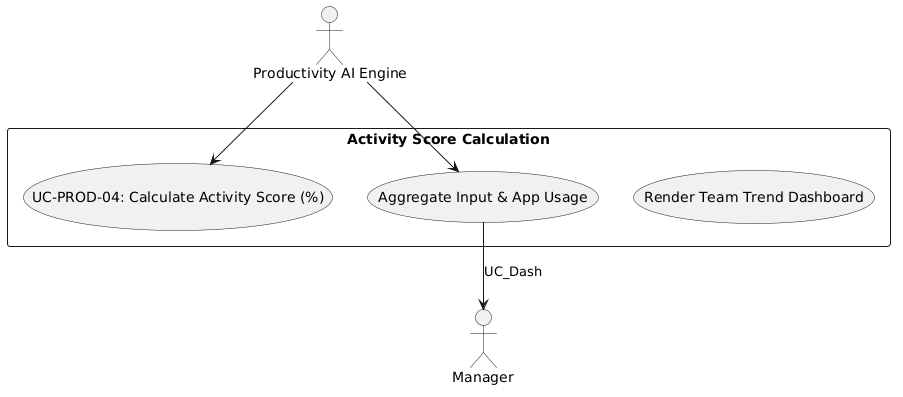

---

#### 4.13. UC-PROD-04a: Weighted Score Algorithm
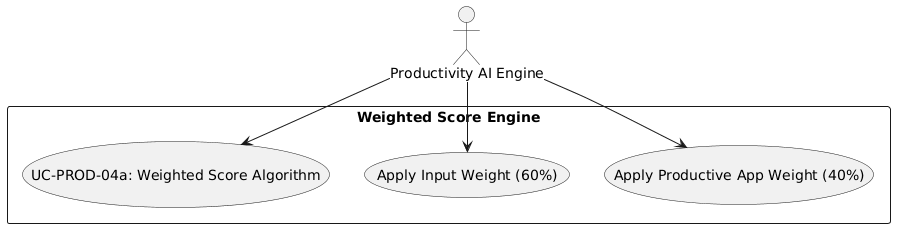

---

#### 4.14. UC-PROD-04b: Low Productivity Alerts
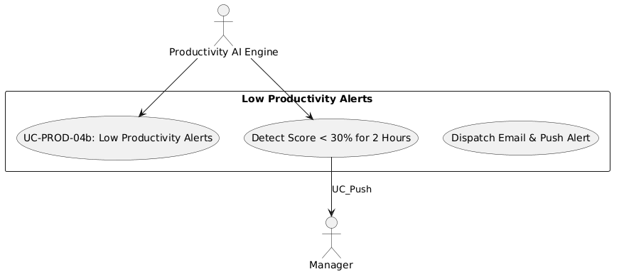

---

### Process Swimlane Diagrams Gallery

#### 4.15. Automated Screenshot Capture Swimlane Process Diagram
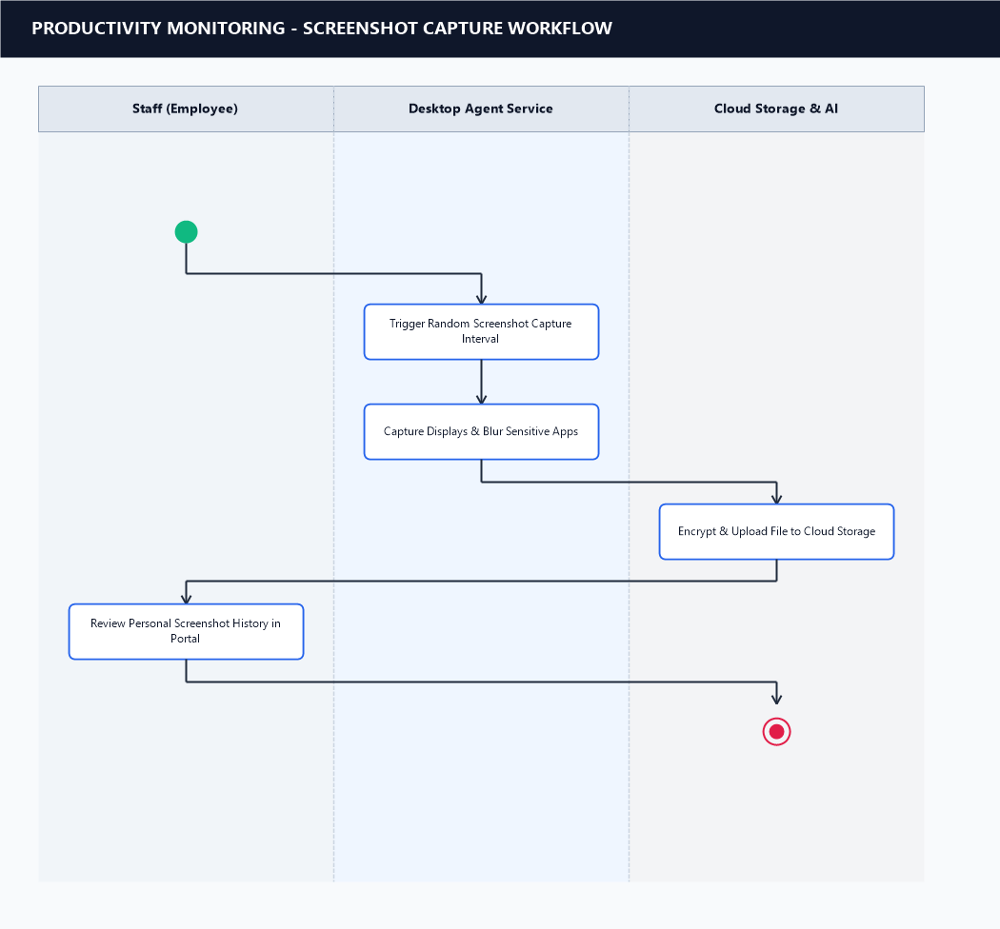

---

#### 4.16. Input Activity Tracking Swimlane Process Diagram
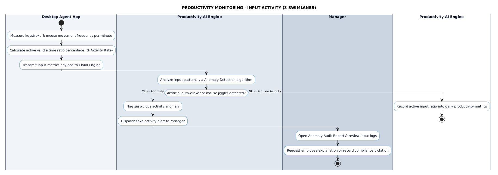

---

#### 4.17. App & Website Classification Swimlane Process Diagram
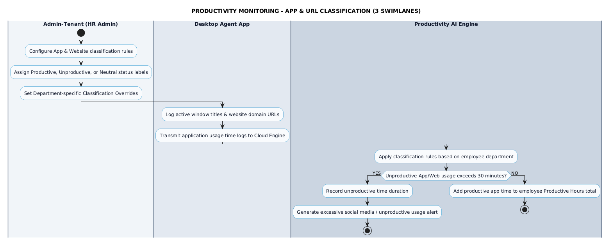

---

#### 4.18. Activity Score & Real-time Alerts Swimlane Process Diagram
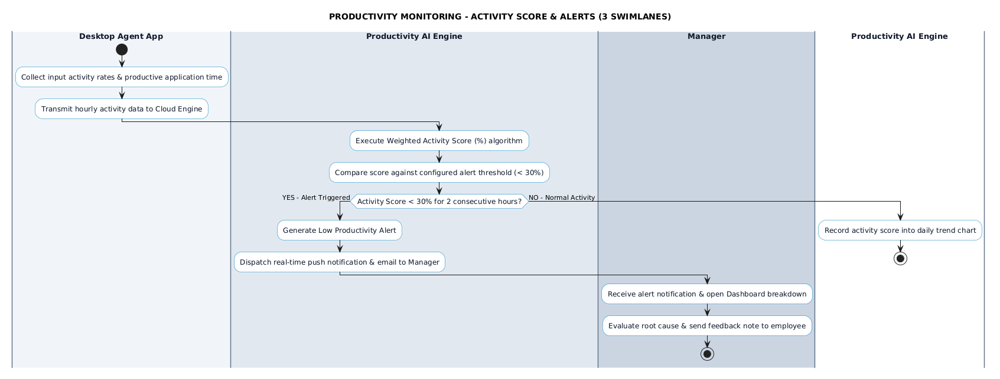

---

## 5. Scheduling & Time-Off Subsystem

### Use Case Specifications

| ID | Name | Actor | Description |
| :--- | :--- | :--- | :--- |
| **UC-SCHED-01** | Weekly Shift Planning | `Manager`, `Staff` | Assigns morning, afternoon, night, or split shift patterns, classifies Onsite/Remote work modes. |
| **UC-SCHED-01a** | Shift Pattern Selection | `Manager` | Selects designated shift templates for team members. |
| **UC-SCHED-01b** | Onsite / Remote Classification | `Manager` | Sets work location mode (Onsite Office vs Remote WFH) per shift. |
| **UC-SCHED-01c** | Shift Conflict Check | `Scheduling Engine`, `Manager` | Validates shift overlap conflicts and mandatory rest period rules. |
| **UC-SCHED-02** | Time-off & Leave Management | `Staff`, `Manager`, `Admin-Tenant` | Verifies available leave balances, submits leave requests with supporting attachments. |
| **UC-SCHED-02a** | Leave Balance Verification | `Leave Service`, `Staff` | Checks remaining annual leave balance before allowing submission. |
| **UC-SCHED-02b** | Medical Note Attachment | `Staff` | Attaches medical notes or sick leave documentation to request. |
| **UC-SCHED-02c** | Multi-level Leave Approval | `Manager`, `Admin-Tenant` | Routes leave requests > 3 days to HR Admin for final approval. |
| **UC-SCHED-03** | Attendance Rules Reconciliation | `System Service`, `Manager`, `Admin-Tenant` | Applies work shift grace periods, logs late arrival and early departure violations. |
| **UC-SCHED-03a** | Shift Grace Period Allowance | `Admin-Tenant`, `System Service` | Configures 15-minute grace period allowance before flagging tardiness. |
| **UC-SCHED-03b** | Late Arrival Violation Logging | `System Service`, `Staff` | Logs tardiness minutes and dispatches violation notices to employee. |
| **UC-SCHED-03c** | Unexcused Absence Flagging | `System Service`, `Payroll Engine` | Flags unexcused absences and applies pay penalty deductions. |

### Detailed Use Case Diagrams Gallery

#### 5.1. UC-SCHED-01: Weekly Shift Planning
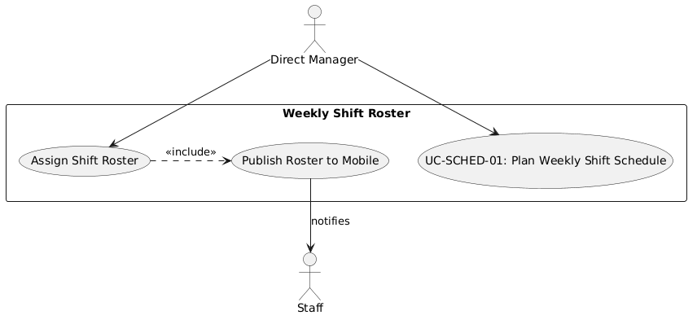

---

#### 5.2. UC-SCHED-01a: Shift Pattern Selection
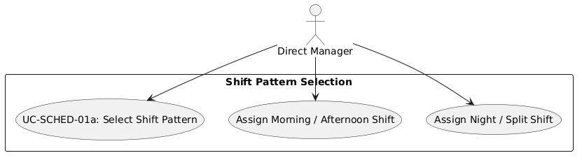

---

#### 5.3. UC-SCHED-01b: Onsite / Remote Classification
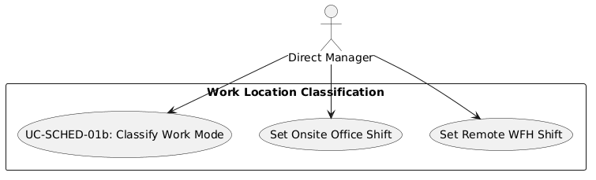

---

#### 5.4. UC-SCHED-01c: Shift Conflict Check
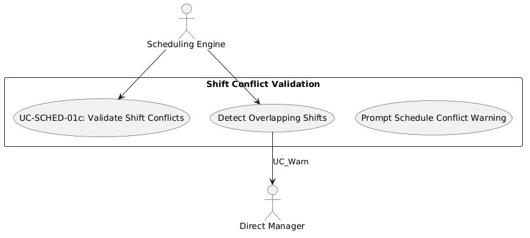

---

#### 5.5. UC-SCHED-02: Time-off & Leave Management
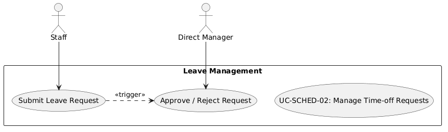

---

#### 5.6. UC-SCHED-02a: Leave Balance Verification
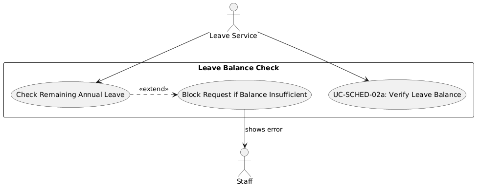

---

#### 5.7. UC-SCHED-02b: Medical Note Attachment
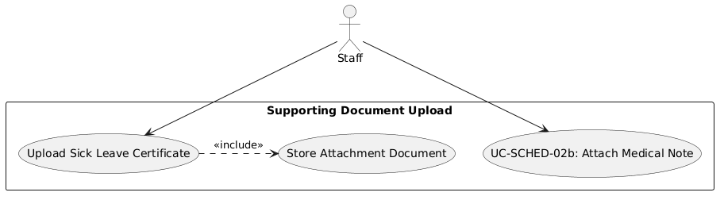

---

#### 5.8. UC-SCHED-02c: Multi-level Leave Approval
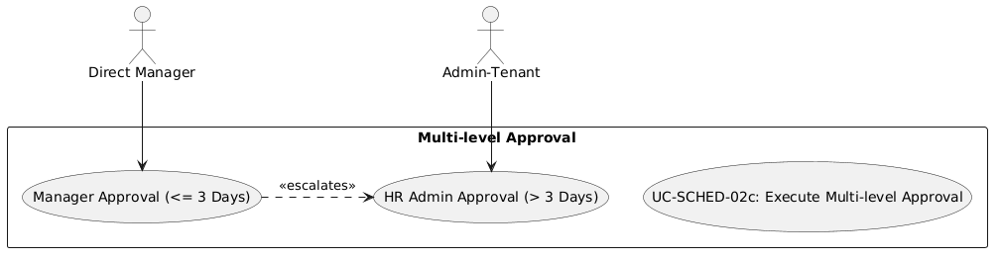

---

#### 5.9. UC-SCHED-03: Attendance Rules Reconciliation
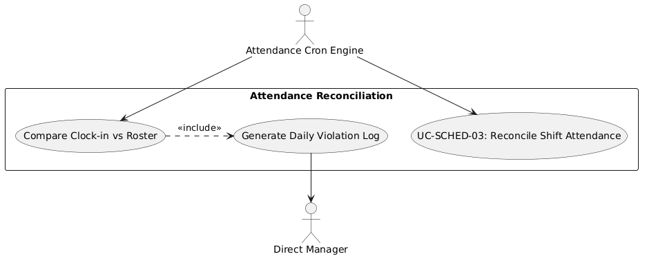

---

#### 5.10. UC-SCHED-03a: Shift Grace Period Allowance
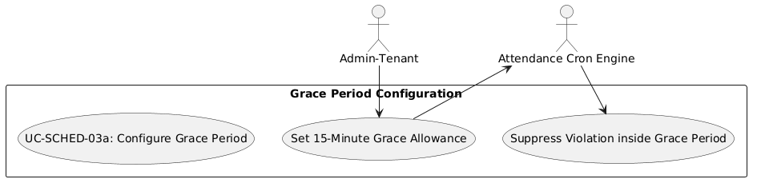

---

#### 5.11. UC-SCHED-03b: Late Arrival Violation Logging
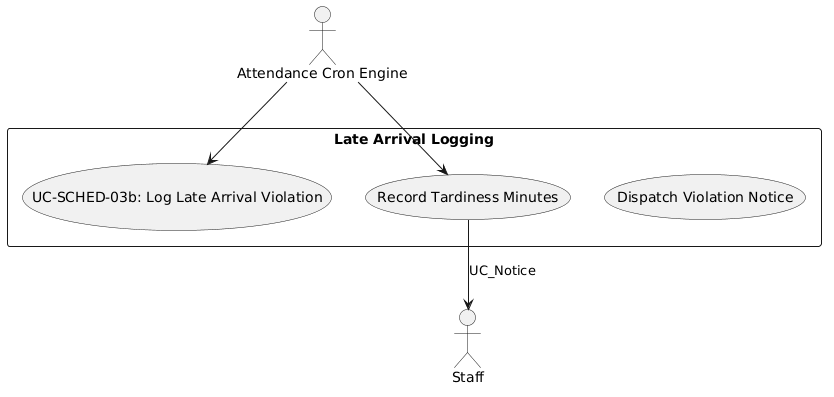

---

#### 5.12. UC-SCHED-03c: Unexcused Absence Flagging
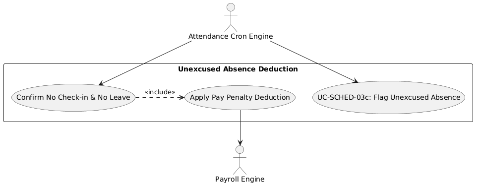

---

### Process Swimlane Diagrams Gallery

#### 5.13. Weekly Shift Planning Swimlane Process Diagram
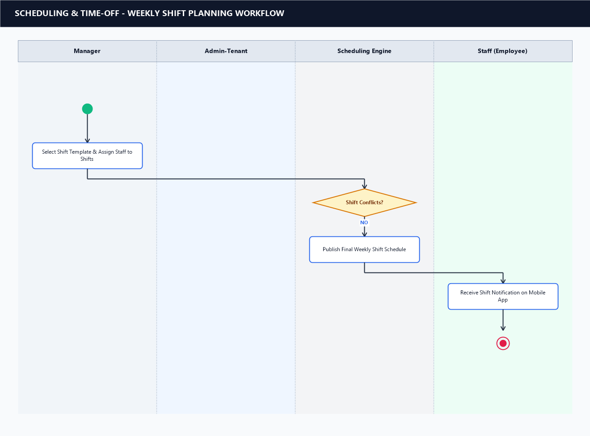

---

#### 5.14. Time-off & Leave Management Swimlane Process Diagram
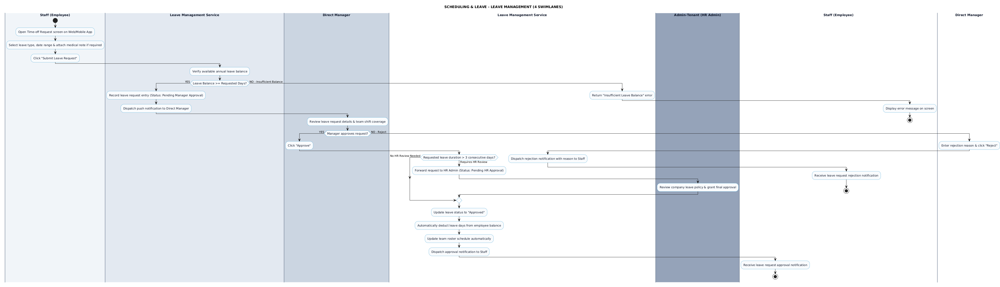

---

#### 5.15. Attendance Rules & Violation Log Swimlane Process Diagram
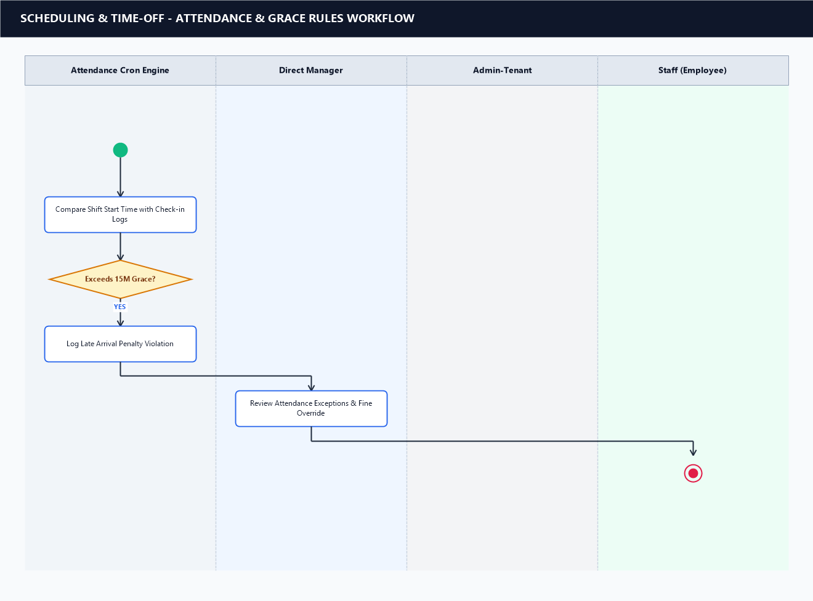

---

## 6. Payroll & Client Invoicing Subsystem

### Use Case Specifications

| ID | Name | Actor | Description |
| :--- | :--- | :--- | :--- |
| **UC-PAY-01** | Automated Monthly Salary Calculation | `Admin-Tenant`, `System Service`, `Staff` | Calculates monthly salary sheets automatically using approved timesheets, base pay rates. |
| **UC-PAY-01a** | Timesheet Hours Integration | `Time API`, `Payroll Engine` | Fetches verified timesheet hours to calculate base compensation. |
| **UC-PAY-01b** | Punctuality Violation Deduction | `Payroll Engine` | Deducts tardiness fines and unexcused absence penalties from payroll. |
| **UC-PAY-01c** | Monthly Salary Sheet Audit | `Admin-Tenant`, `Director` | Audits monthly salary sheets and submits for executive payout approval. |
| **UC-PAY-01d** | Encrypted Paystub PDF Generation | `Payroll Engine`, `Staff` | Generates password-encrypted PDF Paystubs and dispatches via email. |
| **UC-PAY-02** | Overtime Pay Management | `Admin-Tenant`, `Director` | Applies overtime multipliers, computes allowances, and monitors overtime budget caps. |
| **UC-PAY-02a** | Overtime Multiplier Configuration | `Admin-Tenant` | Sets overtime multipliers (Weekday 150%, Weekend 200%, Holiday 300%). |
| **UC-PAY-02b** | Night Shift Allowance Calculation | `Payroll Engine` | Calculates night shift premium allowances (22:00 - 06:00). |
| **UC-PAY-02c** | Overtime Budget Cap Monitoring | `Payroll Engine`, `Director` | Triggers alert when department OT costs exceed allocated budget cap. |
| **UC-PAY-02d** | Executive Overtime Budget Override | `Director`, `Payroll Engine` | Grants executive budget override for authorized department overtime. |
| **UC-PAY-03** | Client Invoicing Approval | `Manager`, `Client`, `Billing System` | Approves client-billable project work hours, applies role-based hourly billing rates. |
| **UC-PAY-03a** | Billable Hours Filtering | `Project Manager` | Filters client project billable hours from general timesheet logs. |
| **UC-PAY-03b** | Hourly Billing Rate Application | `Billing Engine` | Applies role-based hourly billing rate cards to compute total invoice. |
| **UC-PAY-03c** | Client Portal Invoice Payment | `Client`, `Billing Engine` | Allows client to view, download PDF invoice, and execute payment. |

### Detailed Use Case Diagrams Gallery

#### 6.1. UC-PAY-01: Automated Monthly Salary Calculation
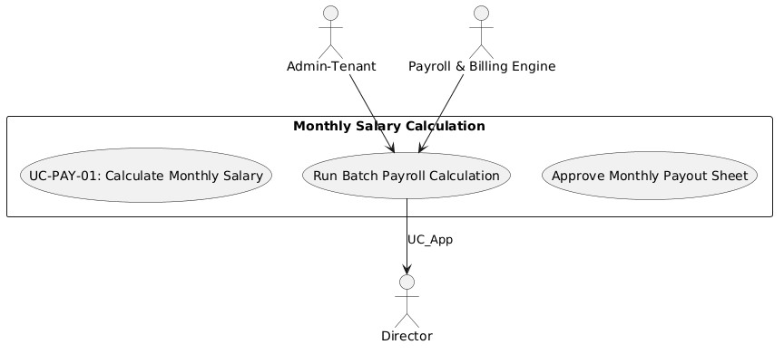

---

#### 6.2. UC-PAY-01a: Timesheet Hours Integration
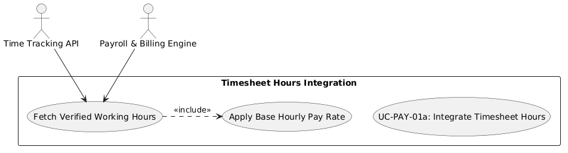

---

#### 6.3. UC-PAY-01b: Punctuality Violation Deduction
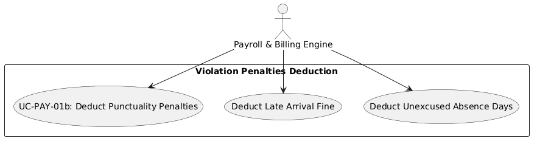

---

#### 6.4. UC-PAY-01c: Monthly Salary Sheet Audit
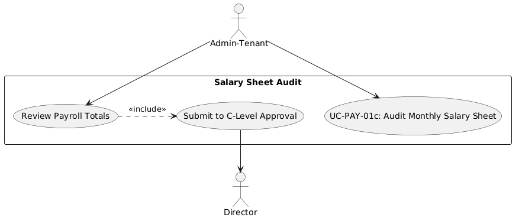

---

#### 6.5. UC-PAY-01d: Encrypted Paystub PDF Generation
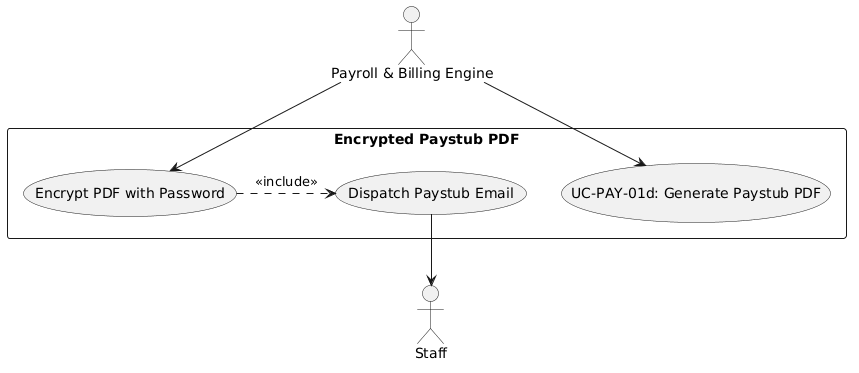

---

#### 6.6. UC-PAY-02: Overtime Pay & Allowance Management
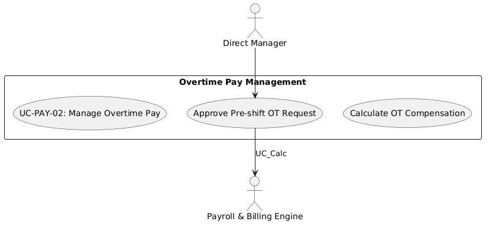

---

#### 6.7. UC-PAY-02a: Overtime Multiplier Configuration
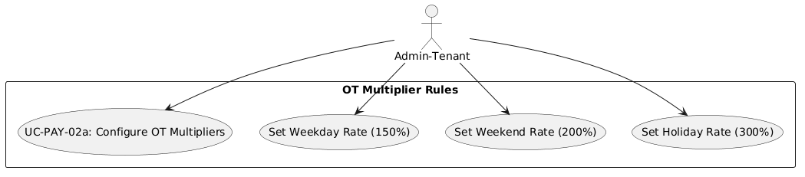

---

#### 6.8. UC-PAY-02b: Night Shift Allowance Calculation
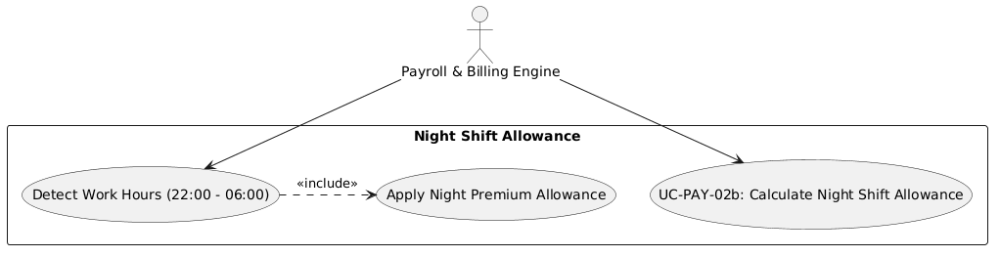

---

#### 6.9. UC-PAY-02c: Overtime Budget Cap Monitoring
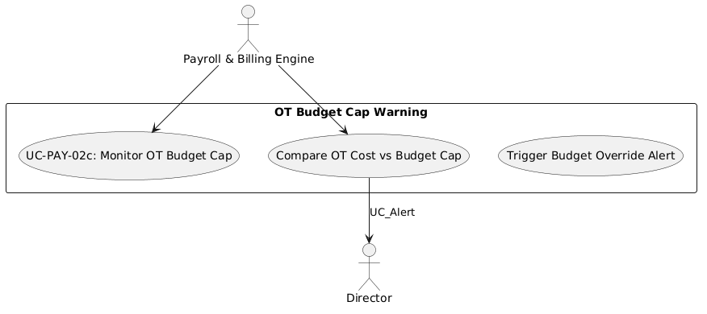

---

#### 6.10. UC-PAY-02d: Executive Overtime Budget Override
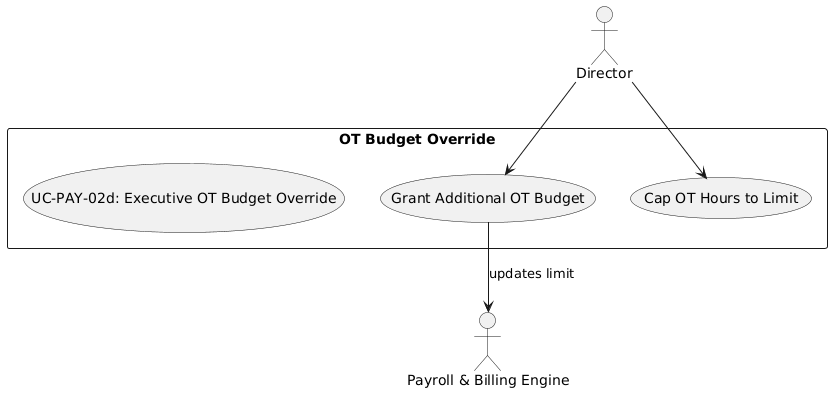

---

#### 6.11. UC-PAY-03: Client Invoicing & Billable Hours Approval
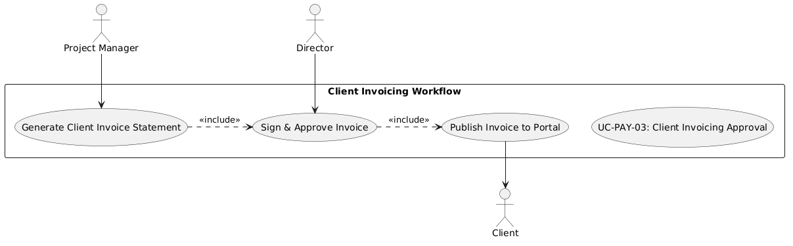

---

#### 6.12. UC-PAY-03a: Billable Hours Filtering
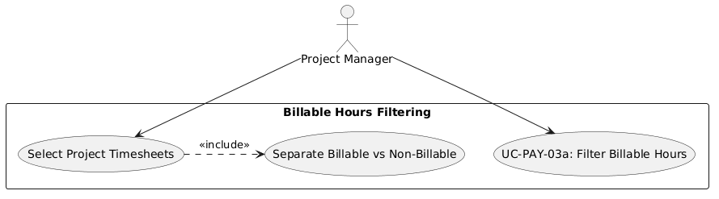

---

#### 6.13. UC-PAY-03b: Hourly Billing Rate Application

---

#### 6.14. UC-PAY-03c: Client Portal Invoice Payment
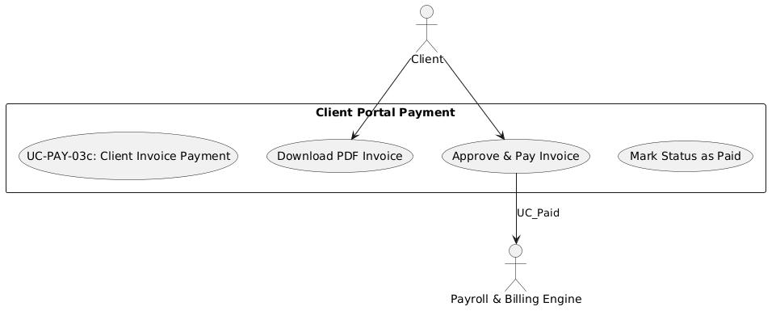

---

### Process Swimlane Diagrams Gallery

#### 6.15. Automated Monthly Salary Calculation Swimlane Process Diagram
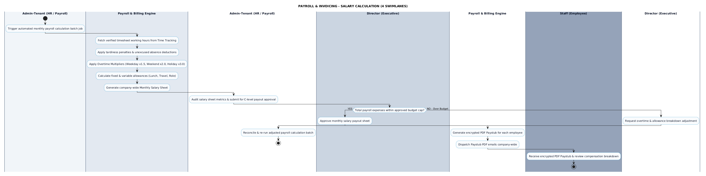

---

#### 6.16. Overtime Pay & Allowance Management Swimlane Process Diagram
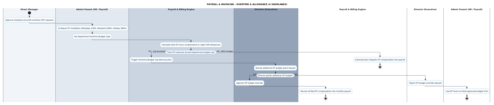

---

#### 6.17. Client Invoicing & Billable Hours Swimlane Process Diagram
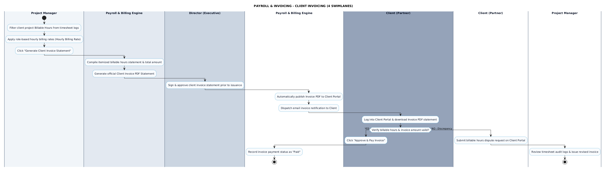
