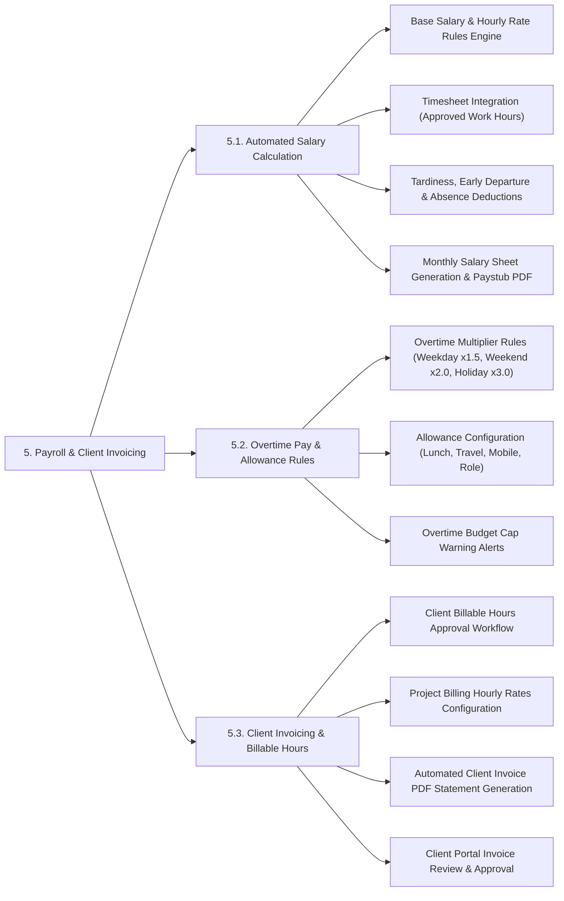

# PAYROLL & CLIENT INVOICING - DETAILED FEATURE BREAKDOWN

This document provides a detailed specification breakdown for the **Payroll & Client Invoicing** subsystem based on `docs/mindmap/Architecture.md`.

---

## 1. MINDMAP TREE - PAYROLL & CLIENT INVOICING

---

## 2. DETAILED FEATURE SPECIFICATIONS

### 5.1. Automated Salary Calculation
* **Salary Formula Engine:** Configures base salary compensation rules, insured salary brackets, standard work day basis (22 or 26 days), or hourly compensation rates.
* **Automated Timesheet Integration:** Fetches verified, approved working hours automatically from the Time Tracking subsystem without manual data re-entry.
* **Automated Violation Deductions:** Automatically applies salary penalty deductions for late arrivals, early departures, unexcused absences, or discarded idle time blocks.
* **Salary Sheet & Paystub PDF Generation:** Compiles monthly company-wide payroll summary sheets and generates individual password-encrypted PDF paystubs dispatched via email/HR Portal.

### 5.2. Overtime Pay & Allowance Rules
* **Overtime Multipliers Setup:** Automatically applies overtime compensation multipliers according to labor compliance laws or organizational policy:
  * *Weekday Overtime:* **x1.5** multiplier (150%).
  * *Weekend Overtime:* **x2.0** multiplier (200%).
  * *Public Holiday Overtime:* **x3.0** multiplier (300%).
* **Allowance Configuration:** Manages fixed and variable employee allowances (Meal/Lunch, Travel/Transit, Mobile Phone, Role-based responsibility allowance).
* **Overtime Budget Cap Monitoring:** Dispatches warning notifications to C-Level Directors and Managers when department overtime expenditure reaches 80% and 100% of allocated budget caps.

### 5.3. Client Invoicing & Billable Hours
* **Billable Hours Approval Workflow:** Tagged work hours on client projects are reviewed and approved by Managers and Clients on a weekly/monthly basis.
* **Hourly Billing Rates per Project/Role:** Configures hourly billing rate cards per project or role tier (e.g., Senior Engineer $40/h, UI/UX Designer $30/h).
* **Automated Client Invoice Generation:** Multiplies verified billable hours by billing rate cards to compile itemized invoice statements (Subtotal, VAT, Discounts, Grand Total).
* **Client Portal Access:** Allows external clients to log into the dedicated Client Portal to review time log breakdowns, approve invoices, and download official PDF invoice statements.
