# PAYROLL & CLIENT INVOICING - DETAILED FEATURE BREAKDOWN

Tài liệu này bóc tách chi tiết phân hệ **Payroll & Client Invoicing (Tính lương tự động & Xuất hóa đơn Khách hàng)** từ sơ đồ kiến trúc `docs/mindmap/Architecture.md`.

---

## 1. MINDMAP TREE - PAYROLL & CLIENT INVOICING

```mermaid
flowchart TD
    ROOT["5. Payroll & Client Invoicing"]

    %% Branch 1: Automated Salary Calculation
    ROOT --> SAL["5.1. Automated Salary Calculation"]
    SAL --> S1["Base Salary & Hourly Rate Rules Engine"]
    SAL --> S2["Timesheet Integration (Approved Work Hours)"]
    SAL --> S3["Tardiness, Early Departure & Absence Deductions"]
    SAL --> S4["Monthly Salary Sheet Generation & Paystub PDF"]

    %% Branch 2: Overtime Pay & Allowance Rules
    ROOT --> OT["5.2. Overtime Pay & Allowance Rules"]
    OT --> O1["Overtime Multiplier Rules (Weekday x1.5, Weekend x2.0, Holiday x3.0)"]
    OT --> O2["Allowance Configuration (Lunch, Travel, Mobile, Role)"]
    OT --> O3["Overtime Budget Cap Warning Alerts"]

    %% Branch 3: Client Invoicing & Billable Hours
    ROOT --> INV["5.3. Client Invoicing & Billable Hours"]
    INV --> I1["Client Billable Hours Approval Workflow"]
    INV --> I2["Project Billing Hourly Rates Configuration"]
    INV --> I3["Automated Client Invoice PDF Statement Generation"]
    INV --> I4["Client Portal Invoice Review & Approval"]
```

---

## 2. DETAILED FEATURE SPECIFICATIONS

### 5.1. Automated Salary Calculation (Tính lương tự động)
* **Cấu hình công thức lương:** Cấu hình mức lương cơ bản (Base Salary), lương đóng bảo hiểm, lương tính theo ngày công chuẩn (22 hoặc 26 ngày) hoặc lương tính theo đơn giá giờ (Hourly Rate).
* **Tích hợp tự động với Timesheet:** Hệ thống tự động kéo dữ liệu tổng số giờ làm việc thực tế đã được phê duyệt từ phân hệ Time Tracking mà không cần nhập liệu thủ công.
* **Tự động khấu trừ vi phạm (Deductions):** Tự động áp dụng quy tắc khấu trừ tiền lương đối với số phút đi muộn, về sớm, nghỉ không phép hoặc số giờ idle bị loại bỏ.
* **Xuất bảng lương & Phiếu lương (Paystub PDF):** Tạo bảng tổng hợp lương hàng tháng cho toàn bộ nhân viên và tự động xuất phiếu lương cá nhân (Paystub) gửi qua email/HR Portal cho từng nhân viên.

### 5.2. Overtime Pay & Allowance Rules (Tính lương tăng ca & Phụ cấp)
* **Quy tắc hệ số tăng ca (Overtime Multipliers):** Tự động nhân hệ số lương Overtime theo đúng Luật Lao động hoặc chính sách công ty:
  * *Tăng ca ngày thường:* Hệ số **x1.5** (150%).
  * *Tăng ca ngày nghỉ hàng tuần (Cuối tuần):* Hệ số **x2.0** (200%).
  * *Tăng ca ngày Lễ, Tết:* Hệ số **x3.0** (300%).
* **Cấu hình khoản phụ cấp (Allowances):** Quản lý các khoản phụ cấp cố định hoặc biến đổi (Phụ cấp ăn trưa, phụ cấp xăng xe/đi lại, phụ cấp điện thoại, phụ cấp trách nhiệm).
* **Cảnh báo trần ngân sách Overtime:** Gửi thông báo cảnh báo đến Director & Manager khi chi phí lương tăng ca của một phòng ban/dự án chạm mức 80% và 100% trần ngân sách cho phép.

### 5.3. Client Invoicing & Billable Hours (Xuất hóa đơn Khách hàng & Giờ tính phí)
* **Phê duyệt giờ tính phí (Billable Hours Approval):** Nhân viên gán nhãn giờ làm việc cho dự án khách hàng. Manager và Client rà soát, phê duyệt tổng số giờ Billable Hours hợp lệ theo tuần/tháng.
* **Đơn giá tính phí theo Dự án/Vai trò (Billing Rates):** Cấu hình đơn giá tính phí theo giờ (Hourly Rate) áp dụng cho từng dự án hoặc từng vai trò nhân sự (ví dụ: Senior Dev $40/h, UI Designer $30/h).
* **Xuất hóa đơn dịch vụ tự động (Client Invoice Generation):** Tự động nhân số giờ Billable Hours đã duyệt với đơn giá Billing Rate để tạo ra hóa đơn dịch vụ hoàn chỉnh (bao gồm Subtotal, Thuế VAT, Chiết khấu và Tổng tiền thanh toán).
* **Cổng thông tin Khách hàng (Client Portal):** Khách hàng đăng nhập Client Portal để xem bảng kê chi tiết giờ làm (Time Log), xem và bấm duyệt hóa đơn, hoặc tải tệp hóa đơn PDF chính thức.
