# PEOPLE MANAGEMENT - DETAILED FEATURE BREAKDOWN

Tài liệu này bóc tách chi tiết phân hệ **People Management (Quản lý Nhân sự & Cơ cấu Tổ chức)** từ sơ đồ kiến trúc `docs/mindmap/Architecture.md`.

---

## 1. MINDMAP TREE - PEOPLE MANAGEMENT

```mermaid
flowchart TD
    ROOT["1. People Management"]

    %% Branch 1: Employee Profiles
    ROOT --> PROFILES["1.1. Employee Profiles"]
    PROFILES --> P1["Personal & Contact Info (Họ tên, CCCD, SĐT, Email)"]
    PROFILES --> P2["Contract & Employment History (Thử việc, Chính thức, Ngày vào)"]
    PROFILES --> P3["Department & Direct Manager Assignment"]
    PROFILES --> P4["Emergency Contacts & Bank Account Details"]

    %% Branch 2: Org Structure
    ROOT --> ORG["1.2. Org Structure & Departments"]
    ORG --> O1["Interactive Multi-level Org Tree (Cây sơ đồ tổ chức)"]
    ORG --> O2["Department & Sub-unit Management (Phòng ban/Chi nhánh)"]
    ORG --> O3["Department Head & Deputy Assignment (Bổ nhiệm Trưởng/Phó phòng)"]
    ORG --> O4["Headcount & Roster Statistics (Định biên nhân sự)"]

    %% Branch 3: Onboarding & Offboarding
    ROOT --> ONBOARD["1.3. Onboarding & Offboarding Workflow"]
    ONBOARD --> N1["Automated Account Provisioning (Email, HR Portal, App)"]
    ONBOARD --> N2["Equipment & Asset Handover Log (Bàn giao máy tính, thẻ từ)"]
    ONBOARD --> N3["Exit Checklist & Task Handover (Checklist nghỉ việc)"]
    ONBOARD --> N4["Account Revocation & Data Archiving (Thu hồi quyền & Đóng băng)"]

    %% Branch 4: Roles & Permissions
    ROOT --> RBAC["1.4. Role & Permission Management (RBAC)"]
    RBAC --> R1["Default System Roles (Admin, Director, Manager, Staff, Client)"]
    RBAC --> R2["Custom Role Group Creation (HR Officer, Finance Officer)"]
    RBAC --> R3["Action Permission Matrix (Create, Read, Update, Delete, Approve)"]
    RBAC --> R4["Data Scope Scoping (Company-wide, Department, Self-only)"]
```

---

## 2. DETAILED FEATURE SPECIFICATIONS

### 2.1. Employee Profile Management (Quản lý Hồ sơ Nhân sự)
* **Thông tin cá nhân & Liên hệ:** Quản lý thông tin định danh (Họ tên, Ngày sinh, Giới tính, Số CCCD/Passport), Email công ty, SĐT, Địa chỉ thường trú/tạm trú.
* **Hợp đồng & Quá trình công tác:** Lưu trữ loại hợp đồng (Thử việc, Xác định thời hạn, Không xác định thời hạn), Ngày bắt đầu/kết thúc, Lịch sử tăng lương và khen thưởng/kỷ luật.
* **Phân bổ nhân sự:** Gán nhân viên vào Phòng ban/Chi nhánh, bổ nhiệm Chức danh công việc và thiết lập Người quản lý trực tiếp (Direct Manager).
* **Thông tin tài chính & Khẩn cấp:** Lưu số tài khoản ngân hàng nhận lương, mã số thuế cá nhân, người liên hệ khẩn cấp (Emergency Contact).

### 2.2. Organizational Structure Setup (Cơ cấu Tổ chức & Phòng ban)
* **Cây sơ đồ tổ chức đa cấp (Interactive Org Tree):** Hiển thị trực quan cấu trúc công ty từ Hội đồng quản trị, Ban giám đốc xuống các Phòng ban, Ban bệ và Nhóm dự án.
* **Quản lý phòng ban & Chi nhánh:** Tạo mới, chỉnh sửa, sáp nhập hoặc giải thể các phòng ban/chi nhánh làm việc.
* **Bổ nhiệm lãnh đạo:** Bổ nhiệm Trưởng phòng (Department Head), Phó phòng và Trưởng nhóm (Team Lead) để phân quyền duyệt đơn từ.
* **Định biên nhân sự:** Cấu hình và theo dõi số lượng nhân sự tối thiểu/tối đa cho từng phòng ban.

### 2.3. Onboarding & Offboarding Workflow (Quy trình Tiếp nhận & Thôi việc)
* **Tiếp nhận nhân sự mới (Onboarding):**
  * Tự động cấp tài khoản đăng nhập (Email công ty, HR Portal, Desktop/Mobile Timer App).
  * Giao checklist công việc tiếp nhận cho nhân viên mới và quản lý trực tiếp.
  * Theo dõi nhật ký bàn giao thiết bị (Máy tính, Màn hình, Thẻ từ, Đồng phục).
* **Thôi việc & Bàn giao (Offboarding):**
  * Tạo luồng duyệt đơn xin nghỉ việc (Resignation Request).
  * Checklist thu hồi tài sản, bàn giao tài nguyên/dự án đang làm.
  * Tự động vô hiệu hóa toàn bộ quyền truy cập tài khoản khi đến ngày nghỉ việc chính thức.

### 2.4. Role & Permission Management - RBAC (Phân quyền Vai trò)
* **Các vai trò mặc định (System Roles):**
  * `System-Admin`: Super Admin quản trị nền tảng SaaS.
  * `Admin-Tenant`: Admin quản trị toàn bộ doanh nghiệp.
  * `Director`: Ban giám đốc (Xem báo cáo tổng quan & chỉ số AI).
  * `Manager`: Trưởng phòng/Quản lý dự án (Duyệt phép, phân ca, giao việc).
  * `Staff`: Nhân viên (Chấm công, làm việc, xin nghỉ).
  * `Client`: Khách hàng đối tác (Xem tiến độ & duyệt giờ tính phí).
* **Tạo nhóm quyền tùy chỉnh (Custom Roles):** Cho phép tạo các nhóm quyền riêng như *Cán bộ HR*, *Kế toán tiền lương*, *Quản lý kho*.
* **Ma trận phân quyền granular:** Thiết lập chi tiết từng thao tác (`Xem`, `Thêm`, `Sửa`, `Xóa`, `Phê duyệt`, `Xuất dữ liệu`) trên từng màn hình tính năng.
* **Phạm vi dữ liệu (Data Scope):** Cấu hình phạm vi xem dữ liệu: *Toàn công ty (Company-wide)*, *Trong phòng ban (Department-only)*, hoặc *Chỉ cá nhân (Self-only)*.
