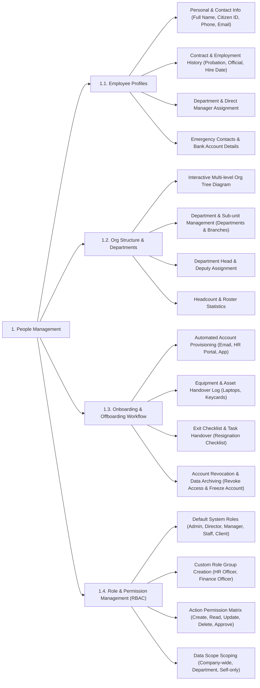

# PEOPLE MANAGEMENT - DETAILED FEATURE BREAKDOWN

This document provides a detailed specification breakdown for the **People Management (Personnel & Organizational Structure)** subsystem based on `docs/mindmap/Architecture.md`.

---

## 1. MINDMAP TREE - PEOPLE MANAGEMENT

---

## 2. DETAILED FEATURE SPECIFICATIONS

### 2.1. Employee Profile Management
* **Personal & Contact Details:** Manages identity records (Full Name, DOB, Gender, National ID/Passport), company email, phone number, and residential address.
* **Contract & Employment History:** Stores contract types (Probation, Fixed-term, Indefinite), start/end dates, salary increase logs, and performance records.
* **Personnel Assignment:** Assigns employees to departments/branches, configures job titles, and designates direct managers.
* **Financial & Emergency Information:** Stores direct deposit bank accounts, tax IDs, and emergency contact details.

### 2.2. Organizational Structure Setup
* **Interactive Multi-Level Org Tree:** Visualizes organizational structure from Board of Directors down to departments, divisions, and project teams.
* **Department & Branch Management:** Creates, edits, merges, or dissolves departments and branch offices.
* **Leadership Appointments:** Appoints Department Heads, Deputy Heads, and Team Leads to route approval workflows.
* **Headcount Planning:** Configures and monitors minimum/maximum headcount capacity per department.

### 2.3. Onboarding & Offboarding Workflow
* **New Hire Onboarding:**
  * Automated account provisioning (Company Email, HR Portal, Desktop/Mobile Timer App).
  * Onboarding task checklist assignment for new hires and direct managers.
  * Equipment and hardware asset handover tracking (Laptops, Monitors, Keycards, Badges).
* **Employee Offboarding:**
  * Resignation request and exit approval workflows.
  * Asset retrieval checklist and active project task handover logs.
  * Automatic account access revocation and data archiving upon official departure date.

### 2.4. Role & Permission Management (RBAC)
* **Default System Roles:**
  * `System-Admin`: Super administrator for the SaaS platform.
  * `Admin-Tenant`: Administrator for the tenant enterprise.
  * `Director`: C-Level executive (Overview reports & AI metrics).
  * `Manager`: Department Head / Project Manager (Approvals, shift planning, task assignments).
  * `Staff`: Internal employee (Time tracking, work log, leave requests).
  * `Client`: External client partner (Track progress & approve billable hours).
* **Custom Role Groups:** Allows creating custom roles such as *HR Officer*, *Payroll Accountant*, or *Inventory Manager*.
* **Granular Permission Matrix:** Configures action permissions (`Create`, `Read`, `Update`, `Delete`, `Approve`, `Export`) per feature screen.
* **Data Scoping:** Configures data visibility boundaries: *Company-wide*, *Department-only*, or *Self-only*.
