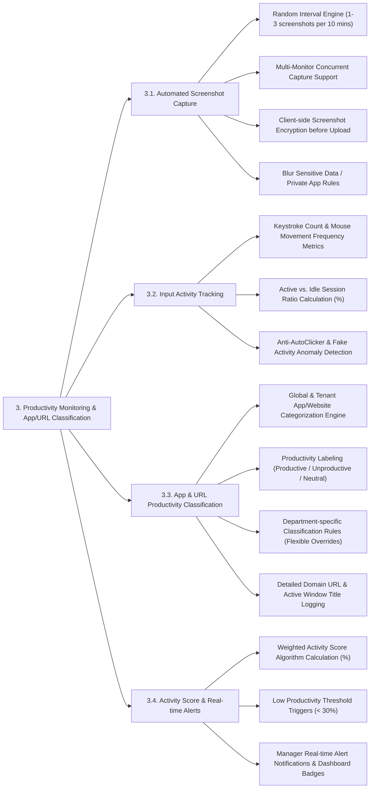

# PRODUCTIVITY MONITORING & APP/URL CLASSIFICATION - DETAILED FEATURE BREAKDOWN

This document provides a detailed specification breakdown for the **Productivity Monitoring & App/URL Classification** subsystem based on `docs/mindmap/Architecture.md`.

---

## 1. MINDMAP TREE - PRODUCTIVITY MONITORING & APP/URL CLASSIFICATION

---

## 2. DETAILED FEATURE SPECIFICATIONS

### 3.1. Automated Screenshot Capture
* **Random Interval Engine:** Captures random screenshots (e.g., 1 to 3 captures within every 10-minute block) to ensure objective, unannounced sampling.
* **Multi-Monitor Support:** Captures all connected displays concurrently (Display 1, Display 2, Display 3) for multi-monitor workstations.
* **Client-Side Encryption:** Encrypts captured images using AES-256 on the desktop agent prior to uploading to secure cloud storage.
* **Sensitive Data Blurring:** Automatically blurs screen capture content when employees access pre-configured sensitive applications (e.g., Password Managers, Banking apps, Private messaging).

### 3.2. Input Activity Tracking
* **Input Frequency Metrics:** Measures keystrokes count and mouse movement/click frequency per minute *(Note: Does not log actual key characters/keylogger to preserve privacy).*
* **Active Ratio Calculation:** Calculates the active versus idle session percentage ratio per minute.
* **Anti-AutoClicker Detection:** Integrates AI anomaly detection algorithms to identify artificial mouse jigglers and auto-clicker software based on non-human periodic movement frequencies.

### 3.3. Application & URL Productivity Classification
* **Software & Web Domain Categorization:** Automatically detects running desktop applications and active browser domain URLs.
* **Productivity Labeling:**
  * `Productive`: Work-related applications/domains (e.g., VS Code, Jira, Figma, Google Docs).
  * `Unproductive`: Non-work or entertainment domains/apps (e.g., Facebook, YouTube, Steam, Netflix, TikTok).
  * `Neutral`: General system utility tools (e.g., File Explorer, Calculator, System Settings).
* **Department-Specific Overrides:** Configures flexible classification rules based on department roles:
  * *Facebook / TikTok:* Labeled as `Productive` for Marketing departments, but labeled as `Unproductive` for Software Engineering.
* **Active Window & Domain Logging:** Records exact domain URLs and active window title text for compliance auditing.

### 3.4. Activity Score & Real-Time Alerts
* **Weighted Activity Score Algorithm (%):** Combines input frequency (60%) and productive app usage (40%) into a unified Activity Score metric (0% - 100%).
* **Low Productivity Threshold Triggers:** Configures threshold alerts (e.g., Activity Score < 30% for 2 consecutive hours).
* **Real-Time Alert Dispatch:** Sends instant push notifications and dashboard badges to supervisors when low-productivity thresholds or compliance anomalies are detected.
