# PRODUCTIVITY MONITORING & APP/URL CLASSIFICATION - DETAILED FEATURE BREAKDOWN

Tài liệu này bóc tách chi tiết phân hệ **Productivity Monitoring & App/URL Classification (Giám sát Hiệu suất & Phân loại App/Web)** từ sơ đồ kiến trúc `docs/mindmap/Architecture.md`.

---

## 1. MINDMAP TREE - PRODUCTIVITY MONITORING & APP/URL CLASSIFICATION

```mermaid
flowchart TD
    ROOT["3. Productivity Monitoring & App/URL Classification"]

    %% Branch 1: Automated Screenshot Capture
    ROOT --> SCR["3.1. Automated Screenshot Capture"]
    SCR --> S1["Random Interval Engine (1-3 screenshots per 10 mins)"]
    SCR --> S2["Multi-Monitor Concurrent Capture Support"]
    SCR --> S3["Client-side Screenshot Encryption before Upload"]
    SCR --> S4["Blur Sensitive Data / Private App Rules"]

    %% Branch 2: Input Activity Tracking
    ROOT --> INP["3.2. Input Activity Tracking"]
    INP --> I1["Keystroke Count & Mouse Movement Frequency Metrics"]
    INP --> I2["Active vs. Idle Session Ratio Calculation (%)"]
    INP --> I3["Anti-AutoClicker & Fake Activity Anomaly Detection"]

    %% Branch 3: App & URL Classification
    ROOT --> APP["3.3. App & URL Productivity Classification"]
    APP --> A1["Global & Tenant App/Website Categorization Engine"]
    APP --> A2["Productivity Labeling (Productive / Unproductive / Neutral)"]
    APP --> A3["Department-specific Classification Rules (Flexible Overrides)"]
    APP --> A4["Detailed Domain URL & Active Window Title Logging"]

    %% Branch 4: Activity Score & Alerts
    ROOT --> SCORE["3.4. Activity Score & Real-time Alerts"]
    SCORE --> C1["Weighted Activity Score Algorithm Calculation (%)"]
    SCORE --> C2["Low Productivity Threshold Triggers (< 30%)"]
    SCORE --> C3["Manager Real-time Alert Notifications & Dashboard Badges"]
```

---

## 2. DETAILED FEATURE SPECIFICATIONS

### 3.1. Automated Screenshot Capture (Chụp màn hình ngẫu nhiên tự động)
* **Cơ chế chụp ngẫu nhiên (Random Interval Engine):** Tự động chụp màn hình ngẫu nhiên (ví dụ: 1 đến 3 ảnh trong mỗi khung thời gian 10 phút) để đảm bảo tính khách quan, chống đối phó.
* **Hỗ trợ nhiều màn hình (Multi-Monitor Support):** Chụp đồng thời tất cả các màn hình hiển thị (Monitor 1, Monitor 2, Monitor 3) nếu nhân viên dùng hệ thống đa màn hình.
* **Mã hóa dữ liệu tại máy trạm (Client-side Encryption):** Hình ảnh được mã hóa ngay tại ứng dụng Client trước khi tải lên kho lưu trữ Cloud an toàn.
* **Làm mờ thông tin nhạy cảm (Blur Sensitive Data):** Cấu hình tự động làm mờ (Blur) nội dung màn hình khi nhân viên mở các ứng dụng nhạy cảm (ví dụ: Trình duyệt mật khẩu, Ngân hàng, Ứng dụng tin nhắn riêng tư).

### 3.2. Input Activity Tracking (Theo dõi tương tác Phím & Chuột)
* **Đo đạc số lượng phím & thao tác chuột:** Ghi nhận số lượng phím gõ (Keystrokes) và di chuyển/click chuột trong từng phút ca làm việc *(Lưu ý: Không lưu nội dung chữ gõ - Keylogger để bảo vệ riêng tư).*
* **Tính tỷ lệ thời gian hoạt động thực tế:** Phân tích tỷ lệ phần trăm Active vs Idle trong mỗi phiên làm việc.
* **Phát hiện gian lận (Anti-AutoClicker Detection):** Hệ thống tích hợp thuật toán AI phát hiện hành vi bất thường như sử dụng công cụ di chuột tự động (Mouse Jiggler/Auto-Clicker) dựa trên tần suất lặp lại tuần hoàn phi tự nhiên.

### 3.3. Application & URL Classification (Phân loại Ứng dụng & Trang web)
* **Phân loại phần mềm & Tên miền Web:** Tự động phát hiện tất cả ứng dụng đang chạy và các địa chỉ URL trang web mà nhân viên truy cập.
* **Gán nhãn hiệu suất (Productivity Labels):**
  * `Productive` (Hữu ích): Phần mềm/Web phục vụ công việc (Ví dụ: VS Code, Jira, Figma, Google Docs).
  * `Unproductive` (Lãng phí): Trang web/Ứng dụng giải trí (Ví dụ: Facebook, YouTube, Steam, Netflix, Tiktok).
  * `Neutral` (Trung tính): Công cụ tiện ích chung (Ví dụ: File Explorer, Calculator, Settings).
* **Quy tắc linh hoạt theo Phòng ban (Department-specific Rules):** Cấu hình linh hoạt nhãn phân loại theo đặc thù công việc:
  * *Facebook / Tiktok:* Dán nhãn `Productive` đối với phòng Marketing, nhưng dán nhãn `Unproductive` đối với phòng Kỹ thuật/Lập trình.
* **Nhật ký Tên miền & Tiêu đề cửa sổ (Active Window Logging):** Ghi chi tiết URL trang web cụ thể và tiêu đề cửa sổ ứng dụng đang active để làm bằng chứng kiểm toán.

### 3.4. Activity Score & Alerts (Tính điểm Activity Score & Cảnh báo)
* **Thuật toán tính điểm Activity Score (%):** Tổng hợp dữ liệu tương tác phím/chuột + Tỷ lệ thời gian trên các ứng dụng `Productive` để đưa ra một chỉ số phần trăm hiệu suất tổng hợp (0% - 100%).
* **Cấu hình ngưỡng cảnh báo hiệu suất thấp:** Thiết lập ngưỡng báo động (ví dụ: Activity Score < 30% trong 2 giờ liên tiếp).
* **Bắn thông báo cảnh báo thời gian thực (Real-time Alerts):** Gửi thông báo đẩy (Push Notification / Email) ngay lập tức cho Manager khi nhân viên rơi vào ngưỡng hiệu suất thấp hoặc phát hiện gian lận.
