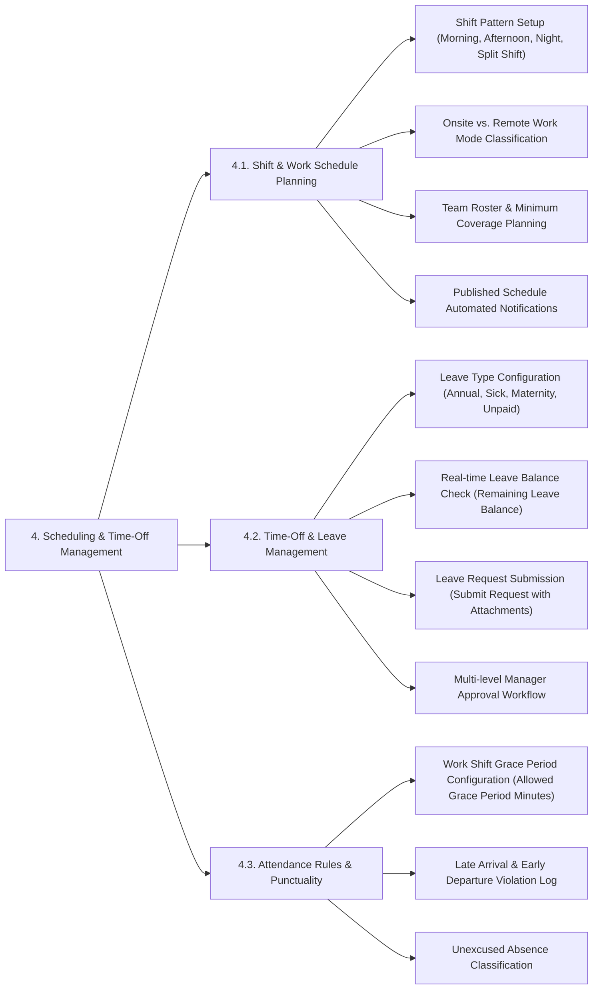

# SCHEDULING & TIME-OFF MANAGEMENT - DETAILED FEATURE BREAKDOWN

This document provides a detailed specification breakdown for the **Scheduling & Time-Off Management** subsystem based on `docs/mindmap/Architecture.md`.

---

## 1. MINDMAP TREE - SCHEDULING & TIME-OFF MANAGEMENT

---

## 2. DETAILED FEATURE SPECIFICATIONS

### 4.1. Shift & Work Schedule Planning
* **Shift Pattern Setup:** Defines work shift templates: Standard Office Hours (8:00 - 17:00), Morning/Afternoon/Night shifts, Split Shifts, or Flexitime.
* **Onsite vs. Remote Classification:** Tags work locations as Onsite Office or Remote/Work-From-Home per shift.
* **Team Roster Coverage:** Assists supervisors in weekly shift scheduling, ensuring minimum coverage requirements for operational shifts.
* **Automated Schedule Publishing Notifications:** Automatically dispatches mobile push notifications and email alerts when new weekly/monthly shift schedules are published.

### 4.2. Time-Off & Leave Management
* **Leave Type Configuration:** Configures compliance leave categories:
  * *Annual Leave* - Fully paid compensation.
  * *Sick Leave* - Social security or medical note required.
  * *Maternity / Bereavement / Marriage Leave.*
  * *Unpaid Leave.*
  * *Compensatory Time-off (Comp-time)* - Accumulated from approved overtime.
* **Real-time Leave Balance Verification:** Automatically tracks and displays available leave balances before request submission. Blocks submission if requested days exceed available quota.
* **Leave Request Submission:** Allows staff to select leave types, duration (Half-day, Full-day, Multi-day), justification notes, and upload medical certificates or documentation.
* **Multi-Level Approval Workflow:** Automatically routes leave requests to Direct Managers for approval. Supports 2-stage approval (Manager ➔ HR Admin) for long-duration leave (> 3 days).

### 4.3. Attendance Rules & Punctuality
* **Shift Grace Period Allowance:** Configures allowed tardiness grace period minutes (e.g., 15-minute grace period allowance per shift).
* **Late Arrival & Early Departure Logging:** Compares actual Clock In/Out timestamps against scheduled shift bounds, logging exact minutes of tardiness or early departure.
* **Unexcused Absence Classification:** Automatically flags unexcused absences if employees fail to clock in without an approved leave request.
