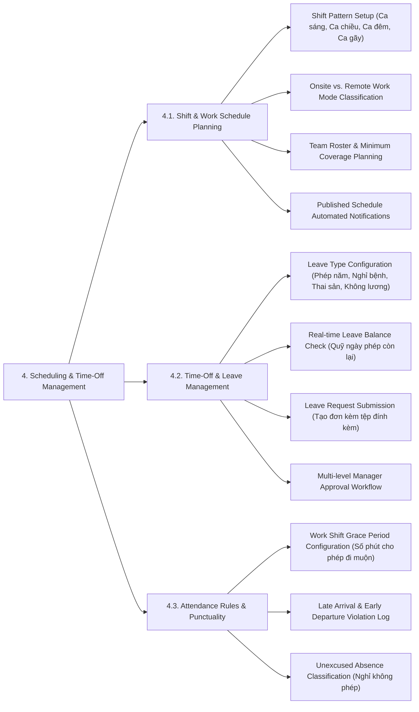

# SCHEDULING & TIME-OFF MANAGEMENT - DETAILED FEATURE BREAKDOWN

Tài liệu này bóc tách chi tiết phân hệ **Scheduling & Time-Off Management (Lịch làm việc & Quản lý Nghỉ phép)** từ sơ đồ kiến trúc `docs/mindmap/Architecture.md`.

---

## 1. MINDMAP TREE - SCHEDULING & TIME-OFF MANAGEMENT

---

## 2. DETAILED FEATURE SPECIFICATIONS

### 4.1. Shift & Work Schedule Planning (Lên lịch làm việc & Phân ca)
* **Thiết lập ca làm việc (Shift Patterns):** Định nghĩa các loại ca làm việc: Ca hành chính (8:00 - 17:00), Ca sáng/chiều/đêm, Ca gãy (Split Shift) hoặc Ca linh hoạt (Flexitime).
* **Phân loại chế độ làm việc (Onsite vs Remote):** Đánh dấu nhân viên làm việc trực tiếp tại văn phòng (Onsite) hay làm việc từ xa tại nhà (Remote/Work-From-Home).
* **Quản lý định biên ca (Roster Coverage):** Giúp Manager lập kế hoạch xếp ca cho nhóm, đảm bảo luôn đủ số lượng nhân sự trực tối thiểu cho từng ca làm việc.
* **Tự động gửi thông báo lịch làm:** Ngay khi Manager xuất bản (Publish) lịch làm việc tuần/tháng mới, hệ thống tự động đẩy thông báo về app Mobile/Desktop của toàn bộ nhân viên trong nhóm.

### 4.2. Time-Off & Leave Management (Quản lý Đăng ký Nghỉ phép)
* **Cấu hình loại hình nghỉ phép (Leave Types):** Quản lý các loại phép theo quy định pháp luật & công ty:
  * *Nghỉ phép năm (Annual Leave)* - Tính lương 100%.
  * *Nghỉ bệnh (Sick Leave)* - Có bảo hiểm xã hội / xác nhận của bác sĩ.
  * *Nghỉ thai sản / Cưới hỏi / Tang chế (Maternity / Special Leave).*
  * *Nghỉ không hưởng lương (Unpaid Leave).*
  * *Nghỉ bù (Compensatory Leave)* - Tích lũy từ giờ làm tăng ca.
* **Kiểm tra quỹ ngày phép còn lại (Leave Balance):** Hệ thống tự động tính toán và hiển thị số ngày phép khả dụng còn lại của nhân viên trước khi cho phép nộp đơn. Ngăn chặn nộp đơn nếu số ngày xin nghỉ vượt quá quỹ phép khả dụng.
* **Đăng ký đơn xin nghỉ (Leave Submission):** Cho phép nhân viên chọn loại phép, khoảng thời gian nghỉ (Nửa ngày, 1 ngày, Nhiều ngày) kèm lý do và tải lên tệp đính kèm (Giấy xác nhận của viện, đơn từ).
* **Quy trình phê duyệt nhiều cấp (Approval Workflow):** Tự động chuyển đơn xin nghỉ đến Quản lý trực tiếp (Manager) để phê duyệt. Hỗ trợ quy trình 2 cấp (Manager -> HR Admin) đối với đơn nghỉ dài hạn (> 3 ngày).

### 4.3. Attendance Rules & Punctuality (Quy tắc Chấm công & Đi muộn / Về sớm)
* **Thời gian ân hạn đi muộn (Grace Period):** Cấu hình số phút cho phép nhân viên đi muộn mà không bị tính phạt (ví dụ: 15 phút đầu ca).
* **Ghi nhận vi phạm đi muộn / về sớm:** Tự động đối chiếu giờ Clock In/Out thực tế với khung giờ ca làm việc để lưu vết số phút đi muộn (Late Arrival) hoặc về sớm (Early Departure).
* **Phân loại nghỉ không phép (Unexcused Absence):** Nếu nhân viên không thực hiện Clock In trong ca làm việc và không có đơn xin nghỉ phép được duyệt, hệ thống tự động đánh dấu trạng thái "Nghỉ không phép".
