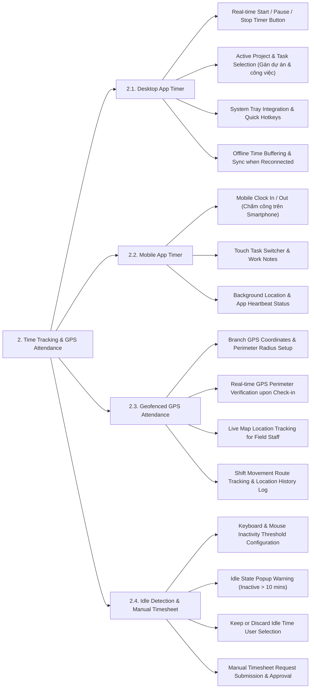

# TIME TRACKING & GPS ATTENDANCE - DETAILED FEATURE BREAKDOWN

Tài liệu này bóc tách chi tiết phân hệ **Time Tracking & GPS Attendance (Theo dõi Thời gian & Chấm công)** từ sơ đồ kiến trúc `docs/mindmap/Architecture.md`.

---

## 1. MINDMAP TREE - TIME TRACKING & GPS ATTENDANCE

---

## 2. DETAILED FEATURE SPECIFICATIONS

### 2.1. Desktop App Timer (Bộ đếm thời gian trên Desktop)
* **Nút bấm đếm giờ thời gian thực:** Bật (Start), Tạm dừng (Pause), và Kết thúc (Stop) ca làm việc trực tiếp trên phần mềm Desktop (Windows / macOS / Linux).
* **Gán Dự án & Công việc (Project & Task Selector):** Bắt buộc nhân viên chọn đúng Dự án (Project) và Tác vụ (Task) trước khi bấm đếm giờ để lưu vết Timesheet.
* **Chạy ngầm & Phím tắt:** Thu nhỏ dưới thanh System Tray, hỗ trợ tổ hợp phím tắt nhanh (`Ctrl + Shift + S` để Start/Stop).
* **Đệm dữ liệu Offline (Offline Buffering):** Khi mất kết nối Internet, ứng dụng tự động lưu vết đếm giờ mã hóa vào bộ nhớ đệm cục bộ và tự động đồng bộ (Sync) lên Server ngay khi có mạng trở lại.

### 2.2. Mobile App Timer (Bộ đếm thời gian trên Mobile)
* **Chấm công trên Smartphone:** Dành cho nhân viên làm việc từ xa, làm việc thị trường hoặc làm tại các công trình chi nhánh.
* **Chuyển đổi tác vụ cảm ứng:** Giao diện đơn giản cho phép chọn công việc, ghi chú ngắn (Work Notes) và đính kèm hình ảnh thực địa.
* **Trạng thái chạy ngầm (App Heartbeat):** Gửi tín hiệu nhịp tim (Heartbeat) định kỳ về máy chủ để xác nhận ứng dụng vẫn đang chạy trong ca làm việc.

### 2.3. Geofenced GPS Attendance (Chấm công định vị GPS)
* **Cấu hình ranh giới GPS (Geofence Zones):** Quản trị viên thiết lập tọa độ địa lý (Vĩ độ/Kinh độ) và bán kính cho phép (ví dụ: 100m) xung quanh các trụ sở, chi nhánh hoặc công trình.
* **Xác thực vị trí khi Chấm công:** Khi nhân viên bấm Clock In/Out trên Mobile App, hệ thống tự động đối chiếu tọa độ GPS thực tế của thiết bị với bán kính Geofence. Nếu nằm ngoài bán kính, hệ thống ngăn chặn chấm công và phát báo lỗi.
* **Theo dõi vị trí Live Map:** Cho phép Manager xem vị trí hiện tại của các nhân viên dịch vụ thị trường trên bản đồ thời gian thực.
* **Nhật ký Lộ trình (Route History Log):** Lưu trữ lịch sử di chuyển và bản đồ lộ trình của nhân viên trong suốt ca trực.

### 2.4. Idle Detection & Manual Timesheet (Phát hiện Idle & Timesheet Thủ công)
* **Cấu hình ngưỡng không tương tác (Idle Thresholds):** Đặt khoảng thời gian không gõ phím hoặc di chuyển chuột (ví dụ: 10 phút) để kích hoạt trạng thái tạm dừng.
* **Popup Cảnh báo Inactive:** Hiển thị cửa sổ bật lên khi phát hiện nhân viên rời màn hình: *"Bạn đã không hoạt động trong 10 phút. Bạn muốn giữ hay xóa khoảng thời gian này?"*.
* **Xử lý thời gian Idle:**
  * **Giữ thời gian (Keep Idle Time):** Tính khoảng thời gian đó vào giờ làm việc (nếu là trao đổi công việc trực tiếp).
  * **Xóa thời gian (Discard Idle Time):** Tự động trừ thời gian rảnh rỗi khỏi Timesheet.
* **Duyệt Timesheet Thủ công (Manual Timesheet Submission):** Trường hợp quên bật đếm giờ hoặc làm việc offline, nhân viên gửi đơn giải trình kèm số giờ làm việc để Manager duyệt bổ sung.
