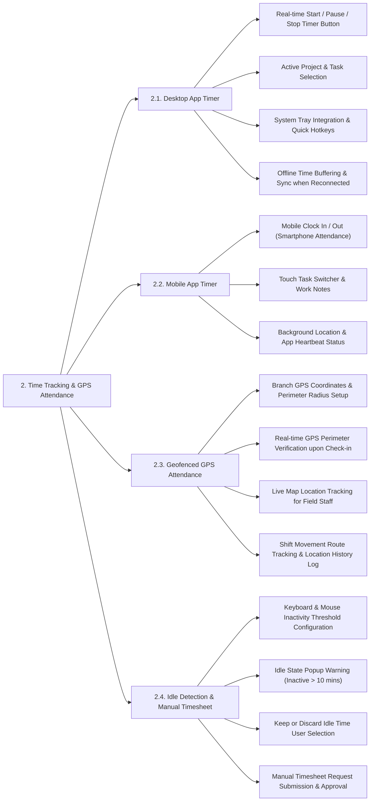

# TIME TRACKING & GPS ATTENDANCE - DETAILED FEATURE BREAKDOWN

This document provides a detailed specification breakdown for the **Time Tracking & GPS Attendance** subsystem based on `docs/mindmap/Architecture.md`.

---

## 1. MINDMAP TREE - TIME TRACKING & GPS ATTENDANCE

---

## 2. DETAILED FEATURE SPECIFICATIONS

### 2.1. Desktop App Timer
* **Real-time Work Timer Controls:** Start, Pause, and Stop work session timers directly on desktop applications (Windows / macOS / Linux).
* **Project & Task Selection:** Requires employees to select designated projects and active work items before initiating timer sessions for accurate timesheet logging.
* **System Tray & Quick Hotkeys:** Minimizes to the System Tray with configurable global hotkeys (`Ctrl + Shift + S` to Start/Stop).
* **Offline Time Buffering:** Stores encrypted work logs locally during network outages and automatically synchronizes with cloud servers upon reconnection.

### 2.2. Mobile App Timer
* **Smartphone Attendance:** Enables mobile check-in/out for remote staff, field technicians, and branch office workers.
* **Touch Task Switcher & Notes:** Simple mobile interface to toggle active tasks, enter work notes, and attach field activity photos.
* **Background App Heartbeat:** Transmits periodic heartbeat pings to verify active mobile app sessions during work shifts.

### 2.3. Geofenced GPS Attendance
* **Geofence Zone Setup:** Administrators configure geographical coordinates (Latitude/Longitude) and allowed perimeter radii (e.g., 100m) around office branches or project sites.
* **Real-time GPS Verification:** Verifies device GPS position against the geofence perimeter using the Haversine algorithm upon Clock In/Out. Out-of-bounds check-ins are rejected.
* **Live Map Location Tracking:** Displays real-time positions of active field service staff on an interactive live map.
* **Shift Route History Log:** Logs chronological movement coordinates and route maps during active field shifts.

### 2.4. Idle Detection & Manual Timesheet
* **Inactivity Threshold Setup:** Configures keyboard and mouse inactivity thresholds (e.g., 10 minutes) to trigger idle state detection.
* **Idle Warning Popup:** Prompts interactive user dialog upon detecting idle state: *"You have been inactive for 10 minutes. Keep or discard this time block?"*.
* **Idle Time Handling:**
  * **Keep Idle Time:** Retains inactive time in timesheets for approved offline discussions.
  * **Discard Idle Time:** Automatically deducts idle duration from recorded work hours.
* **Manual Timesheet Submissions:** Allows staff to submit manual time adjustments with justifications for supervisor approval when timer toggles are missed.
