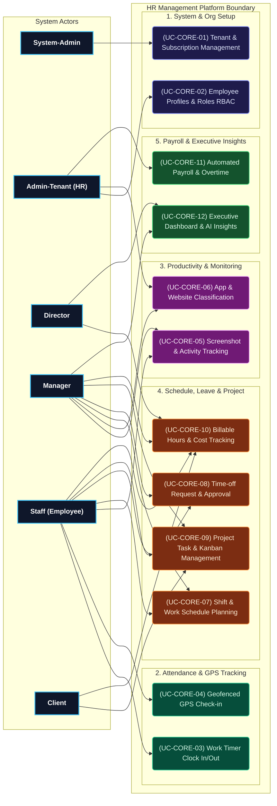

# HR MANAGEMENT PLATFORM - CORE USE CASES

This document condenses the most critical Use Cases extracted from the system specification, focusing on the core Use Case list for the High-Level Use Case Diagram.

---

## 1. TOP 12 CORE USE CASES SPECIFICATIONS

| UC ID | Use Case Name | Feature Module | Primary Actor | Secondary Actor | Description |
| :--- | :--- | :--- | :--- | :--- | :--- |
| **UC-CORE-01** | Tenant Provisioning & Subscription | System & Tenant Admin | System-Admin | System | Initializes new tenant organizations, provisions primary Admin-Tenant credentials, and manages resource quota caps. |
| **UC-CORE-02** | Employee Profiles & Role RBAC | People Management | Admin-Tenant | Manager | Manages employee personal details, contracts, department assignments, and configures custom RBAC permissions. |
| **UC-CORE-03** | Work Timer Clock In/Out | Time Tracking | Staff | System | Toggles work timers on desktop client apps to record actual working hours and automated idle detection. |
| **UC-CORE-04** | Geofenced GPS Check-in | GPS & Geofencing | Staff | System | Restricts clock-in/out functionality to designated GPS coordinates and branch perimeter radii. |
| **UC-CORE-05** | Screenshot & Activity Tracking | Productivity Monitoring | System | Manager, Staff | Captures screen activity at random intervals and calculates weighted Activity Score (%). |
| **UC-CORE-06** | App & Website Classification | App & URL Classification | Admin-Tenant | Manager | Categorizes software and domain URLs into Productive, Unproductive, or Neutral status. |
| **UC-CORE-07** | Shift & Work Schedule Planning | Scheduling | Manager | Staff | Assigns weekly shift patterns, work locations (Onsite/Remote), and coverage plans. |
| **UC-CORE-08** | Time-off Request & Approval | Scheduling & Leave | Staff | Manager | Submits annual, sick, or personal leave requests for manager approval workflows. |
| **UC-CORE-09** | Project Task & Kanban Management | Project Management | Manager | Staff, Client | Manages project task lists, Kanban boards, task assignments, and estimated hours. |
| **UC-CORE-10** | Billable Hours & Cost Tracking | Worktime Expenditure | Staff | Manager, Client | Flags client-billable work hours and converts logged employee work time into project cost metrics. |
| **UC-CORE-11** | Automated Payroll & Overtime | Payroll & Invoicing | Admin-Tenant | System | Generates salary sheets automatically using timesheet data, shifts, and overtime multiplier rules. |
| **UC-CORE-12** | Executive Dashboard & AI Insights | Dashboard & Insights | Director | Manager | Displays executive-level KPIs, company-wide productivity trends, and AI turnover risk predictions. |

---

## 2. ACTOR & CORE USE CASE ALLOCATION MATRIX

| Actor | Actor Name | Priority Level | Direct Core Use Cases List |
| :--- | :--- | :---: | :--- |
| **ACT-01** | **System-Admin** | High | UC-CORE-01 |
| **ACT-02** | **Admin-Tenant (HR)** | High | UC-CORE-02, UC-CORE-06, UC-CORE-11 |
| **ACT-03** | **Director** | High | UC-CORE-10, UC-CORE-12 |
| **ACT-04** | **Manager** | High | UC-CORE-05, UC-CORE-06, UC-CORE-07, UC-CORE-08, UC-CORE-09, UC-CORE-10, UC-CORE-12 |
| **ACT-05** | **Staff (Employee)** | High | UC-CORE-03, UC-CORE-04, UC-CORE-05, UC-CORE-07, UC-CORE-08, UC-CORE-09, UC-CORE-10 |
| **ACT-06** | **Client** | Medium | UC-CORE-09, UC-CORE-10 |

---

## 3. SYSTEM OVERVIEW MERMAID USE CASE DIAGRAM

