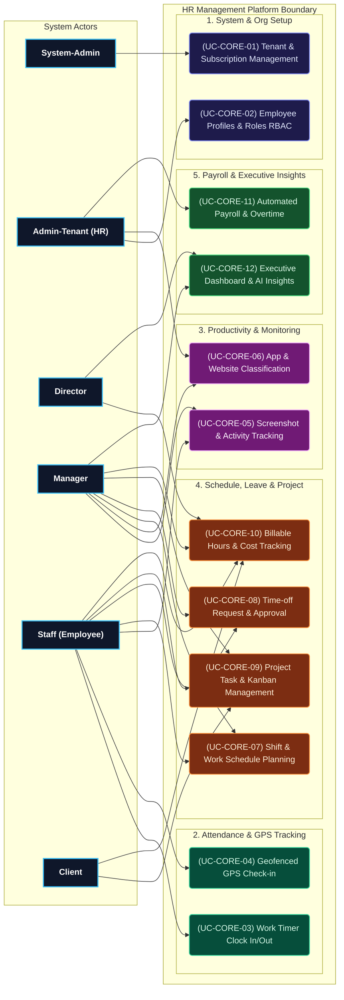

# HR MANAGEMENT PLATFORM - CORE USE CASES

Tài liệu này cô đọng các Use Cases quan trọng nhất trích xuất từ 39 Use Cases đầy đủ, tập trung hoàn toàn vào danh sách Use Case cốt lõi để vẽ Use Case Diagram (không bao gồm Test Case).

---

## 1. DANH SÁCH 12 CORE USE CASES QUAN TRỌNG NHẤT (TOP 30%)

| UC ID | Tên Use Case | Phân hệ (Module) | Actor chính | Actor phụ | Mô tả ngắn gọn |
| :--- | :--- | :--- | :--- | :--- | :--- |
| **UC-CORE-01** | Tenant Provisioning & Subscription | System & Tenant Admin | System-Admin | System | Khởi tạo tổ chức (Tenant), cấp quota tài nguyên và quản lý gói dịch vụ SaaS. |
| **UC-CORE-02** | Employee Profiles & Role RBAC | People Management | Admin-Tenant | Manager | Quản lý sơ đồ tổ chức, thông tin nhân sự và phân quyền vai trò (RBAC). |
| **UC-CORE-03** | Work Timer Clock In/Out | Time Tracking | Staff | System | Bật/Tắt bộ đếm thời gian làm việc trên app Desktop/Mobile, lưu timesheet. |
| **UC-CORE-04** | Geofenced GPS Check-in | GPS & Geofencing | Staff | System | Chấm công xác thực vị trí GPS trong bán kính quy định của văn phòng/công trình. |
| **UC-CORE-05** | Screenshot & Activity Tracking | Productivity Monitoring | System | Manager, Staff | Chụp màn hình ngẫu nhiên và theo dõi mật độ phím/chuột tự động. |
| **UC-CORE-06** | App & Website Classification | App & URL Classification | Admin-Tenant | Manager | Gán nhãn ứng dụng/domain thành Productive, Unproductive hoặc Neutral. |
| **UC-CORE-07** | Shift & Work Schedule Planning | Scheduling | Manager | Staff | Phân ca làm việc hàng tuần, cấu hình hình thức làm việc Onsite / Remote. |
| **UC-CORE-08** | Time-off Request & Approval | Scheduling & Leave | Staff | Manager | Đăng ký nghỉ phép (nghỉ phép năm, bệnh) và quy trình duyệt phép của Manager. |
| **UC-CORE-09** | Project Task & Kanban Management | Project Management | Manager | Staff, Client | Tạo dự án, phân công công việc trên bảng Kanban và theo dõi tiến độ. |
| **UC-CORE-10** | Billable Hours & Cost Tracking | Expenditure & Billing | Staff | Manager, Client | Ghi nhận giờ làm tính phí (Billable) và quy đổi thành chi phí dự án. |
| **UC-CORE-11** | Automated Payroll & Overtime | Payroll & Invoicing | Admin-Tenant | System | Tự động tính bảng lương hàng tháng kèm tiền làm thêm giờ (Overtime). |
| **UC-CORE-12** | Executive Dashboard & AI Insights | Dashboard & Insights | Director | Manager | Dashboard chỉ số KPI toàn công ty và dự báo AI về rủi ro quá tải/kiệt sức. |

---

## 2. MA TRẬN PHÂN BỔ ACTOR VÀ CORE USE CASE

| Actor | Tên Actor | Mức độ ưu tiên | Core Use Cases tham gia trực tiếp |
| :--- | :--- | :---: | :--- |
| **ACT-01** | **System-Admin** | Cao | UC-CORE-01 |
| **ACT-02** | **Admin-Tenant (HR)** | Cao | UC-CORE-02, UC-CORE-06, UC-CORE-11 |
| **ACT-03** | **Director** | Cao | UC-CORE-10, UC-CORE-12 |
| **ACT-04** | **Manager** | Cao | UC-CORE-05, UC-CORE-06, UC-CORE-07, UC-CORE-08, UC-CORE-09, UC-CORE-10, UC-CORE-12 |
| **ACT-05** | **Staff (Employee)** | Cao | UC-CORE-03, UC-CORE-04, UC-CORE-05, UC-CORE-07, UC-CORE-08, UC-CORE-09, UC-CORE-10 |
| **ACT-06** | **Client** | Trung bình | UC-CORE-09, UC-CORE-10 |

---

## 3. SƠ ĐỒ USE CASE MERMAID TỔNG QUAN (CORE USE CASE DIAGRAM)

