# HR Management Platform - Process Swimlane Activity Diagrams

This document compiles all **19 Process Swimlane Activity Diagrams** across the 6 core subsystems of the HR Management Platform. Each diagram models the operational interaction flow, decision nodes, and data transitions between system actors, client applications, and backend services.

---

## 1. People Management Subsystem

### 1.1. Onboarding & Offboarding Workflow Diagram
*(4 Swimlanes: Admin-Tenant, HR System Services, Employee, Direct Manager)*

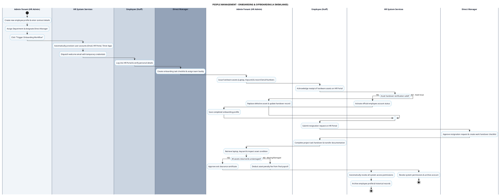

---

### 1.2. Role & Permission Management (RBAC) Diagram
*(4 Swimlanes: System-Admin, Admin-Tenant, Security Engine & Database, Employee)*

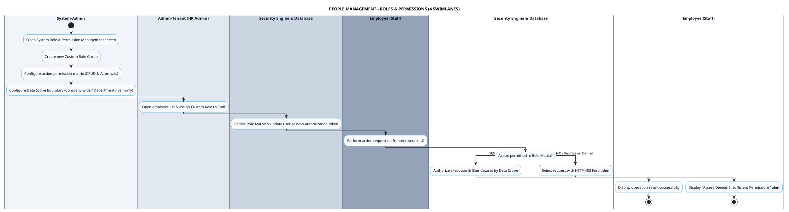

---

### 1.3. Employee Profile Management Diagram
*(4 Swimlanes: Admin-Tenant, Direct Manager, HR System Services, Employee)*

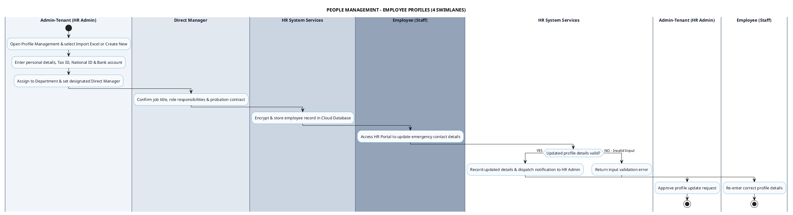

---

### 1.4. Organizational Structure Setup Diagram
*(4 Swimlanes: Admin-Tenant, Director, Direct Manager, HR System Services)*

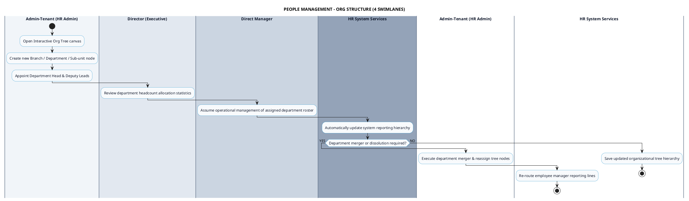

---

## 2. Time Tracking Subsystem

### 2.1. Desktop App Work Timer Diagram
*(3 Swimlanes: Staff, Desktop Client App, Cloud Time Tracking API)*

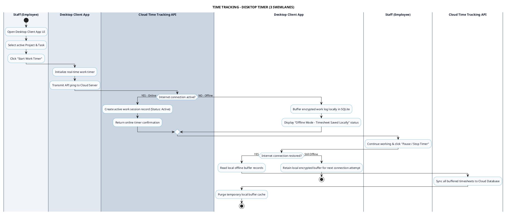

---

### 2.2. Mobile App Clock In / Out Diagram
*(3 Swimlanes: Staff, Mobile Client App, Cloud Time Tracking API)*

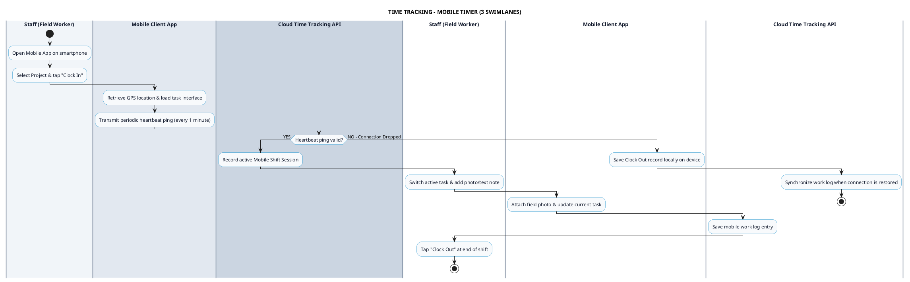

---

### 2.3. Idle Detection & Manual Timesheet Diagram
*(3 Swimlanes: Staff, Desktop Agent Service, Manager & Time Backend)*

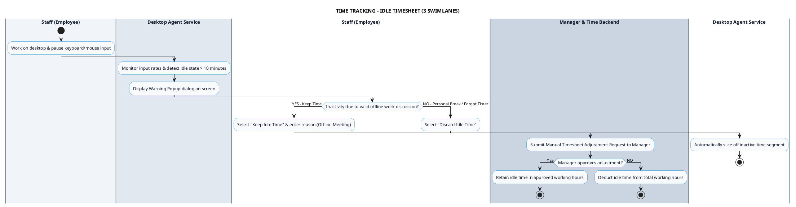

---

## 3. GPS Attendance Subsystem

### 3.1. Geofenced GPS Check-in Diagram
*(3 Swimlanes: Staff, Mobile App Client, GPS Location Service)*

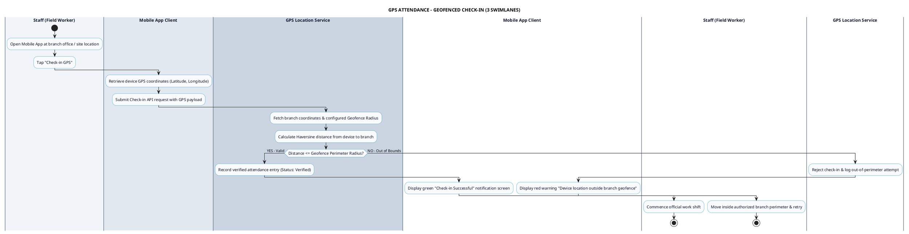

---

### 3.2. Live Map Location & Shift Route Tracking Diagram
*(3 Swimlanes: Manager, GPS Location Service, Staff)*

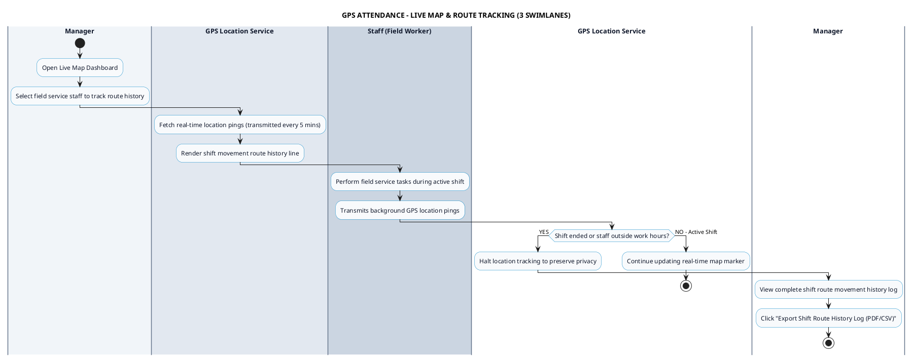

---

## 4. Productivity Monitoring Subsystem

### 4.1. Automated Screenshot Capture Diagram
*(3 Swimlanes: Desktop Agent App, Productivity AI Engine, Manager)*

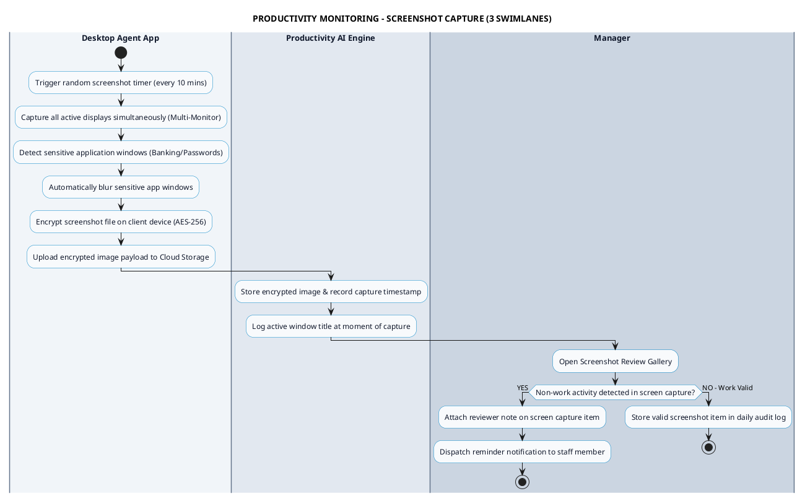

---

### 4.2. Input Activity Tracking Diagram
*(3 Swimlanes: Desktop Agent App, Productivity AI Engine, Manager)*

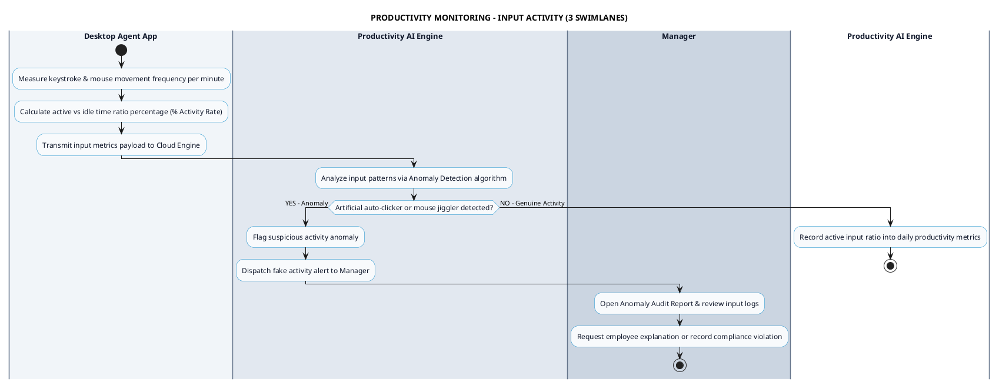

---

### 4.3. App & Website Classification Diagram
*(3 Swimlanes: Admin-Tenant, Desktop Agent App, Productivity AI Engine)*

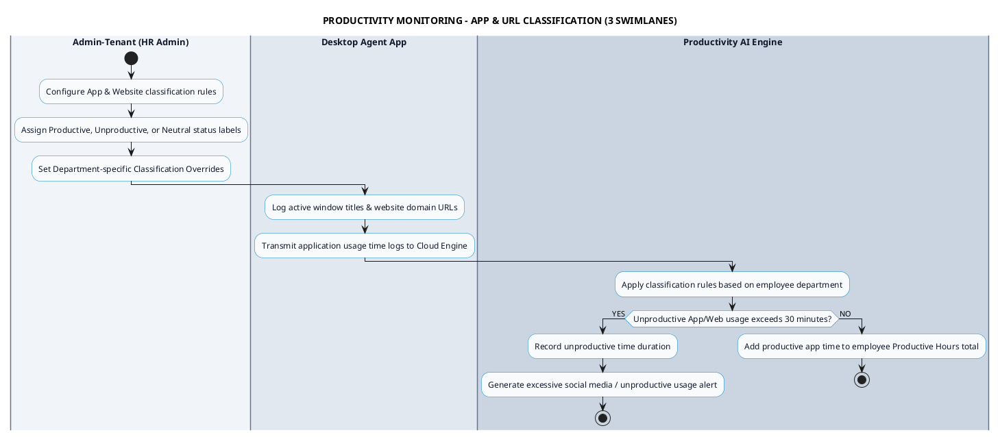

---

### 4.4. Activity Score & Real-time Alerts Diagram
*(3 Swimlanes: Desktop Agent App, Productivity AI Engine, Manager)*

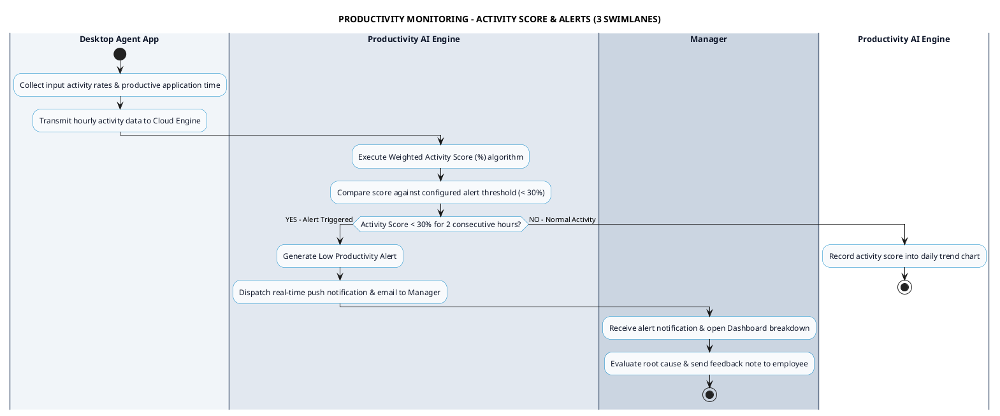

---

## 5. Scheduling & Time-Off Subsystem

### 5.1. Weekly Shift Planning Diagram
*(4 Swimlanes: Direct Manager, Admin-Tenant, Scheduling Engine, Staff)*

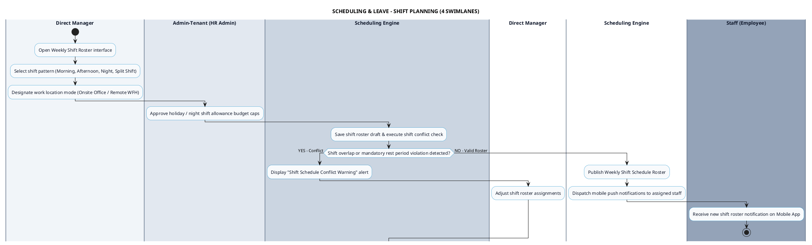

---

### 5.2. Time-off Request & Leave Management Diagram
*(4 Swimlanes: Staff, Leave Management Service, Direct Manager, Admin-Tenant)*

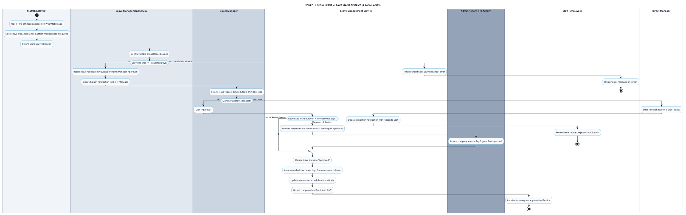

---

### 5.3. Attendance Rules & Violation Log Diagram
*(4 Swimlanes: Attendance Cron Engine, Direct Manager, Admin-Tenant, Staff)*

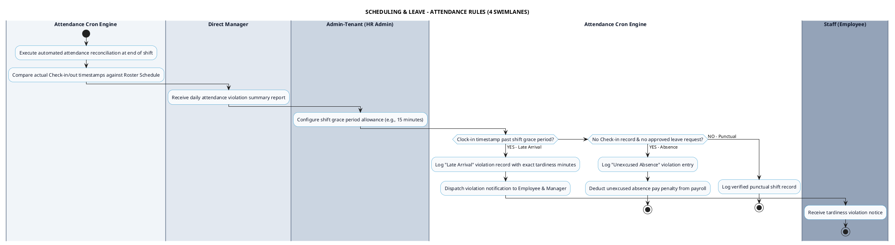

---

## 6. Payroll & Client Invoicing Subsystem

### 6.1. Automated Monthly Salary Calculation Diagram
*(4 Swimlanes: Admin-Tenant, Payroll & Billing Engine, Director, Staff)*

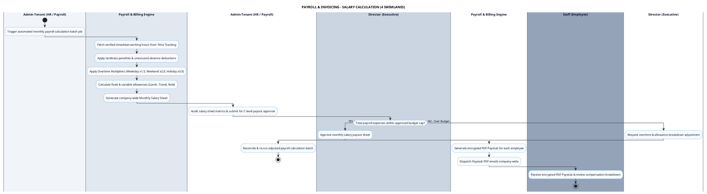

---

### 6.2. Overtime Pay & Allowance Management Diagram
*(4 Swimlanes: Direct Manager, Admin-Tenant, Payroll & Billing Engine, Director)*

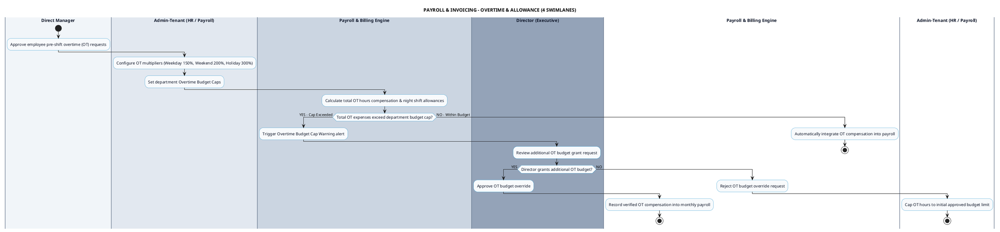

---

### 6.3. Client Invoicing & Billable Hours Approval Diagram
*(4 Swimlanes: Project Manager, Payroll & Billing Engine, Director, Client)*

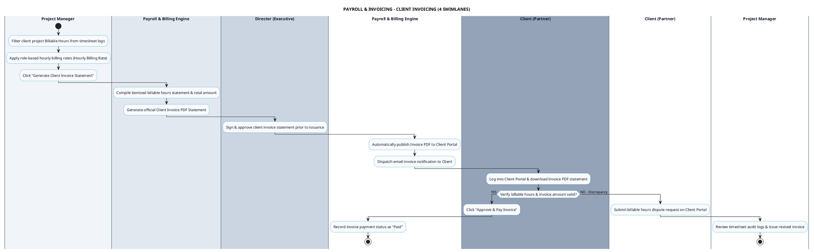
