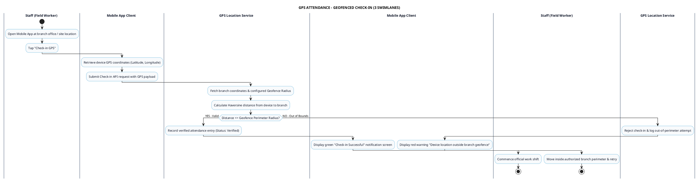

# GPS ATTENDANCE - GEOFENCED CHECK-IN PROCESS DIAGRAM

This document contains the **PlantUML** Swimlane Activity Diagram for the **Geofenced GPS Check-in Workflow**.

---

## PlantUML Source Code

```plantuml
@startuml
title GPS ATTENDANCE - GEOFENCED CHECK-IN (3 SWIMLANES)

skinparam linetype ortho
skinparam nodesep 60
skinparam ranksep 80

skinparam activity {
  BackgroundColor #f8fafc
  BorderColor #0284c7
  FontColor #0f172a
  FontSize 12
}
skinparam swimlane {
  BorderColor #64748b
  TitleFontColor #0f172a
  TitleFontSize 13
  TitleFontStyle bold
}

' =====================================================
' 3 SWIMLANES DECLARATION
' =====================================================
|Staff (Field Worker) |
start
:Open Mobile App at branch office / site location;
:Tap "Check-in GPS";

|Mobile App Client |
:Retrieve device GPS coordinates (Latitude, Longitude);
:Submit Check-in API request with GPS payload;

|GPS Location Service |
:Fetch branch coordinates & configured Geofence Radius;
:Calculate Haversine distance from device to branch;

if (Distance <= Geofence Perimeter Radius?) then (YES - Valid)
  :Record verified attendance entry (Status: Verified);
  |Mobile App Client|
  :Display green "Check-in Successful" notification screen;
  |Staff (Field Worker)|
  :Commence official work shift;
  stop
else (NO - Out of Bounds)
  |GPS Location Service|
  :Reject check-in & log out-of-perimeter attempt;
  |Mobile App Client|
  :Display red warning "Device location outside branch geofence";
  |Staff (Field Worker)|
  :Move inside authorized branch perimeter & retry;
  stop
endif

@enduml
```

