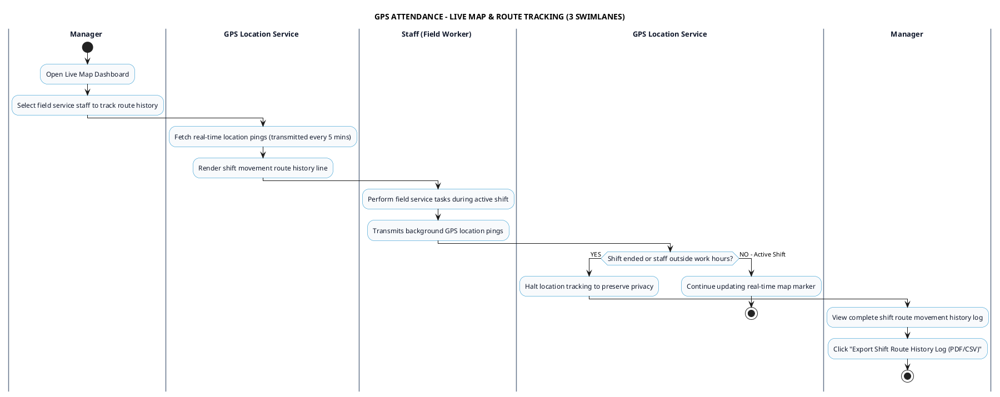

# GPS ATTENDANCE - LIVE MAP & ROUTE TRACKING PROCESS DIAGRAM

This document contains the **PlantUML** Swimlane Activity Diagram for the **Live Map Location & Shift Route Tracking Workflow**.

---

## PlantUML Source Code

