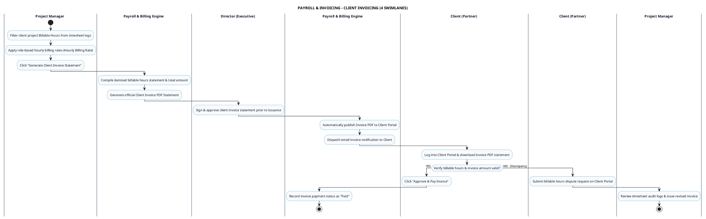

# PAYROLL & INVOICING - CLIENT INVOICING PROCESS DIAGRAM

This document contains the **PlantUML** Swimlane Activity Diagram for the **Client Invoicing & Billable Hours Approval Workflow**.

---

## PlantUML Source Code

