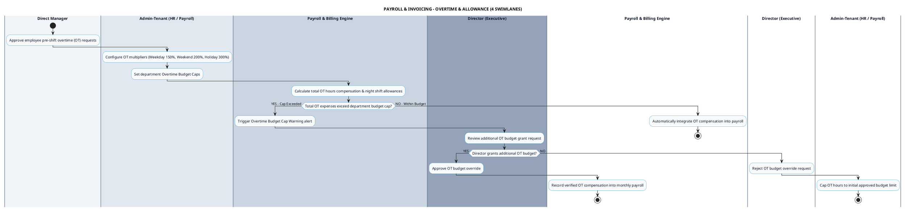

# PAYROLL & INVOICING - OVERTIME & ALLOWANCES PROCESS DIAGRAM

This document contains the **PlantUML** Swimlane Activity Diagram for the **Overtime Pay & Allowance Management Workflow**.

---

## PlantUML Source Code

