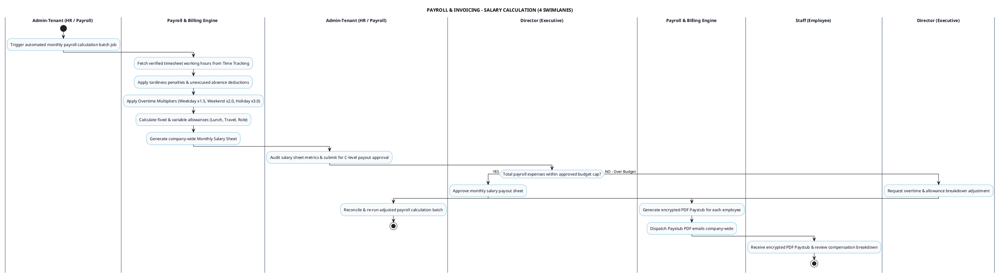

# PAYROLL & INVOICING - SALARY CALCULATION PROCESS DIAGRAM

This document contains the **PlantUML** Swimlane Activity Diagram for the **Automated Monthly Salary Calculation Workflow**.

---

## PlantUML Source Code

