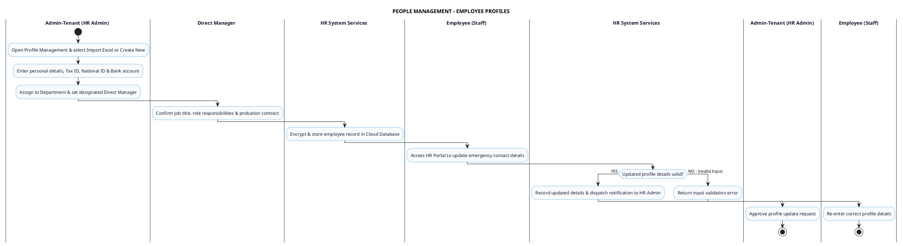

# PEOPLE MANAGEMENT - EMPLOYEE PROFILES PROCESS DIAGRAM

This document contains the **PlantUML** Swimlane Activity Diagram for the **Employee Profile Management Workflow**.

---

## PlantUML Source Code

