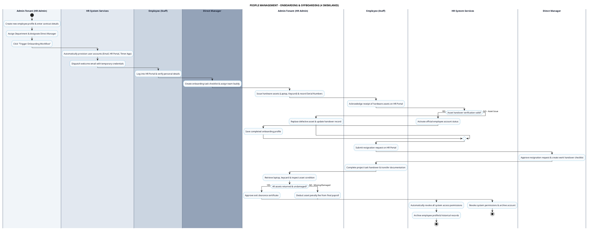

# PEOPLE MANAGEMENT - ONBOARDING & OFFBOARDING PROCESS DIAGRAM

This document contains the **PlantUML** Swimlane Activity Diagram for the **Employee Onboarding & Offboarding Workflow**.

---

## PlantUML Source Code

