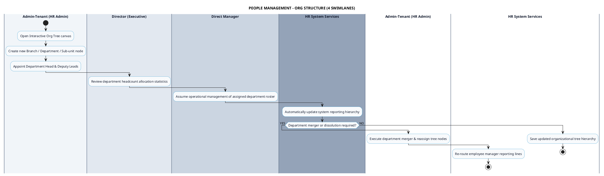

# PEOPLE MANAGEMENT - ORGANIZATIONAL STRUCTURE PROCESS DIAGRAM

This document contains the **PlantUML** Swimlane Activity Diagram for the **Organizational Structure Setup Workflow**.

---

## PlantUML Source Code

