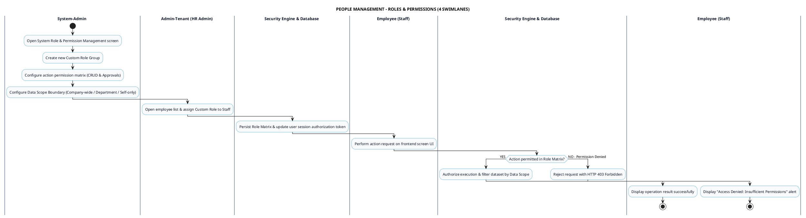

# PEOPLE MANAGEMENT - ROLES & PERMISSIONS (RBAC) PROCESS DIAGRAM

This document contains the **PlantUML** Swimlane Activity Diagram for the **Role & Permission Management (RBAC) & Data Scope Scoping Workflow**.

---

## PlantUML Source Code

