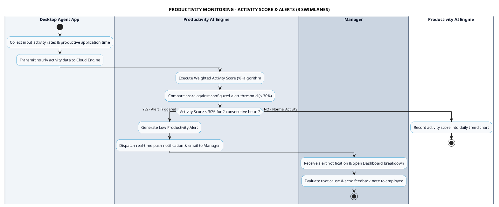

# PRODUCTIVITY MONITORING - ACTIVITY SCORE & ALERTS PROCESS DIAGRAM

This document contains the **PlantUML** Swimlane Activity Diagram for the **Activity Score Calculation & Real-time Alerts Workflow**.

---

## PlantUML Source Code

