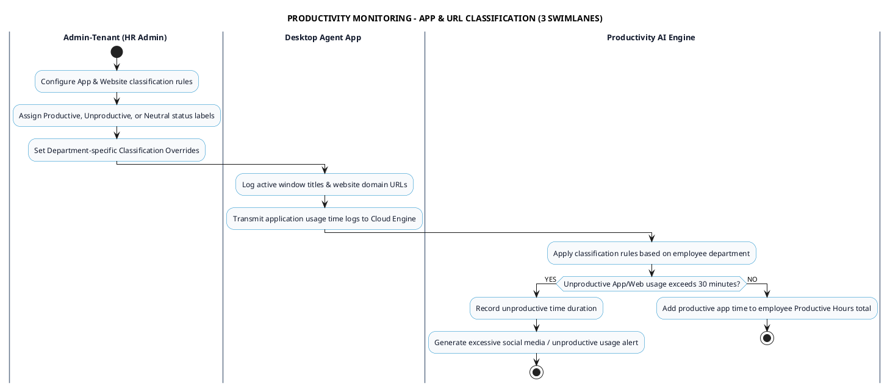

# PRODUCTIVITY MONITORING - APP & URL CLASSIFICATION PROCESS DIAGRAM

This document contains the **PlantUML** Swimlane Activity Diagram for the **App & Website Productivity Classification Workflow**.

---

## PlantUML Source Code

