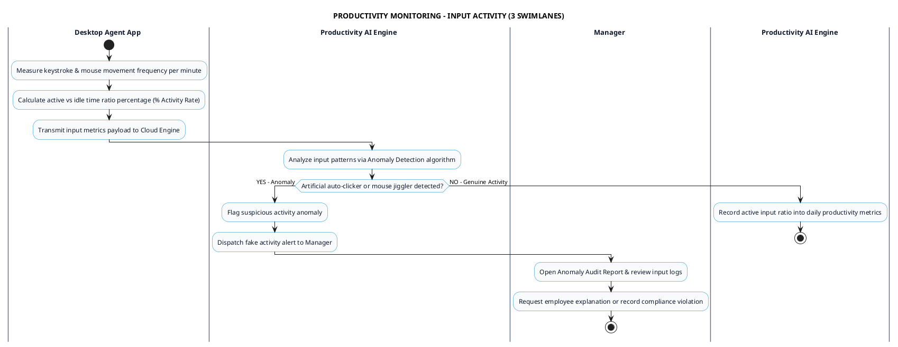

# PRODUCTIVITY MONITORING - INPUT ACTIVITY TRACKING PROCESS DIAGRAM

This document contains the **PlantUML** Swimlane Activity Diagram for the **Input Activity Tracking Workflow**.

---

## PlantUML Source Code

