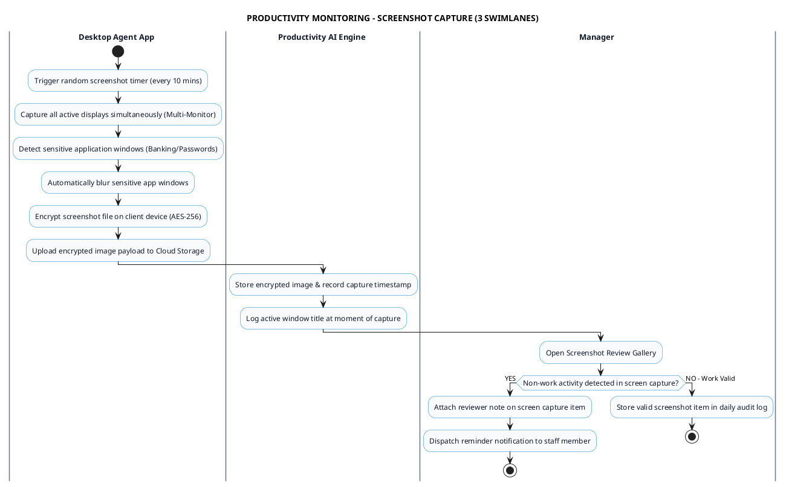

# PRODUCTIVITY MONITORING - SCREENSHOT CAPTURE PROCESS DIAGRAM

This document contains the **PlantUML** Swimlane Activity Diagram for the **Automated Screenshot Capture Workflow**.

---

## PlantUML Source Code

