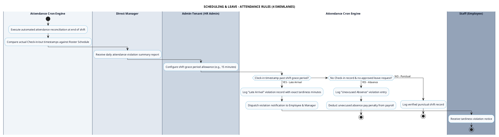

# SCHEDULING & LEAVE - ATTENDANCE RULES PROCESS DIAGRAM

This document contains the **PlantUML** Swimlane Activity Diagram for the **Attendance Rules & Punctuality Violation Log Workflow**.

---

## PlantUML Source Code

