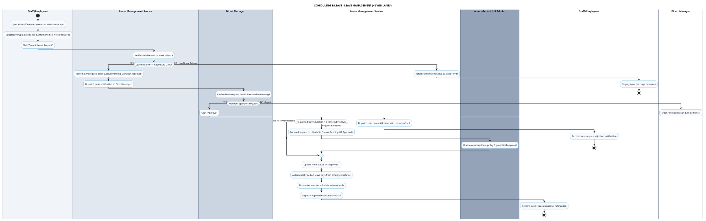

# SCHEDULING & LEAVE - LEAVE MANAGEMENT PROCESS DIAGRAM

This document contains the **PlantUML** Swimlane Activity Diagram for the **Time-off & Leave Request Management Workflow**.

---

## PlantUML Source Code

