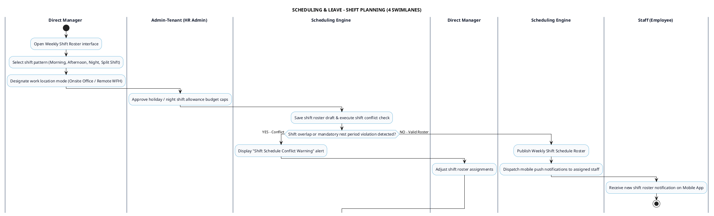

# SCHEDULING & LEAVE - SHIFT PLANNING PROCESS DIAGRAM

This document contains the **PlantUML** Swimlane Activity Diagram for the **Weekly Shift & Work Schedule Planning Workflow**.

---

## PlantUML Source Code

