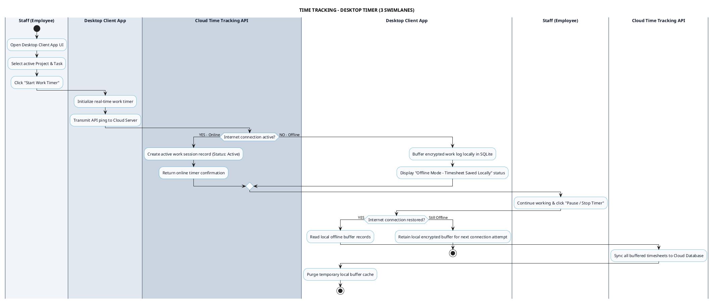

# TIME TRACKING - DESKTOP APP TIMER PROCESS DIAGRAM

This document contains the **PlantUML** Swimlane Activity Diagram for the **Desktop Work Timer Control Workflow**.

---

## PlantUML Source Code

