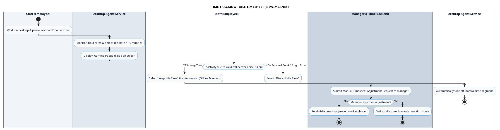

# TIME TRACKING - IDLE DETECTION & TIMESHEET PROCESS DIAGRAM

This document contains the **PlantUML** Swimlane Activity Diagram for the **Idle Inactivity Detection & Manual Timesheet Approval Workflow**.

---

## PlantUML Source Code

