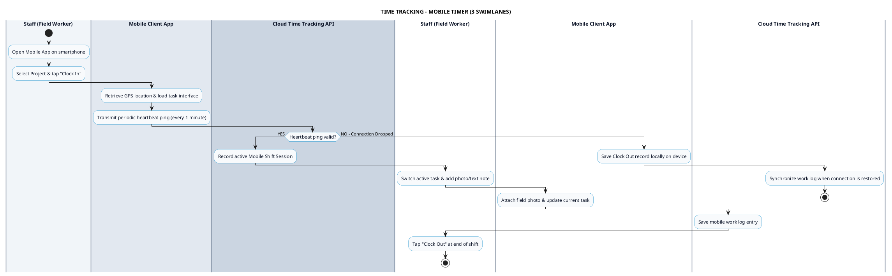

# TIME TRACKING - MOBILE CLOCK IN/OUT PROCESS DIAGRAM

This document contains the **PlantUML** Swimlane Activity Diagram for the **Mobile Clock In / Out & Task Switcher Workflow**.

---

## PlantUML Source Code

