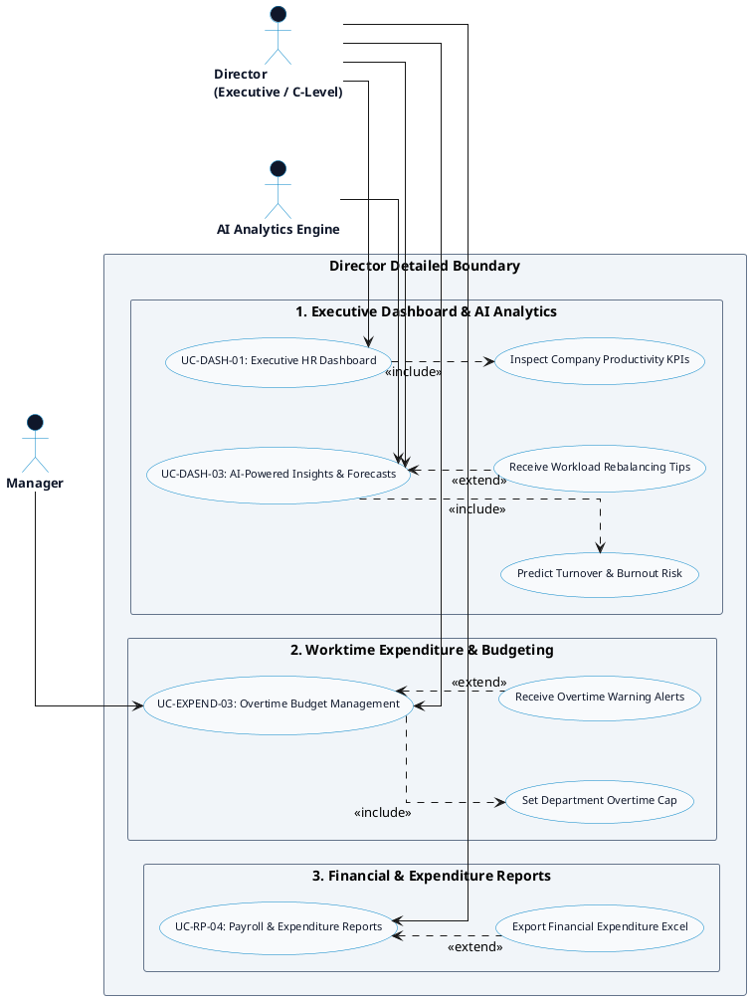

# HR MANAGEMENT PLATFORM - DIRECTOR DETAILED USE CASE DIAGRAM

Tài liệu này chứa mã **PlantUML** và sơ đồ **Use Case Chi tiết cho Actor Director (Executive C-Level Detailed Use Case Diagram)** của hệ thống HR Management Platform.

---

## PlantUML Source Code

