# HR MANAGEMENT PLATFORM - OVERVIEW USE CASE DIAGRAM

Tài liệu này chứa mã **PlantUML** và sơ đồ **Use Case Cấp cao (Overview Use Case Diagram)** của hệ thống HR Management Platform, bao gồm 6 System Actors và 12 Core Use Cases.

---

## PlantUML Source Code

```plantuml
@startuml
skinparam packageStyle rectangle
skinparam backgroundColor #ffffff
skinparam shadowing false
skinparam actorStyle stickman

' Bẻ cong mũi tên mềm mại
skinparam linetype polyline

' =====================================================
' STYLING CONFIGURATION
' =====================================================
skinparam usecase {
  BackgroundColor #f8fafc
  BorderColor #0284c7
  FontColor #0f172a
  FontSize 11
  FontName Arial
}

skinparam package {
  BackgroundColor #f1f5f9
  BorderColor #64748b
  FontColor #334155
  FontStyle bold
  FontSize 12
}

skinparam actor {
  BackgroundColor #0f172a
  BorderColor #0284c7
  FontColor #0f172a
  FontSize 12
  FontStyle bold
}

' =====================================================
' LEFT ACTORS (QUẢN TRỊ & QUẢN LÝ)
' =====================================================
actor "System-Admin" as SA
actor "Admin-Tenant (HR)" as HR
actor "Manager" as MGR

SA -[hidden]down-> HR
HR -[hidden]down-> MGR

' =====================================================
' RIGHT ACTORS (NGƯỜI DÙNG & KHÁCH HÀNG)
' =====================================================
actor "Staff (Employee)" as EMP
actor "Director" as DIR
actor "Client" as CLI

EMP -[hidden]down-> DIR
DIR -[hidden]down-> CLI

' =====================================================
' SYSTEM BOUNDARY (BỐ CỤC 2 CỘT SONG SONG NẰM NGANG)
' =====================================================
rectangle "HR Management Platform Boundary" {

  ' === CỘT 1 (BÊN TRÁI) ===
  package "1. System & Tenant Admin" as PKG1 {
    usecase "UC-CORE-01: Tenant & Subscription Management" as UC01
    usecase "UC-CORE-02: Employee Profiles & Roles RBAC" as UC02
  }

  package "2. Attendance & GPS Tracking" as PKG2 {
    usecase "UC-CORE-03: Work Timer Clock In/Out" as UC03
    usecase "UC-CORE-04: Geofenced GPS Check-in" as UC04
    usecase "Detect Idle State" as UC_IDLE
    usecase "Manual Timesheet Submission" as UC_MANUAL
    usecase "Route History Tracking" as UC_ROUTE
  }

  package "3. Productivity Monitoring" as PKG3 {
    usecase "UC-CORE-05: Screenshot & Activity Tracking" as UC05
    usecase "UC-CORE-06: App & Website Classification" as UC06
    usecase "Send Low Productivity Alert" as UC_ALERT
  }

  ' === CỘT 2 (BÊN PHẢI) ===
  package "4. Schedule, Leave & Project" as PKG4 {
    usecase "UC-CORE-07: Shift & Work Schedule Planning" as UC07
    usecase "UC-CORE-08: Time-off Request & Approval" as UC08
    usecase "UC-CORE-09: Project Task & Kanban Management" as UC09
    usecase "UC-CORE-10: Billable Hours & Cost Tracking" as UC10
    usecase "Check Leave Balance" as UC_BAL
  }

  package "5. Payroll & Executive Insights" as PKG5 {
    usecase "UC-CORE-11: Automated Payroll & Overtime" as UC11
    usecase "UC-CORE-12: Executive Dashboard & AI Insights" as UC12
    usecase "Aggregate Timesheet & OT Data" as UC_AGGR
  }

  ' DÀN HÀNG NGANG GIỮA CÁC PHÂN HỆ
  PKG1 -[hidden]right-> PKG4
  PKG2 -[hidden]right-> PKG4
  PKG3 -[hidden]right-> PKG5
}

' =====================================================
' CONNECTIONS - LEFT ACTORS
' =====================================================
SA -right-> UC01

HR -right-> UC02
HR -right-> UC06
HR -right-> UC11

MGR -right-> UC05
MGR -right-> UC06
MGR -right-> UC07
MGR -right-> UC08
MGR -right-> UC09
MGR -right-> UC10
MGR -right-> UC12

' =====================================================
' CONNECTIONS - RIGHT ACTORS
' =====================================================
EMP -left-> UC03
EMP -left-> UC04
EMP -left-> UC05
EMP -left-> UC07
EMP -left-> UC08
EMP -left-> UC09
EMP -left-> UC10

DIR -left-> UC10
DIR -left-> UC12

CLI -left-> UC09
CLI -left-> UC10

' =====================================================
' INCLUDE RELATIONSHIPS
' =====================================================
UC03 .down.> UC_IDLE : <<include>>
UC08 .right.> UC_BAL : <<include>>
UC11 .down.> UC_AGGR : <<include>>

' =====================================================
' EXTEND RELATIONSHIPS
' =====================================================
UC_MANUAL .up.> UC03 : <<extend>>
UC_ROUTE .up.> UC04 : <<extend>>
UC_ALERT .right.> UC05 : <<extend>>

@enduml
```

