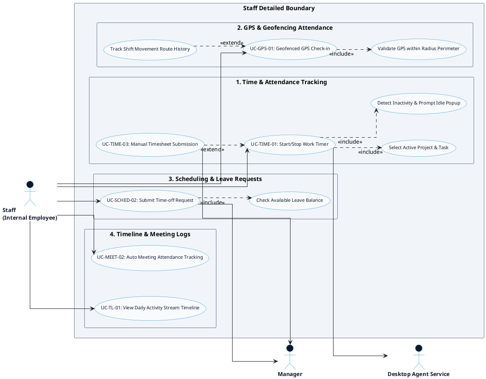

# HR MANAGEMENT PLATFORM - STAFF DETAILED USE CASE DIAGRAM

This document contains the **PlantUML** code and diagram for the **Staff Detailed Use Case Diagram** of the HR Management Platform.

---

## PlantUML Source Code

