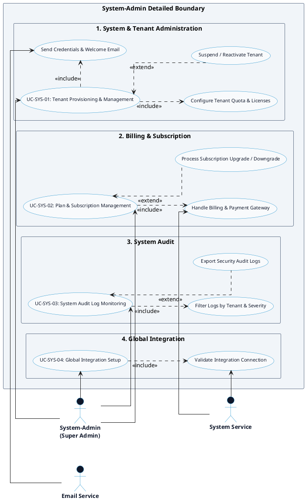

# HR MANAGEMENT PLATFORM - SYSTEM-ADMIN DETAILED USE CASE DIAGRAM

Tài liệu này chứa mã **PlantUML** và sơ đồ **Use Case Chi tiết cho Actor System-Admin (System-Admin Detailed Use Case Diagram)** của hệ thống HR Management Platform, hoàn toàn đồng bộ mã UC-ID và tên Use Case với [`ListUsecase.md`](file:///d:/Monitoring_HR/docs/usecase_diagram/ListUsecase.md).

---

## PlantUML Source Code

